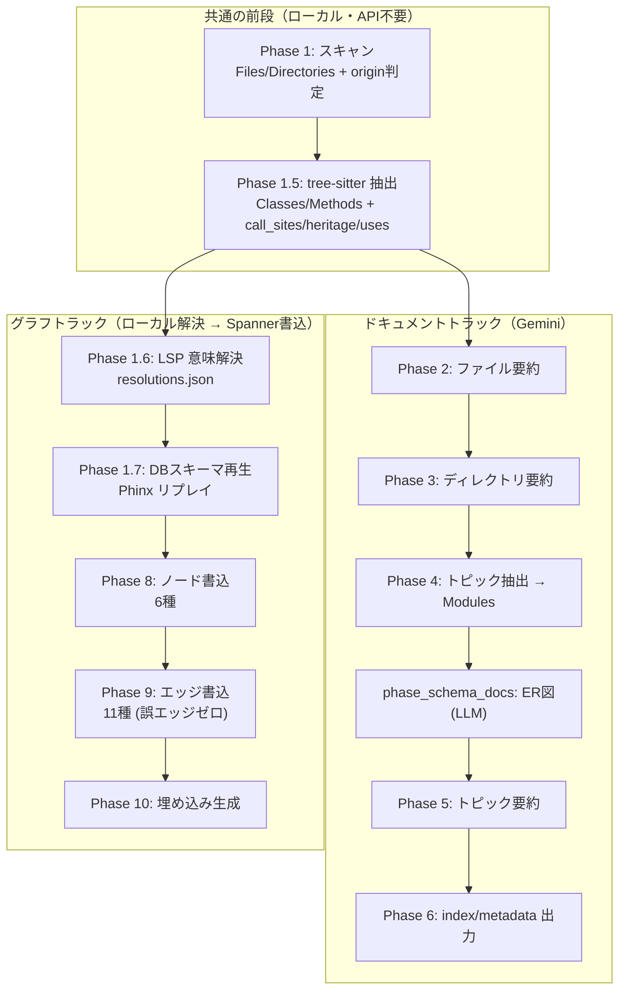
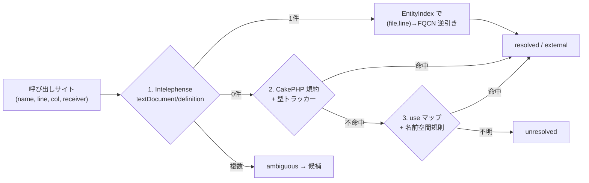
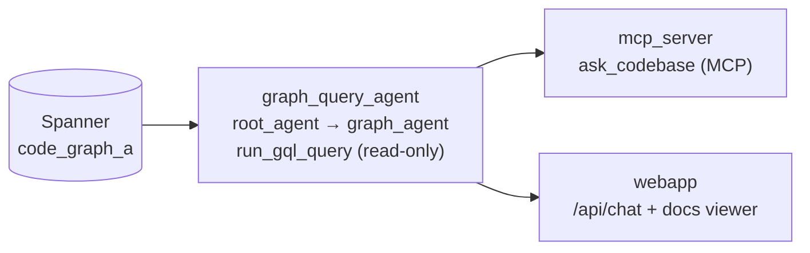

# CodeDoc アーキテクチャ（パイプライン全体像）

対象読者: CodeDoc に手を入れる開発者、または「このシステムは中で何をしているのか」を一段深く理解したい人。

このドキュメントは **コンポーネントがどう連携してパイプラインを構成しているか** を説明する。粒度の違う関連ドキュメントは以下:

| ドキュメント | 粒度 | 内容 |
|---|---|---|
| [`README.md`](README.md) | 入門 | セットアップ・コマンド・使い方 |
| **`ARCHITECTURE.md`（本書）** | 全体設計 | コンポーネント連携・データフロー・設計判断 |
| [`graph_generator/manual.md`](graph_generator/manual.md) | フェーズ詳細 | 10 フェーズの逐次仕様・レジューム・リトライ |
| [`GRAPH_SCHEMA_GUIDE.md`](GRAPH_SCHEMA_GUIDE.md) | スキーマ詳細 | ノード/エッジのテーブル定義・GQL 例 |

---

## 1. 一言でいうと

CodeDoc は **PHP / CakePHP のソースコード**を入力に、2 つの成果物を作る:

1. **日本語 Wiki ドキュメント**（Gemini が生成、ファイル/ディレクトリ/モジュール要約）
2. **コードナレッジグラフ**（Cloud Spanner 上のノード＋エッジ。graph-RAG クエリの基盤）

設計の芯は **「グラフに張るエッジは正しいものだけ」（誤エッジゼロ方針）**。呼び出し・継承・import は Intelephense（LSP）と CakePHP 規約で完全修飾名に**確定**したものだけをエッジにし、確定できないものは別テーブル（`PossiblyCalls`）か統計に隔離する。

---

## 2. 2 トラック構成

パイプラインは 1 本道ではなく、**ドキュメントトラック**と**グラフトラック**の 2 系統からなる（`graph_generator/pipeline.py` の `run_pipeline` が両方を順に実行。`generate wiki` は前者だけ、`generate graph` は後者だけを走らせる）。

ポイント:

- **Phase 1 / 1.5 は両トラック共通の前段**。ローカル完結（API 呼び出しゼロ）で、Files/Classes/Methods の素と、意味解決の入力（行・桁位置付きの `call_sites` / `heritage` / `uses`）を作る。
- **Phase 1.6 / 1.7 はグラフトラックの先頭**でだけ走る（wiki 生成には不要なので走らせない）。どちらも**ローカル完結**（1.6 は Intelephense をサブプロセスで、1.7 は DB 接続なしのマイグレーション再生）。
- **Phase 8〜10 だけが Spanner に触れる**。ここより前はすべて GCP なしで動く — だから `evaluate` は Phase 1〜1.7 ＋導出をローカルで回してグラフ内容を検証できる（9 章）。
- 「Phase 7」は欠番（旧 LLM エンティティ抽出の名残。今は Phase 1.5 の tree-sitter が担う）。

各フェーズの逐次仕様は [`manual.md`](graph_generator/manual.md) を参照。

---

## 3. コンポーネント地図

| モジュール / ディレクトリ | 役割 | GCP 依存 |
|---|---|---|
| `graph_generator/__main__.py` | CLI エントリ（`analyze` / `generate` / `evaluate` / `setup` / `validate` / `init`）、vendor プロンプト、pkl レジューム | 書込コマンドのみ |
| `graph_generator/pipeline.py` | 10 フェーズ本体。`build_node_rows` / `derive_edge_rows`（純関数）＋ Spanner 書込 | Phase 8〜10 のみ |
| `graph_generator/treesitter_parser.py` | tree-sitter による PHP/`.ctp` の AST 抽出（v2 スキーマ: 位置付き call_sites/heritage/uses） | なし |
| `graph_generator/resolution.py` | **Phase 1.6**。呼び出し/継承/import の意味解決（LSP＋規約＋パーサ）、`EntityIndex` / 型トラッカー | なし |
| `graph_generator/lsp_client.py` | Intelephense を `--stdio` で駆動する最小 JSON-RPC クライアント（stdlib のみ） | なし（Node/Intelephense に依存） |
| `graph_generator/php_conventions.py` | CakePHP 文字列規約 → FQCN 候補（純関数。`fetchTable` / plugin-dot / Inflector 等） | なし |
| `graph_generator/migration_parser.py` | **Phase 1.7**。Phinx マイグレーションを決定論的に再生 → 最終 DB スキーマ | なし |
| `graph_generator/evaluate.py` | `evaluate` コマンド本体。フィクスチャに対する正解率・カバレッジ・誤エッジ判定 | なし |
| `graph_generator/setup_spanner_graph.py` | `SCHEMA_SPEC`（スキーマの単一の真実）＋ DDL 生成 ＋ 既存 DB の冪等マイグレーション | 実行時のみ |
| `graph_generator/config.py` | `.env` からの設定読み込み（モデル・Spanner名・LSP・vendor・並行数） | なし |
| `graph_generator/prompts.py` | Gemini 用プロンプト（日本語出力） | — |
| `graph_query_agent/agent.py` | Spanner グラフに GQL を実行するクエリエージェント（2-ADK-agent 構成、読み取り専用） | あり |
| `mcp_server/` | `graph_query_agent` を MCP（streamable-http）で公開（`ask_codebase`） | あり |
| `webapp/` | FastAPI（ドキュメント配信 ＋ `/api/chat`）＋ Vite/React フロント | あり |

**依存の向き**: `pipeline.py` は書込カラムを `setup_spanner_graph.py` の `write_columns()` から取り込む。つまり **DDL とインサートは同一の `SCHEMA_SPEC` から導出**され、ズレようがない（4 章）。`resolution.py` は `treesitter_parser`（再パース用）と `php_conventions` に依存。`evaluate.py` は `pipeline` の純関数を呼ぶ。

---

## 4. スキーマの単一の真実（`SCHEMA_SPEC`）

Spanner のテーブル定義は `setup_spanner_graph.py` の `NODE_SPEC` / `EDGE_SPEC` に一元化されている。ここから:

- `CREATE TABLE` DDL（`node_table_ddl()` / `edge_table_ddl()`）
- プロパティグラフ定義（`graph_ddl()` — 各エッジの `SOURCE KEY` / `DESTINATION KEY`）
- Phase 8/9 が書き込むカラム順（`write_columns()` — `embedding` を除く）

がすべて導出される。`pipeline.py` は `NODE_COLUMNS` / `EDGE_COLUMNS` をこの `write_columns()` から作るので、**カラムを 1 つ増やすときに触るのは `SCHEMA_SPEC` だけ**。ノード 6 種・エッジ 11 種の一覧と全カラムは [`GRAPH_SCHEMA_GUIDE.md`](GRAPH_SCHEMA_GUIDE.md) の 3〜4 章に。

既存 DB の移行は `migrate_schema()` が担当する: `INFORMATION_SCHEMA` と `SCHEMA_SPEC` を突き合わせ、**不足しているテーブル/カラムだけ**を `CREATE TABLE` / `ALTER TABLE ADD COLUMN` で足す（データは消えない）。プロパティグラフは `CREATE OR REPLACE`。`python -m graph_generator.setup_spanner_graph --migrate`、または `setup spanner` を既存 DB に再実行すると走る。

---

## 5. 意味解決アーキテクチャ（Phase 1.6 — 誤エッジゼロの心臓部）

`resolution.py` は各呼び出しサイト・継承・import に対し、**強い順に 3 つの経路**で解決を試みる:

各レコードは **status** と **由来 `via`** を持ち、`resolutions.json` にチェックポイントされる（ファイル単位の mtime でレジューム）:

| status | 意味 | Phase 9 での扱い |
|---|---|---|
| `resolved` | グラフ内ノードに確定 | **MethodCalls / ClassInherits / FileImports / FileDependsOn**（`resolution` 付き） |
| `external` | 確定したがグラフ外（vendor 等） | エッジなし・カウントのみ |
| `ambiguous` | 静的候補が複数（LSB の `static::` 等） | 候補 ≤ 5 なら **PossiblyCalls**（`reason=ambiguous`） |
| `dynamic` | レシーバ/呼び先が実行時決定 | エッジなし・カウントのみ |
| `unresolved` | 何も確定できず | 同名内部メソッド ≤ 5 なら **PossiblyCalls**（`reason=name-heuristic`） |

設計上の要点:

- **LSP だけでは足りない**。Intelephense は `fetchTable()` の戻り値を総称 `Cake\ORM\Table` と型付けするため、magic finder・behavior mixin・entity 仮想フィールドは LSP 単独では追えない。そこを `php_conventions.py` ＋ メソッド内の**レシーバ型トラッカー**（`$this`・`new`・代入・プロパティ宣言型・loadComponent 登録・コントローラ既定テーブルから型を推定）が埋める。
- **インターフェイス → 具象の補正**: LSP が `EntityInterface::set` を返しても、トラッカーで受け手の具象型が分かれば `EntityTrait::set` に**確定できた場合のみ**置き換える（`via=lsp+concrete`）。確定できなければ触らない。
- **候補は必ず実在確認**してから記録する（規約が生成した FQCN が実在クラス/メンバーに無ければ採用しない）。
- **縮退動作**: Intelephense が無い/初期化失敗時は大きく警告し、規約＋パーサのみに切り替える。確認できない呼び出しは PossiblyCalls に回るだけで、**旧来の「単純名で最初に一致した相手に繋ぐ」方式には決して戻らない**。

エッジ導出 `derive_edge_rows()` は純関数（Spanner 非依存）なので、`evaluate` とユニットテストが本番と同一コードパスで「誤エッジ 0」を直接検証できる。

---

## 6. DB スキーマ再生（Phase 1.7）

`migration_parser.py` は `config/Migrations/`（プラグイン配下含む）の Phinx マイグレーションを**タイムスタンプ順にリプレイ**して最終スキーマを組み立てる（DB 接続なし）。`$this->table('x')->addColumn(...)->addForeignKey(...)->create()` のチェーンを追い、暗黙の `id` 主キー・removeColumn/rename/changeColumn・重複 create（列和集合＋警告）・動的引数（スキップ＋警告）まで扱う。

これが供給するグラフ要素:

- **DbTables** ノード（columns / indexes / foreign_keys を JSON で保持）
- **TableReferences** エッジ（FK: `articles.user_id` → `users.id`）
- **ClassMapsToTable** エッジ（CakePHP Table クラス → 物理テーブル。`setTable('x')` リテラルなら `via=settable`、無ければ Inflector 規約で `via=convention`）

これは Gemini による ER 図ドキュメント生成（ドキュメントトラックの `phase_schema_docs`）とは**独立の系統**。1.7 は決定論的なグラフ用、`phase_schema_docs` は人間向けの Mermaid ER 図。

---

## 7. ノード同一性と冪等性

すべての ID は決定的ハッシュ `"<ID_PREFIX>_" + sha256("part1|part2|…")[:16]`（`_make_id`）。材料は:

| ノード | 材料 |
|---|---|
| File | `("file", 相対パス)` |
| Class | `("class", 相対パス, FQCN)` |
| Method | `("method", 相対パス, FQCN, メソッド名)` |
| Directory / Module / DbTable | `("dir"/"module"/"dbtable", 相対パス or 名前)` |

2 つの狙い:

1. **相対パス**なので、リポジトリをどのマシンのどこに置いても同じ ID（旧版は絶対パスで移植不可だった）。
2. **FQCN 込み**なので、別ファイル・別名前空間・別プロジェクトの同名クラス/メソッドが**1 ノードに混ざらない**（クロスプロジェクト解析での取り違え防止）。

書き込みは `insert_or_update`（upsert）なので再実行しても重複しない。ID の材料が変わったため `ID_SCHEME = 2` を `graph_checkpoint.json` に記録し、旧スキームのチェックポイントは破棄して Phase 8 から作り直す（新旧 ID の混在を防ぐ）。

**チェックポイントとレジューム**:

| ファイル（`OUTPUT_DIR` 配下） | 内容 | レジューム単位 |
|---|---|---|
| `entities.json` | Phase 1.5 抽出結果（`{"version":2,"entities":{…}}`） | 版数不一致なら破棄・再パース |
| `resolutions.json` | Phase 1.6 解決結果 | ファイル単位（mtime） |
| `graph_checkpoint.json` | Phase 8/9/10 の完了フェーズ＋ ID マップ | フェーズ単位（`id_scheme` 検査付き） |
| `pipeline_data.pkl` | docs → graph のデータ受け渡し | `generate graph` が再利用（欠損フィールドは自動バックフィル） |

---

## 8. vendor の取り扱い

`vendor/` は既定でスキャン対象外（`SKIP_DIRS`）。取り込みは 優先順 **CLI フラグ（`--include-vendor` / `--exclude-vendor`）→ `.env INCLUDE_VENDOR` → 対話プロンプト**（vendor の PHP ファイル数と合計サイズを提示。非対話時は除外にフォールバック）。

取り込んだ場合の扱い:

- vendor ファイルは `origin='vendor'` のノード/エッジになる。
- **Gemini ドキュメント生成（Phase 2〜6）と埋め込み（Phase 10）からは除外**（コスト対策）。
- 除外していても Intelephense は vendor をインデックスするので、vendor への呼び出しは `external` として正しく確定する（エッジは張られず、統計に載る）。

---

## 9. 検証アーキテクチャ

2 段構え:

1. **`evaluate` コマンド（ローカル・GCP 不要）** — `test_codes/php_plain`（フレームワークなし）と `test_codes/php_cakephp`（実 CakePHP アプリ）に対し Phase 1〜1.7 ＋ノード/エッジ導出を回し、正解データ `ground_truth.json` と突き合わせる。レポートは **正答率・エンティティカバレッジ・QA 正答率・誤エッジ数** の 4 指標。終了コードは全指標 85% 以上かつ誤エッジ 0 で `0`、未達で `1`、環境不備で `2`。フィクスチャの同名クラス/メソッドの罠（vendor 双子・plugin 双子・app が vendor を隠す等）が「誤エッジ 0」の回帰ゲートになっている。
2. **pytest スイート（`tests/`）** — genai / Spanner / vertexai をフェイク化し、Intelephense は本物（`@pytest.mark.lsp`）と偽 LSP サーバの両方で駆動。`build_node_rows` / `derive_edge_rows` の誤エッジゼロ不変条件を直接アサートする。

---

## 10. クエリ／配信スタック

グラフができた後の読み取り側:

- `graph_query_agent` は 2-ADK-agent 構成。`root_agent`（オーケストレータ、ツールなし）が `graph_agent`（読み取り専用の `run_gql_query` を持つ）に委譲する。接続先は環境変数（`SPANNER_INSTANCE` / `SPANNER_DATABASE` / `GRAPH_NAME` / `GOOGLE_CLOUD_PROJECT`）から直接読む（`graph_generator.config` は経由しない）。
- `mcp_server` と `webapp/main.py` はこのエージェントを包むだけで、テーブル名は持たない（スキーマ知識はエージェントの指示文に集約）。

---

## 11. 設定と外部依存

- **設定**: すべて `.env` → `config.py`。主要キーは `GOOGLE_CLOUD_PROJECT` / `GEMINI_MODEL` / `SPANNER_INSTANCE` / `SPANNER_DATABASE` / `GRAPH_NAME` / `ID_PREFIX` / `OUTPUT_DIR` と、LSP・vendor 系（`INTELEPHENSE_PATH` / `LSP_INDEX_TIMEOUT` / `LSP_REQUEST_TIMEOUT` / `POSSIBLY_CALLS_MAX_CANDIDATES` / `INCLUDE_VENDOR`）。テンプレートは `.env.example`。
- **外部依存**: Vertex AI（Gemini + text-embedding-005）、Cloud Spanner（Enterprise 階層 — プロパティグラフに必要）、Node.js + Intelephense（Phase 1.6。無くても縮退動作）、tree-sitter + tree-sitter-php（Phase 1.5）。
- **スキャン対象**は `.php` / `.ctp` のみ（`SOURCE_EXTENSIONS`）。`config/Migrations/` はスキャン対象に残す（Phase 1.7 と DB スキーマ検出が依存）。

---

## まとめ（設計判断の要点）

- **2 トラック**（docs / graph）で、グラフトラックは Phase 8〜10 以外すべてローカル → GCP なしで検証可能。
- **誤エッジゼロ**を構造で保証: 確定（resolved）だけがエッジ、推測は PossiblyCalls か統計へ。純関数の導出＋フィクスチャゲートで担保。
- **スキーマは 1 箇所**（`SCHEMA_SPEC`）から DDL・グラフ定義・書込カラムを導出。既存 DB は冪等マイグレーション。
- **ID は相対パス＋FQCN** で、移植可能かつ同名衝突に強い。
- **意味解決は 3 層**（LSP → CakePHP 規約＋型トラッカー → パーサ）で、CakePHP のマジックまで追いつつ、Intelephense 不在時も安全に縮退する。
