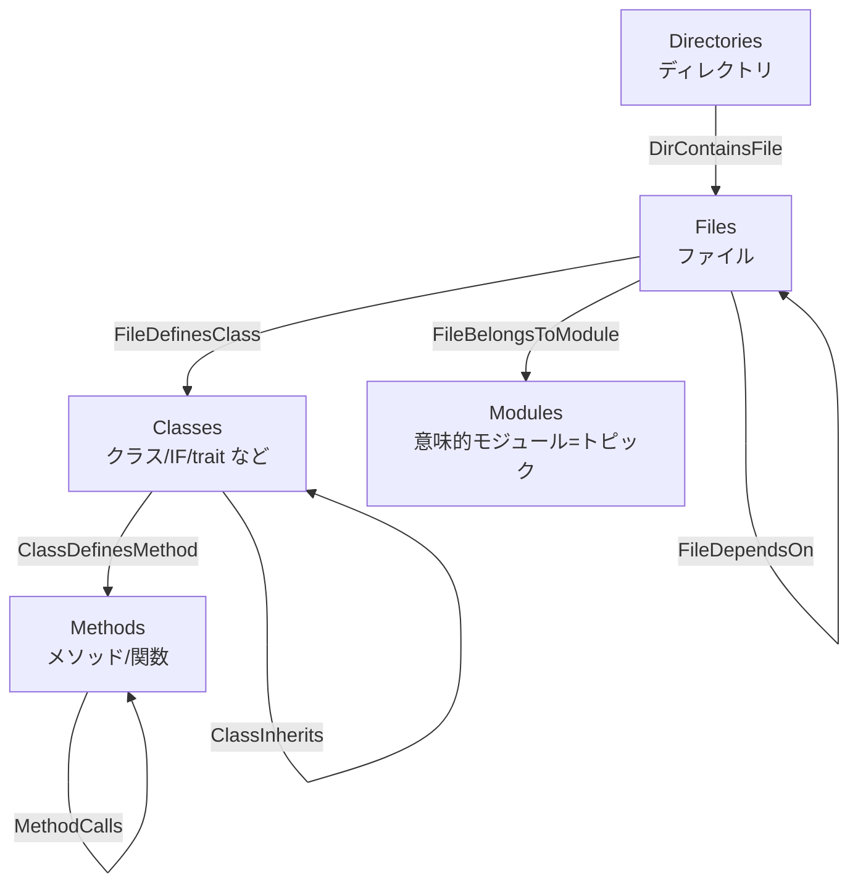

# CodeDoc コードグラフ ガイド（テーブル構造とマッピング）

対象読者: コードは読めるが CodeDoc は初めて、というエンジニア。
目的: 「Spanner に作られるグラフが何を表しているか」「ソースコードがどうグラフに変換されるか」を、人に説明できるレベルで理解する。

> 定義の出どころ（このドキュメントの根拠）
> - スキーマ（テーブル/グラフ定義）: `setup_spanner_graph.py`
> - ソース解析（ノード/エッジの素）: `graph_generator/treesitter_parser.py`
> - グラフへの書き込み（マッピング本体）: `graph_generator/pipeline.py`（Phase 8〜10）
> - 設定値: `graph_generator/config.py`

---

## 1. これは何か（30秒で説明する版）

CodeDoc は、ソースコード全体を **「ノード（点）」と「エッジ（線）」のグラフ**として Google Cloud Spanner に保存する。

- **ノード** = コードの構成要素（ディレクトリ / ファイル / クラス / メソッド / モジュール）
- **エッジ** = 要素どうしの関係（含む / 定義する / 継承する / 呼び出す / 依存する / 属する）

こうしておくと、「この関数を呼んでいるのは誰か」「このクラスは何を継承しているか」「このファイルが壊れたら影響範囲はどこか」といった質問に、grep ではなくグラフ探索（1ホップ、2ホップ…）で答えられる。`ask_codebase`（MCP）はこのグラフを裏で叩いている。

ポイントは2つだけ覚えればよい:

1. **5種類のノード**と**8種類のエッジ**（実際にデータが入るのは7種類）がある。
2. ノードには2つの出どころがある。**構造系**（tree-sitter で機械的に抽出＝正確）と、**意味系**（LLM がまとめた「モジュール」＝便利だが揺れる）。

---

## 2. 全体像（一枚絵）



- 縦の骨格は **包含関係**: ディレクトリ ⊃ ファイル ⊃ クラス ⊃ メソッド。
- 横の線は **意味的な関係**: 依存（File→File）、継承（Class→Class）、呼び出し（Method→Method）。
- `Modules` は LLM が「これらのファイルは "ユーザー管理" だね」とまとめた束で、ファイルから生える。

---

## 3. ノードテーブル（5種類）

Spanner には全部で **13 テーブル**（ノード5 + エッジ8）と、それらを束ねる **1 つのプロパティグラフ `code_graph_a`** がある。

| テーブル | 1 件は何か | 主キー | 主なカラム | 出どころ | summary の中身 | embedding |
|---|---|---|---|---|---|---|
| **Files** | ソースファイル1つ | `file_id` | `file_name`, `extension`, `directory`, `summary` | スキャン（決定的） | LLM のファイル要約（先頭4000字） | あり |
| **Classes** | クラス/IF/trait/enum など | `class_id` | `name`, `file_id`, `kind`, `modifiers`, `summary` | tree-sitter（決定的） | `"<名前>: <kind>"` の簡易ラベル | あり |
| **Methods** | メソッド/関数（PHP ではクラスのプロパティ・enum ケースも1件ずつここに入る） | `method_id` | `name`, `class_id`, `file_id`, `signature`, `modifiers`, `return_type`, `summary` | tree-sitter（決定的） | `"<クラス>.<メソッド>"` の簡易ラベル | **なし** |
| **Modules** | 意味的なまとまり（トピック） | `module_id` | `name`, `summary` | LLM トピック抽出（意味的） | LLM のトピック要約（先頭4000字） | あり |
| **Directories** | ディレクトリ1つ | `dir_id` | `name`, `summary` | スキャン（決定的） | LLM のディレクトリ要約（先頭4000字） | **なし** |

補足:
- 全テーブルに `embedding ARRAY<FLOAT64>` カラムがあるが、実際にベクトルが入るのは **Files / Classes / Modules の3種だけ**（Phase 10）。Methods と Directories は空のまま。
- `kind`（Classes）には `class` / `interface` / `trait` / `enum` のいずれか、または `module`（トップレベル関数を束ねる擬似クラス `(global)`）が入る。
- `Classes.summary` と `Methods.summary` は LLM 要約ではなく、機械生成の短いラベル。リッチな自然言語要約が載るのは Files / Directories / Modules 側。

### ノードの2系統（ここが理解の肝）

| 系統 | テーブル | 生成方法 | 性質 |
|---|---|---|---|
| **構造系** | Files, Classes, Methods, Directories | tree-sitter / ファイルスキャン | **決定的**。同じコードなら毎回同じ。正確。 |
| **意味系** | Modules | LLM（トピック抽出） | **非決定的**。実行ごとに名前や粒度が揺れうる。便利だが「正解」ではない。 |

---

## 4. エッジテーブル（8種類、うち7種にデータが入る）

エッジは「どのノードからどのノードへ」の向きを持つ。プロパティグラフ定義の `SOURCE KEY` / `DESTINATION KEY` がその向きを規定している。

| テーブル | 向き（source → destination） | 意味 | どう作られるか |
|---|---|---|---|
| **DirContainsFile** | Directory → File | ディレクトリが直下にファイルを含む | スキャン結果（dir_tree）から決定的に |
| **FileDefinesClass** | File → Class | ファイルがクラスを定義 | tree-sitter の抽出結果から |
| **ClassDefinesMethod** | Class → Method | クラスがメソッドを持つ | tree-sitter の抽出結果から |
| **FileDependsOn** | File → File | ファイル間の依存 | ① import 先の名前をファイル名にマッチ ② 同一パッケージ内で参照しているクラスの定義元へ |
| **ClassInherits** | Class → Class | 継承 / 実装 | `base_classes` + `interfaces` を **クラス名（単純名）** で解決。`kind` カラムは常に `"extends"` |
| **MethodCalls** | Method → Method | メソッド呼び出し | 本体の呼び出し名を **メソッド名（単純名）** で解決。`callee_name` に元の呼び出し文字列を保持 |
| **FileBelongsToModule** | File → Module | ファイルが意味モジュールに属する | LLM トピックの `linked_files` から |
| **FileImports** | File → File | import（生の依存） | **未使用**。テーブルは作られるが Phase 9 では書き込まれない（import 情報は FileDependsOn に集約） |

> 注意: スキーマ上のエッジテーブルは8つだが、**パイプラインが実際に投入するのは `FileImports` を除く7つ**。Phase 9 のコードも "Write all 7 edge types" となっている。`FileImports` は将来用に予約されている枠だと思ってよい。

すべてのエッジテーブルは `edge_id`（主キー）＋ source 列 ＋ destination 列（一部に補助列）という共通の形をしている。

---

## 5. ソースコード → グラフ マッピング（具体例）

「1つのファイルが、どう分解されてノード/エッジになるか」を CakePHP の `UsersController.php` で追う。

```php
<?php
// 場所: <repo>/src/Controller/UsersController.php
namespace App\Controller;

use App\Model\Table\UsersTable;
use Cake\Http\Response;

class UsersController extends AppController
{
    public function index()
    {
        $users = $this->paginate($this->Users->find('active'));
        $this->set(compact('users'));
    }

    public function view($id = null): ?Response
    {
        $user = $this->Users->get($id);
        $this->set(compact('user'));

        return $this->render('view');
    }
}
```

### Step 1: tree-sitter が「エンティティ」に分解（Phase 1.5）

ファイルを AST 解析し、構成要素の種類に依存しない共通スキーマに変換する:

```json
{
  "file_path": ".../src/Controller/UsersController.php",
  "namespace": "App\\Controller",
  "classes": [
    {
      "name": "UsersController",
      "kind": "class",
      "modifiers": "",
      "base_classes": ["AppController"],
      "interfaces": [],
      "methods": [
        {
          "name": "index",
          "modifiers": "public",
          "return_type": "",
          "parameters": "",
          "calls": ["paginate", "find", "set", "compact"]
        },
        {
          "name": "view",
          "modifiers": "public",
          "return_type": "?Response",
          "parameters": "$id = null",
          "calls": ["get", "set", "compact", "render"]
        }
      ]
    }
  ],
  "imports": ["App\\Model\\Table\\UsersTable", "Cake\\Http\\Response"]
}
```

この共通スキーマは **PHP のすべての構成要素（class / interface / trait / enum）で同じ形**。だからこの先の処理は構成要素の種類を意識しなくてよい。

### Step 2: ノードに変換（Phase 8）

| 生成されるノード | テーブル | 備考 |
|---|---|---|
| `UsersController.php` | Files | `extension=.php`, `directory=src/Controller` |
| `UsersController` | Classes | `kind=class`, `modifiers=""`（`abstract`/`final` 等が無いので空） |
| `index` | Methods | `signature=" UsersController.index()"`（`return_type` が空のため先頭に空白が残る） |
| `view` | Methods | `signature="?Response UsersController.view($id = null)"`, `return_type=?Response` |

### Step 3: エッジに変換（Phase 9）

| 生成されるエッジ | 種類 | 条件 |
|---|---|---|
| src/Controller → UsersController.php | DirContainsFile | 常に |
| UsersController.php → UsersController | FileDefinesClass | 常に |
| UsersController → index / view | ClassDefinesMethod | 常に |
| UsersController → AppController | ClassInherits | `AppController` という名前のクラスがコードベースに存在すれば |
| index → find | MethodCalls | `find` という名前のメソッドが存在すれば |
| UsersController.php → UsersTable.php | FileDependsOn | use 先（`App\Model\Table\UsersTable`）がファイルとして存在すれば |
| UsersController.php → (例: "ユーザー管理") | FileBelongsToModule | LLM がこのファイルをそのトピックに紐づければ |

「条件」の部分が重要 — 相手が見つからなければエッジは張られない。次章の限界に直結する。

---

## 6. ID の付け方（なぜ再実行で壊れないか）

すべてのノード/エッジ ID は **決定的なハッシュ**で作られる（`pipeline.py` の `_make_id`）:

```
ID = "<ID_PREFIX>_" + sha256("part1|part2|...")[:16]
```

`ID_PREFIX` は config のデフォルトで `a`（グラフ名 `code_graph_a` の末尾と対応）。

| ノード | ハッシュの材料 |
|---|---|
| File | `("file", 絶対パス)` |
| Class | `("class", 絶対パス, クラス名)` |
| Method | `("method", 絶対パス, クラス名, メソッド名)` |
| Module | `("module", トピック名)` |
| Directory | `("dir", 絶対パス)` |

決定的なので、**同じコードを再解析すれば同じ ID になる**。書き込みは `insert_or_update`（upsert）なので、パイプラインを再実行しても重複行ができず、安全に上書き・再開できる。

---

## 7. 生成パイプラインの流れ（どの Phase で何ができるか）

パイプラインは「ドキュメント生成（Phase 1〜6）」と「グラフ生成（Phase 8〜10）」の2部構成（`run_pipeline`）。

| Phase | 名前 | 種別 | このグラフへの貢献 |
|---|---|---|---|
| 1 | スキャン | ローカル | Files / Directories の素、dir_tree |
| 1.5 | tree-sitter 抽出 | ローカル（API不要） | Classes / Methods / imports / calls / inherits の素 |
| 2 | ファイル要約 | LLM | Files.summary |
| 3 | ディレクトリ要約 | LLM | Directories.summary |
| 4 | トピック抽出 | LLM | **Modules** の素（意味的グルーピング） |
| 5 | トピック要約 | LLM | Modules.summary |
| 6 | インデックス組み立て | ローカル | （MD/JSON 出力。グラフには直接書かない） |
| **8** | **ノード書き込み** | Spanner | 5種のノードを投入 |
| **9** | **エッジ書き込み** | Spanner | 7種のエッジを投入 |
| **10** | **埋め込み生成** | Spanner | Files / Classes / Modules に embedding を付与 |

補足:
- Phase 8〜10 はチェックポイント付きで、途中再開できる（`graph_checkpoint.json`）。
- 「Phase 7」は欠番。昔は LLM でエンティティ抽出していた名残で、今は Phase 1.5 の tree-sitter に置き換わっている。
- 未対応拡張子のファイルは Files ノードにはなるが、クラス/メソッドには分解されない（tree-sitter parser が PHP（`.php` / `.ctp`）のみのため）。

---

## 8. 重要な注意点・限界（説明するとき必ず添える）

このグラフは **「正確なコールグラフ」ではなく「実用的な近似グラフ」**。理由を知っておくと誤解を防げる。

1. **継承・呼び出しは「単純名」で解決する**
   `ClassInherits` と `MethodCalls` は名前空間や型を見ず、**名前だけ**で相手を探す。
   - 同名のクラス/メソッドが複数あると、**最初に見つかった1つ**に繋がる（誤接続の可能性）。
   - メソッドのオーバーロードは区別されない。
   - 逆に、外部ライブラリのメソッド（コードベース内に定義が無い）への呼び出しはエッジにならない。

2. **FileDependsOn は取りこぼしうる**
   import 名をファイル名にマッチさせる方式なので、同名 basename が複数あると曖昧として **スキップ**される。同一パッケージ内の参照で補完しているが、完全ではない。

3. **Modules は LLM 由来＝非決定的**
   トピックの名前・粒度・ファイルの紐づけは実行ごとに揺れる。構造系ノード（Files/Classes/Methods/Dirs）は決定的だが、Modules は「そのときの解釈」。

4. **データが入らない枠がある**
   - `FileImports` テーブル: 未使用。
   - `Methods.embedding` / `Directories.embedding`: 常に空。

5. **summary の濃さに差がある**
   Files / Directories / Modules は LLM のリッチな要約。Classes / Methods は短い機械ラベルのみ。

---

## 付録 A: 実際に Spanner Graph を叩いて確かめる

Spanner Graph は **GQL（Graph Query Language）** で問い合わせる。`GRAPH <名前> MATCH (...)-[:エッジ]->(...) RETURN ...` という形。以下はそのまま実行できるテンプレート（`code_graph_a` 前提）。

### まず存在確認（通常 SQL）

```sql
-- テーブル一覧（5ノード+8エッジの13個が見えるはず）
SELECT TABLE_NAME FROM INFORMATION_SCHEMA.TABLES
WHERE TABLE_SCHEMA = '' ORDER BY TABLE_NAME;

-- プロパティグラフの一覧（code_graph_a が見えるはず）
SELECT PROPERTY_GRAPH_NAME FROM INFORMATION_SCHEMA.PROPERTY_GRAPHS;
```

スクリプトからまとめて確認するなら:

```bash
python setup_spanner_graph.py --verify
```

### 件数をざっと見る

```sql
GRAPH code_graph_a
MATCH (f:Files)
RETURN COUNT(f) AS files;
```

### あるクラスのメソッド一覧（包含をたどる）

```sql
GRAPH code_graph_a
MATCH (c:Classes {name: 'UsersController'})-[:ClassDefinesMethod]->(m:Methods)
RETURN m.name, m.signature;
```

### 継承関係を見る

```sql
GRAPH code_graph_a
MATCH (child:Classes)-[:ClassInherits]->(parent:Classes)
RETURN child.name, parent.name
LIMIT 20;
```

### 「この関数を呼んでいるのは誰か」（影響範囲・逆引き）

```sql
GRAPH code_graph_a
MATCH (caller:Methods)-[:MethodCalls]->(callee:Methods {name: 'find'})
RETURN caller.name, caller.signature;
```

### ファイルの依存先

```sql
GRAPH code_graph_a
MATCH (a:Files {file_name: 'UsersController.php'})-[:FileDependsOn]->(b:Files)
RETURN b.file_name;
```

### あるモジュール（トピック）に属するファイル

```sql
GRAPH code_graph_a
MATCH (f:Files)-[:FileBelongsToModule]->(mod:Modules {name: 'ユーザー管理'})
RETURN f.file_name;
```

### 複数ホップ（例: ファイル → クラス → メソッド を一気に）

```sql
GRAPH code_graph_a
MATCH (f:Files {file_name: 'UsersController.php'})-[:FileDefinesClass]->(c:Classes)-[:ClassDefinesMethod]->(m:Methods)
RETURN c.name, m.name;
```

---

## 付録 B: 接続情報と実行方法

| 項目 | デフォルト値 | 上書き用の環境変数 |
|---|---|---|
| インスタンス | `codedoc-instance` | `SPANNER_INSTANCE` |
| データベース | `codedoc-db` | `SPANNER_DATABASE` |
| グラフ名 | `code_graph_a` | `GRAPH_NAME` |
| ID プレフィックス | `a` | `ID_PREFIX` |
| プロジェクト | config 既定値 | `GOOGLE_CLOUD_PROJECT` |

> 実際の環境では `.env` でこれらが上書きされていることがある。グラフ名やプロジェクトは、まず `.env` / 環境変数の実値を確認すること（デプロイ先によって `code_graph_a` 以外の名前になっている場合がある）。

`gcloud` から1発で叩く例:

```bash
gcloud spanner databases execute-sql codedoc-db \
  --instance=codedoc-instance \
  --sql="GRAPH code_graph_a MATCH (c:Classes) RETURN COUNT(c) AS classes"
```

---

## 付録 C: 人に説明するときのカンペ（コピペ用）

> CodeDoc はソースコードを **グラフ**にして Spanner に入れている。
> 点（ノード）が **ディレクトリ・ファイル・クラス・メソッド・モジュール**の5種類、
> 線（エッジ）が **含む・定義する・継承・呼び出し・依存・所属**の関係。
> ディレクトリ ⊃ ファイル ⊃ クラス ⊃ メソッド という入れ子が骨格で、
> そこに「継承」「呼び出し」「依存」の横線が張られる。
> ファイル・クラス・メソッドは tree-sitter で機械的に抽出するので**正確**、
> 「モジュール」だけは LLM がまとめた**意味的な束**なので参考情報。
> 継承と呼び出しは**名前で突き合わせている近似**なので、同名衝突や外部ライブラリは外れることがある。
> だから「正確な静的解析」ではなく「コード理解を高速化する地図」として使う。
