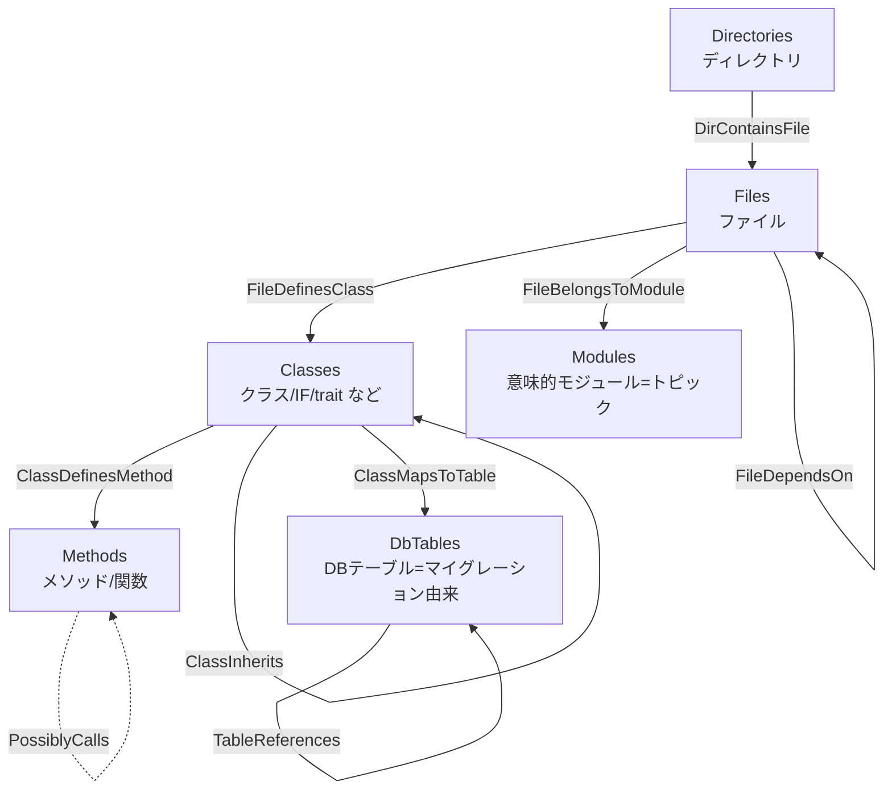

# CodeDoc コードグラフ ガイド（テーブル構造とマッピング）

対象読者: コードは読めるが CodeDoc は初めて、というエンジニア。
目的: 「Spanner に作られるグラフが何を表しているか」「ソースコードがどうグラフに変換されるか」を、人に説明できるレベルで理解する。

> 定義の出どころ（このドキュメントの根拠）
> - スキーマ（テーブル/グラフ定義）: `graph_generator/setup_spanner_graph.py` — `SCHEMA_SPEC`（`NODE_SPEC` / `EDGE_SPEC`）が単一の真実。DDL・プロパティグラフ定義・Phase 8/9 の書き込みカラムはすべてここから導出される
> - ソース解析（ノード/エッジの素）: `graph_generator/treesitter_parser.py`
> - 意味解決（Phase 1.6）: `graph_generator/resolution.py` + `lsp_client.py`（Intelephense）+ `php_conventions.py`（CakePHP 規約）
> - DB スキーマ再生（Phase 1.7）: `graph_generator/migration_parser.py`
> - グラフへの書き込み（マッピング本体）: `graph_generator/pipeline.py`（Phase 8〜10）
> - 設定値: `graph_generator/config.py`
> - ローカル評価: `graph_generator/evaluate.py`（`python -m graph_generator evaluate`）

---

## 1. これは何か（30秒で説明する版）

CodeDoc は、ソースコード全体を **「ノード（点）」と「エッジ（線）」のグラフ**として Google Cloud Spanner に保存する。

- **ノード** = コードの構成要素（ディレクトリ / ファイル / クラス / メソッド / モジュール / DBテーブル）
- **エッジ** = 要素どうしの関係（含む / 定義する / 継承する / 呼び出す / 依存する / import / 属する / FK 参照 / テーブル対応）

こうしておくと、「この関数を呼んでいるのは誰か」「このクラスは何を継承しているか」「この Table クラスはどの物理テーブルを触るのか」といった質問に、grep ではなくグラフ探索（1ホップ、2ホップ…）で答えられる。`ask_codebase`（MCP）はこのグラフを裏で叩いている。

ポイントは3つだけ覚えればよい:

1. **6種類のノード**と**11種類のエッジ**がある。
2. ノードには2つの出どころがある。**構造系**（tree-sitter / マイグレーション再生で機械的に抽出＝正確）と、**意味系**（LLM がまとめた「モジュール」＝便利だが揺れる）。
3. 呼び出し・継承・import のエッジは **Phase 1.6 の意味解決（Intelephense LSP + CakePHP 規約）で「確定」したものだけ**張られ、出自が `resolution` プロパティに残る。確定できない候補は別テーブル `PossiblyCalls` に隔離される — つまり **`MethodCalls` に誤エッジは入らない**（誤エッジゼロ・ポリシー、4章）。

---

## 2. 全体像（一枚絵）



- 縦の骨格は **包含関係**: ディレクトリ ⊃ ファイル ⊃ クラス ⊃ メソッド。
- 横の線は **意味的な関係**: 依存 / import（File→File）、継承（Class→Class）、呼び出し（Method→Method）。呼び出しは**確定（MethodCalls）と候補（PossiblyCalls、点線）の2層**に分かれる。
- `Modules` は LLM が「これらのファイルは "ユーザー管理" だね」とまとめた束で、ファイルから生える。
- `DbTables` は Phinx マイグレーションを再生した**物理テーブル**。外部キー（TableReferences）と、CakePHP の Table クラスとの対応（ClassMapsToTable）を持つ。

---

## 3. ノードテーブル（6種類）

Spanner には全部で **17 テーブル**（ノード6 + エッジ11）と、それらを束ねる **1 つのプロパティグラフ `code_graph_a`** がある。

| テーブル | 1 件は何か | 主キー | 主なカラム | 出どころ | summary の中身 | embedding |
|---|---|---|---|---|---|---|
| **Files** | ソースファイル1つ | `file_id` | `file_name`, `extension`, `directory`, `path`, `origin`, `repo`, `summary` | スキャン（決定的） | LLM のファイル要約（先頭4000字） | あり |
| **Classes** | クラス/IF/trait/enum など | `class_id` | `name`, `namespace`, `fqcn`, `file_id`, `kind`, `modifiers`, `start_line`, `end_line`, `origin`, `repo`, `summary` | tree-sitter（決定的） | `"<FQCN>: <kind>"` の簡易ラベル | あり |
| **Methods** | メソッド/関数（PHP ではクラスのプロパティ・enum ケースも1件ずつここに入る） | `method_id` | `name`, `class_id`, `file_id`, `fqmn`, `signature`, `modifiers`, `return_type`, `start_line`, `end_line`, `origin`, `repo`, `summary` | tree-sitter（決定的） | FQMN（`App\Model\Table\UsersTable::validationDefault` 形式）の簡易ラベル | **なし** |
| **Modules** | 意味的なまとまり（トピック） | `module_id` | `name`, `repo`, `summary` | LLM トピック抽出（意味的） | LLM のトピック要約（先頭4000字） | あり |
| **Directories** | ディレクトリ1つ | `dir_id` | `name`, `repo`, `summary` | スキャン（決定的） | LLM のディレクトリ要約（先頭4000字） | **なし** |
| **DbTables** | 物理 DB テーブル1つ | `table_id` | `name`, `columns`, `indexes`, `foreign_keys`, `source_file`, `plugin`, `repo`, `summary` | マイグレーション再生（決定的、Phase 1.7） | `"<テーブル名>: N columns"` の簡易ラベル | **なし** |

補足:
- **`repo`（全ノード）は所属リポジトリ名**。複数リポジトリを 1 グラフに同居でき、ノード ID は `(repo, 相対パス, FQCN, メンバー)` でハッシュされるため、**リポジトリ間で同名のクラス・メソッドも別ノード**になる（統合されない）。リポジトリ同士は独立した島で、A→B の参照は `external`（エッジなし）。特定リポジトリに絞るクエリは `WHERE n.repo = '<repo>'` を付ける。投入は `analyze <dir> --repo-name X`（都度）または `analyze --repos manifest.json`（一括）。
- 全テーブルに `embedding ARRAY<FLOAT64>` カラムがあるが、実際にベクトルが入るのは **Files / Classes / Modules の3種だけ**（Phase 10）。Methods / Directories / DbTables は空のまま。
- `kind`（Classes）には `class` / `interface` / `trait` / `enum` のいずれか、または `module`（トップレベル関数を束ねる擬似クラス `(global)`）が入る。
- `fqcn` / `fqmn` は完全修飾名（`App\Controller\UsersController` / `App\Controller\UsersController::index`）。`(global)` 関数の `fqmn` は名前空間付き関数名になる。
- `origin`（Files / Classes / Methods）は `app` か `vendor`。vendor/ はデフォルトでスキャン対象外で、`--include-vendor` 指定時のみ `origin='vendor'` のノードが入る（7章）。vendor 由来はノードを持ってもドキュメント生成・embedding の対象にはならない（コスト対策）。
- `DbTables` の `columns` / `indexes` / `foreign_keys` は JSON 文字列（STRING(MAX)）。例: `columns=[{"name": "email", "type": "string", "options": {...}}, ...]`、`foreign_keys=[{"column": "user_id", "referenced_table": "users", "referenced_column": "id"}]`。`source_file` はそのテーブルを create したマイグレーションの相対パス、`plugin` はプラグイン配下（`plugins/<名前>/`）ならそのプラグイン名。
- `Classes.summary` / `Methods.summary` / `DbTables.summary` は LLM 要約ではなく、機械生成の短いラベル。リッチな自然言語要約が載るのは Files / Directories / Modules 側。

### ノードの2系統（ここが理解の肝）

| 系統 | テーブル | 生成方法 | 性質 |
|---|---|---|---|
| **構造系** | Files, Classes, Methods, Directories, DbTables | tree-sitter / ファイルスキャン / マイグレーション再生 | **決定的**。同じコードなら毎回同じ。正確。 |
| **意味系** | Modules | LLM（トピック抽出） | **非決定的**。実行ごとに名前や粒度が揺れうる。便利だが「正解」ではない。 |

---

## 4. エッジテーブル（11種類）と「誤エッジゼロ」ポリシー

エッジは「どのノードからどのノードへ」の向きを持つ。プロパティグラフ定義の `SOURCE KEY` / `DESTINATION KEY` がその向きを規定している。

| テーブル | 向き（source → destination） | 意味 | 補助カラム | どう作られるか |
|---|---|---|---|---|
| **DirContainsFile** | Directory → File | ディレクトリが直下にファイルを含む | — | スキャン結果（dir_tree）から決定的に |
| **FileDefinesClass** | File → Class | ファイルがクラスを定義 | — | tree-sitter の抽出結果から |
| **ClassDefinesMethod** | Class → Method | クラスがメソッドを持つ | — | tree-sitter の抽出結果から |
| **FileImports** | File → File | `use` / require による import | `import`（use された FQCN）, `resolution` | Phase 1.6 で import 先が内部ファイルに**確定**したものだけ。**今バージョンから実データが入る**（旧版では予約枠だった） |
| **FileDependsOn** | File → File | ファイル間依存（集約ビュー） | `resolution` | import・解決済み呼び出しの相手先・継承先・文字列規約（`fetchTable('Users')` → UsersTable.php）など、**確定した**参照の到達先ファイルをまとめたもの |
| **ClassInherits** | Class → Class | 継承 / 実装 / trait 使用 | `kind`（`extends` / `implements` / `uses`）, `resolution` | Phase 1.6 で親クラスが**確定**した場合のみ |
| **MethodCalls** | Method → Method | **確定した**メソッド呼び出し | `callee_name`（元の呼び出し名）, `resolution`（出自）, `call_line`（呼び出し行） | `status=resolved` かつ相手が内部ノードのときだけ（下記ポリシー） |
| **PossiblyCalls** | Method → Method | 呼び出し**候補**（確定ではない） | `callee_name`, `reason`（`ambiguous` / `name-heuristic`）, `candidate_count`（候補数） | 確定できなかった呼び出しの候補展開。候補数が `POSSIBLY_CALLS_MAX_CANDIDATES`（既定5）以下のときだけ |
| **FileBelongsToModule** | File → Module | ファイルが意味モジュールに属する | — | LLM トピックの `linked_files` から |
| **TableReferences** | DbTable → DbTable | 外部キー参照（FK を持つ側 → 参照される側） | `fk_column`, `referenced_column` | Phase 1.7 の最終スキーマの FK から（例: `articles.user_id` → `users.id`） |
| **ClassMapsToTable** | Class → DbTable | CakePHP Table クラス ⇔ 物理テーブル | `via`（`settable` / `convention`） | `setTable('x')` リテラルがあれば `settable`、無ければ Inflector 規約（`UsersTable` → `users`）。テーブルがマイグレーションに実在する場合のみ |

すべてのエッジテーブルは `edge_id`（主キー）＋ source 列 ＋ destination 列（＋補助列）という共通の形をしている。11種すべてにパイプラインがデータを投入する（もちろん、Modules が無ければ FileBelongsToModule は 0 行、マイグレーションが無ければ DbTables 系は 0 行）。

### `resolution` プロパティ（解決の出自）

MethodCalls / ClassInherits / FileImports / FileDependsOn には `resolution` カラムがあり、「そのエッジを誰がどう確定させたか」が残る:

| 値 | 意味 |
|---|---|
| `lsp` | Intelephense の `textDocument/definition` が定義位置を返した（別名 import・レシーバ型・fluent チェーン・`parent::` まで追える最強の経路）。インターフェイス宣言を実装本体に置き換えた場合は `lsp+concrete` |
| `convention:<ルール名>` | CakePHP の文字列規約・マジックで確定。例: `convention:magic_finder`（`findByEmail` → `Table::__call`）、`convention:entity_virtual`（`$user->full_name` → `_getFullName()`）、`convention:callable_literal`（`'App\Utility\Text::slug'` 文字列コーラブル）。候補は必ず実在クラス/メンバーに存在確認してから記録される |
| `parser` | `use` マップ + 名前空間規則による自前解決（LSP が使えないときのフォールバック） |

補足: `FileImports.resolution` / `FileDependsOn.resolution` は現状つねに `resolved`（確定したレコードだけがエッジになる設計のため）。`ClassInherits.resolution` は `lsp` / `parser`、`MethodCalls.resolution` に上記のフルバリエーションが現れる。

### 誤エッジゼロ・ポリシー（MethodCalls と PossiblyCalls の分離）

Phase 1.6 は各呼び出しサイト・継承・import に **status** を付ける。Phase 9 のエッジ導出（`derive_edge_rows`）はそれを次のように振り分ける:

| status | 意味 | グラフへの反映 |
|---|---|---|
| `resolved` | 内部（グラフ内）ノードに確定 | **MethodCalls / ClassInherits / FileImports / FileDependsOn**（`resolution` 付き） |
| `external` | 確定したがグラフ外（vendor 等）が相手 | **エッジなし**。統計にカウントのみ（`calls_external` 等） |
| `ambiguous` | 静的候補が複数（LSB の `static::` など） | 内部候補が5件以下なら **PossiblyCalls**（`reason='ambiguous'`） |
| `dynamic` | レシーバ/呼び先が実行時決定 | **エッジなし**（カウントのみ） |
| `unresolved` | 何も確定できず | 同名の内部メソッドが5件以下なら **PossiblyCalls**（`reason='name-heuristic'`） |

つまり: **確定した呼び出しだけが MethodCalls になり、推測は全部 PossiblyCalls に隔離される。** 旧版の「単純名で最初に見つかった相手に繋ぐ（first-definition-wins）」方式は削除された。`get` / `find` のような頻出名で候補がキャップ（`POSSIBLY_CALLS_MAX_CANDIDATES=5`）を超える場合は PossiblyCalls すら張られない — 誤誘導するくらいなら張らない、が原則。振り分けの内訳は Phase 9 実行時に `Resolution stats:` として表示される。

---

## 5. ソースコード → グラフ マッピング（具体例）

「1つのファイルが、どう分解されてノード/エッジになるか」を CakePHP の `UsersController.php` で追う。

```php
<?php
// 場所: <repo>/src/Controller/UsersController.php
namespace App\Controller;

use App\Model\Table\UsersTable;
use Cake\Http\Response;

class UsersController extends AppController
{
    public function index()
    {
        $users = $this->paginate($this->Users->find('active'));
        $this->set(compact('users'));
    }

    public function view($id = null): ?Response
    {
        $user = $this->Users->get($id);
        $this->set(compact('user'));

        return $this->render('view');
    }
}
```

### Step 1: tree-sitter が「エンティティ」に分解（Phase 1.5）

ファイルを AST 解析し、構成要素の種類に依存しない共通スキーマに変換する（v2 スキーマの抜粋。行/桁位置付きの `call_sites` / `heritage` / `uses` が Phase 1.6 の入力になる）:

```json
{
  "file_path": ".../src/Controller/UsersController.php",
  "namespace": "App\\Controller",
  "classes": [
    {
      "name": "UsersController",
      "kind": "class",
      "fqcn": "App\\Controller\\UsersController",
      "start_line": 8,
      "end_line": 23,
      "base_classes": ["AppController"],
      "heritage": [
        {"name": "AppController", "qualified": "AppController",
         "relation": "extends", "line": 8, "col": 30}
      ],
      "methods": [
        {
          "name": "index",
          "modifiers": "public",
          "start_line": 10,
          "end_line": 14,
          "calls": ["paginate", "find", "set", "compact"],
          "call_sites": [
            {"name": "find", "kind": "method", "line": 12, "col": 47,
             "receiver": "$this->Users", "str_args": ["active"]}
          ]
        },
        {
          "name": "view",
          "modifiers": "public",
          "return_type": "?Response",
          "parameters": "$id = null",
          "calls": ["get", "set", "compact", "render"]
        }
      ]
    }
  ],
  "imports": ["App\\Model\\Table\\UsersTable", "Cake\\Http\\Response"],
  "uses": [
    {"fqcn": "App\\Model\\Table\\UsersTable", "alias": "UsersTable",
     "kind": "class", "line": 5, "col": 4}
  ]
}
```

この共通スキーマは **PHP のすべての構成要素（class / interface / trait / enum）で同じ形**。だからこの先の処理は構成要素の種類を意識しなくてよい。

### Step 2: 呼び出し・継承・import を意味解決（Phase 1.6 → `resolutions.json`）

各サイトを Intelephense（`textDocument/definition`）＋ CakePHP 規約で解決し、status と出自（`via`）付きのレコードにする。例: `view()` の `$this->Users->get($id)`:

```json
{
  "site": {"class": "UsersController", "method": "view",
           "name": "get", "line": 18, "kind": "method"},
  "receiver": "$this->Users",
  "status": "external",
  "via": "lsp",
  "target": {"fqcn": "Cake\\ORM\\Table", "member": "get",
             "path": ".../vendor/cakephp/cakephp/src/ORM/Table.php"}
}
```

`get()` の実体は `UsersTable` が継承する `Cake\ORM\Table`（vendor）側にある → **確定はしたがグラフ外**なので `external`。一方 `extends AppController` は app 内の `src/Controller/AppController.php` に確定するので `resolved`（`via=lsp`）になる。

### Step 3: ノードに変換（Phase 8）

| 生成されるノード | テーブル | 備考 |
|---|---|---|
| `UsersController.php` | Files | `path=src/Controller/UsersController.php`, `directory=src/Controller`, `origin=app` |
| `UsersController` | Classes | `fqcn=App\Controller\UsersController`, `kind=class`, `start_line=8`, `end_line=23`, `modifiers=""` |
| `index` | Methods | `fqmn=App\Controller\UsersController::index`, `signature=" UsersController.index()"`（`return_type` が空のため先頭に空白が残る） |
| `view` | Methods | `fqmn=App\Controller\UsersController::view`, `signature="?Response UsersController.view($id = null)"` |

### Step 4: エッジに変換（Phase 9）

| 生成されるエッジ | 種類 | 条件 / 補助カラム |
|---|---|---|
| src/Controller → UsersController.php | DirContainsFile | 常に |
| UsersController.php → UsersController | FileDefinesClass | 常に |
| UsersController → index / view | ClassDefinesMethod | 常に |
| UsersController → AppController | ClassInherits | Phase 1.6 で `resolved` の場合のみ。`kind=extends`, `resolution=lsp` |
| UsersController.php → UsersTable.php | FileImports + FileDependsOn | `use` 先が内部ファイルに確定したので。`import=App\Model\Table\UsersTable` |
| view → get | **（エッジなし）** | 解決先が `Cake\ORM\Table::get`（vendor）＝ `external`。同名の内部 `get` に誤って繋ぐことは**もうしない**（カウントのみ） |
| UsersController.php → (例: "ユーザー管理") | FileBelongsToModule | LLM がこのファイルをそのトピックに紐づければ |

「条件」の部分が重要 — **相手が確定しなければエッジは張られない**。確定できない候補は PossiblyCalls か統計カウントに回る（4章のポリシー）。

### Step 5: マイグレーション → DB スキーマ（Phase 1.7 → DbTables 系）

`config/Migrations/` 配下の Phinx マイグレーション（プラグイン配下含む）を**DB 接続なしで決定的に再生**し、最終スキーマを作る。例: `CreateUsers` マイグレーション:

```php
// 場所: <repo>/config/Migrations/20250101000000_CreateUsers.php
public function change(): void
{
    $table = $this->table('users');
    $table->addColumn('email', 'string', ['limit' => 255]);
    $table->addColumn('name', 'string', ['limit' => 100]);
    $table->addIndex(['email'], ['unique' => true]);
    $table->create();
}
```

| 生成される行 | テーブル | 内容 |
|---|---|---|
| `users` | DbTables | `columns` に暗黙の `id`（Phinx が自動追加する主キー）+ `email` + `name` の JSON、`indexes` に unique インデックス、`source_file=config/Migrations/20250101000000_CreateUsers.php` |
| articles → users | TableReferences | 別マイグレーションの `addForeignKey('user_id', 'users', 'id')` から。`fk_column=user_id`, `referenced_column=id` |
| UsersTable → users | ClassMapsToTable | `App\Model\Table\UsersTable` は Inflector 規約で `users` に対応（`via=convention`。`setTable('users')` が書いてあれば `via=settable`） |

---

## 6. ID の付け方（なぜ再実行で壊れないか）

すべてのノード/エッジ ID は **決定的なハッシュ**で作られる（`pipeline.py` の `_make_id`）:

```
ID = "<ID_PREFIX>_" + sha256("part1|part2|...")[:16]
```

`ID_PREFIX` は config のデフォルトで `a`（グラフ名 `code_graph_a` の末尾と対応）。

| ノード | ハッシュの材料 |
|---|---|
| File | `("file", 対象ディレクトリからの相対パス)` |
| Class | `("class", 相対パス, FQCN)`（FQCN が空なら単純名） |
| Method | `("method", 相対パス, FQCN, メソッド名)` |
| Module | `("module", トピック名)` |
| Directory | `("dir", 相対パス)` |
| DbTable | `("dbtable", テーブル名)` |

ポイントは2つ:

- **相対パス**を使うので、リポジトリをどのマシンのどこに置いて解析しても同じ ID になる（旧版は絶対パスだったため移植不可だった）。
- **FQCN 込み**なので、別ファイル・別名前空間・別プロジェクトに同名のクラス/メソッドがあっても**絶対にノードが混ざらない**。

決定的なので、同じコードを再解析すれば同じ ID になる。書き込みは `insert_or_update`（upsert）なので、パイプラインを再実行しても重複行ができず、安全に上書き・再開できる。なお ID の材料が変わったため `ID_SCHEME = 2` が `graph_checkpoint.json` に記録され、旧スキームのチェックポイントは自動的に破棄されて Phase 8 から作り直される（新旧 ID が混在しない）。

---

## 7. 生成パイプラインの流れ（どの Phase で何ができるか）

パイプラインは「ドキュメント生成（Phase 1〜6）」と「グラフ生成（Phase 1.6, 1.7, 8〜10）」の2部構成（`run_pipeline`）。Phase 1.6 / 1.7 は**グラフトラックの先頭**で走る（wiki トラックでは走らない）。

| Phase | 名前 | 種別 | このグラフへの貢献 |
|---|---|---|---|
| 1 | スキャン | ローカル | Files / Directories の素、dir_tree、origin（app/vendor）判定 |
| 1.5 | tree-sitter 抽出 | ローカル（API不要） | Classes / Methods の素 + 解決の入力（call_sites / heritage / uses） |
| **1.6** | **LSP 意味解決** | ローカル（Intelephense） | MethodCalls / PossiblyCalls / ClassInherits / FileImports / FileDependsOn の素（`resolutions.json`） |
| **1.7** | **DB スキーマ再生** | ローカル（DB接続なし） | DbTables / TableReferences / ClassMapsToTable の素（Phinx リプレイ） |
| 2 | ファイル要約 | LLM | Files.summary |
| 3 | ディレクトリ要約 | LLM | Directories.summary |
| 4 | トピック抽出 | LLM | **Modules** の素（意味的グルーピング） |
| 5 | トピック要約 | LLM | Modules.summary |
| 6 | インデックス組み立て | ローカル | （MD/JSON 出力。グラフには直接書かない） |
| **8** | **ノード書き込み** | Spanner | 6種のノードを投入 |
| **9** | **エッジ書き込み** | Spanner | 11種のエッジを投入（+ Resolution stats 表示） |
| **10** | **埋め込み生成** | Spanner | Files / Classes / Modules に embedding を付与 |

補足:
- Phase 8〜10 はチェックポイント付きで途中再開できる（`graph_checkpoint.json`）。Phase 1.6 も `resolutions.json` に**ファイル単位（mtime 判定）**でチェックポイントし、変更のないファイルは再解決しない。
- 「Phase 7」は欠番。昔は LLM でエンティティ抽出していた名残で、今は Phase 1.5 の tree-sitter に置き換わっている。
- Phase 1.6 は **Intelephense**（`npm i -g intelephense`、パスは `.env` の `INTELEPHENSE_PATH`）を前提とする。見つからない場合は大きな警告を出して規約＋パーサのみの解決に縮退する — 確認できない呼び出しは PossiblyCalls 行きになるだけで、**MethodCalls に推測が混ざることはない**。タイムアウトは `LSP_INDEX_TIMEOUT`（既定300秒）/ `LSP_REQUEST_TIMEOUT`（既定15秒）。
- **vendor/ はデフォルト除外**。`analyze` / `generate` の `--include-vendor` / `--exclude-vendor` フラグ、`.env` の `INCLUDE_VENDOR`、または解析開始時の対話プロンプト（vendor の PHP ファイル数と合計サイズを表示）で切り替える。含めた場合、vendor ファイルは `origin='vendor'` のノード/エッジになるが、**Gemini ドキュメント生成（Phase 2〜6）と embedding からは除外**される。除外していても Intelephense は vendor をインデックスするので、vendor への呼び出しは `external` として正しく確定する（エッジは張られず、カウントされる）。
- スキャン対象は `.php` / `.ctp` のみ（それ以外の拡張子はそもそも Files ノードにならない）。
- ローカル検証: `python -m graph_generator evaluate [--fixture php_plain|php_cakephp|all] [--dump-edges]`（**GCP 不要**）が Phase 1 / 1.5 / 1.6 / 1.7 ＋ノード/エッジ導出を `test_codes/` のフィクスチャに対して実行し、正解率（85%以上）と**誤エッジ 0** をゲートする（exit 0/1、composer vendor 未導入なら 2）。

---

## 8. 重要な注意点・限界（説明するとき必ず添える）

このグラフは「**張ってあるエッジは正しい**（適合率重視）、ただし**すべての関係が張られているわけではない**」という設計。理由を知っておくと誤解を防げる。

1. **MethodCalls は「確定した呼び出し」だけ**
   旧版の「名前だけで最初に見つかった相手に繋ぐ」方式は削除され、Intelephense + CakePHP 規約で確定したものだけがエッジになる。その代わり:
   - vendor など**グラフ外**への呼び出し（`external`）と**実行時決定**の呼び出し（`dynamic`）はエッジにならない（統計カウントのみ）。
   - つまり **「エッジが無い＝呼んでいない」ではない**。網羅的に調べたいときは PossiblyCalls も併せて見る。

2. **PossiblyCalls は近似**
   宛先を保証しない候補（`reason='ambiguous'` は静的候補の展開、`'name-heuristic'` は同名マッチ）。`candidate_count` が大きいほど当てにならない。候補が5件（`POSSIBLY_CALLS_MAX_CANDIDATES`）を超える頻出名（`get` / `find` 等）はそもそも張られない。

3. **Phase 1.6 は Intelephense が前提**
   無い環境では規約＋パーサのみに縮退し、`unresolved` が増える（= MethodCalls が減って PossiblyCalls に寄る）。**誤エッジが増えることはない**。

4. **Modules は LLM 由来＝非決定的**
   トピックの名前・粒度・ファイルの紐づけは実行ごとに揺れる。構造系ノード（Files/Classes/Methods/Dirs/DbTables）は決定的だが、Modules は「そのときの解釈」。

5. **データが入らない枠がある**
   `Methods.embedding` / `Directories.embedding` / `DbTables.embedding` は常に空（ベクトルが入るのは Files / Classes / Modules だけ）。

6. **summary の濃さに差がある**
   Files / Directories / Modules は LLM のリッチな要約。Classes / Methods / DbTables は短い機械ラベルのみ。

---

## 付録 A: 実際に Spanner Graph を叩いて確かめる

Spanner Graph は **GQL（Graph Query Language）** で問い合わせる。`GRAPH <名前> MATCH (...)-[:エッジ]->(...) RETURN ...` という形。以下はそのまま実行できるテンプレート（`code_graph_a` 前提）。

### まず存在確認（通常 SQL）

```sql
-- テーブル一覧（6ノード+11エッジの17個が見えるはず）
SELECT TABLE_NAME FROM INFORMATION_SCHEMA.TABLES
WHERE TABLE_SCHEMA = '' ORDER BY TABLE_NAME;

-- プロパティグラフの一覧（code_graph_a が見えるはず）
SELECT PROPERTY_GRAPH_NAME FROM INFORMATION_SCHEMA.PROPERTY_GRAPHS;
```

スクリプトからまとめて確認するなら:

```bash
python -m graph_generator.setup_spanner_graph --verify
python -m graph_generator validate    # 行数カウント + 孤立エッジ検査（新テーブル含む）
```

### 件数をざっと見る

```sql
GRAPH code_graph_a
MATCH (f:Files)
RETURN COUNT(f) AS files;
```

### あるクラスのメソッド一覧（包含をたどる）

```sql
GRAPH code_graph_a
MATCH (c:Classes {name: 'UsersController'})-[:ClassDefinesMethod]->(m:Methods)
RETURN m.name, m.signature;
```

### 継承関係を見る（kind と resolution 付き）

```sql
GRAPH code_graph_a
MATCH (child:Classes)-[e:ClassInherits]->(parent:Classes)
RETURN child.fqcn, e.kind, parent.fqcn, e.resolution
LIMIT 20;
```

### 「この関数を呼んでいるのは誰か」（確定エッジだけの逆引き + 出自）

```sql
GRAPH code_graph_a
MATCH (caller:Methods)-[e:MethodCalls]->(callee:Methods {name: 'view'})
RETURN caller.fqmn, e.resolution, e.call_line;
```

`e.resolution` で絞れば「LSP が確定させたものだけ」「CakePHP マジック経由だけ」も見られる:

```sql
GRAPH code_graph_a
MATCH (caller:Methods)-[e:MethodCalls]->(callee:Methods)
WHERE e.resolution LIKE 'convention:%'
RETURN caller.fqmn, callee.fqmn, e.resolution
LIMIT 20;
```

### まだ確定していない呼び出し候補（PossiblyCalls）

```sql
GRAPH code_graph_a
MATCH (caller:Methods)-[e:PossiblyCalls]->(callee:Methods {name: 'get'})
RETURN caller.fqmn, callee.fqmn, e.reason, e.candidate_count
LIMIT 20;
```

### UsersTable がどの物理テーブルに対応するか（ClassMapsToTable）

```sql
GRAPH code_graph_a
MATCH (c:Classes {name: 'UsersTable'})-[m:ClassMapsToTable]->(t:DbTables)
RETURN t.name, m.via;
```

### articles → users の外部キー（TableReferences）

```sql
GRAPH code_graph_a
MATCH (a:DbTables {name: 'articles'})-[r:TableReferences]->(b:DbTables)
RETURN b.name, r.fk_column, r.referenced_column;
```

### ファイルの依存先 / import

```sql
GRAPH code_graph_a
MATCH (a:Files {file_name: 'UsersController.php'})-[:FileDependsOn]->(b:Files)
RETURN b.file_name;

GRAPH code_graph_a
MATCH (a:Files {file_name: 'UsersController.php'})-[e:FileImports]->(b:Files)
RETURN b.file_name, e.import;
```

### あるモジュール（トピック）に属するファイル

```sql
GRAPH code_graph_a
MATCH (f:Files)-[:FileBelongsToModule]->(mod:Modules {name: 'ユーザー管理'})
RETURN f.file_name;
```

### 複数ホップ（例: Table クラス → 物理テーブル → FK 参照先）

```sql
GRAPH code_graph_a
MATCH (c:Classes {name: 'ArticlesTable'})-[:ClassMapsToTable]->(t:DbTables)-[r:TableReferences]->(ref:DbTables)
RETURN t.name, r.fk_column, ref.name;
```

---

## 付録 B: 接続情報と実行方法

| 項目 | デフォルト値 | 上書き用の環境変数 |
|---|---|---|
| インスタンス | `codedoc-instance` | `SPANNER_INSTANCE` |
| データベース | `codedoc-db` | `SPANNER_DATABASE` |
| グラフ名 | `code_graph_a` | `GRAPH_NAME` |
| ID プレフィックス | `a` | `ID_PREFIX` |
| プロジェクト | config 既定値 | `GOOGLE_CLOUD_PROJECT` |

> 実際の環境では `.env` でこれらが上書きされる。本リポジトリの `.env` では **インスタンス `codedoc` / データベース `codedoc-php` / グラフ `code_graph_a`** を使用（プロジェクト ID は環境ごとに異なるため、値はハードコードせず必ず `.env` / 環境変数の実値を確認すること）。

`gcloud` から1発で叩く例（`.env` の実値に合わせる。プロジェクトは `gcloud config` の既定を使用）:

```bash
gcloud spanner databases execute-sql codedoc-php \
  --instance=codedoc \
  --sql="GRAPH code_graph_a MATCH (c:Classes) RETURN COUNT(c) AS classes"
```

**既存データベースのスキーマが古い場合**（旧版で作ったグラフに DbTables 等が無い、`resolution` カラムが無い等）は、データを消さずにマイグレーションできる:

```bash
python -m graph_generator.setup_spanner_graph --migrate
```

`INFORMATION_SCHEMA` と `SCHEMA_SPEC` の差分だけを `CREATE TABLE` / `ALTER TABLE ADD COLUMN` で適用し、プロパティグラフは `CREATE OR REPLACE` で作り直す（`setup spanner` を既存 DB に再実行した場合も同じ処理が走る）。

---

## 付録 C: 人に説明するときのカンペ（コピペ用）

> CodeDoc はソースコードを **グラフ**にして Spanner に入れている。
> 点（ノード）が **ディレクトリ・ファイル・クラス・メソッド・モジュール・DBテーブル**の6種類、
> 線（エッジ）が **含む・定義する・継承・呼び出し・依存・import・所属・FK参照・テーブル対応**の11種類。
> ディレクトリ ⊃ ファイル ⊃ クラス ⊃ メソッド という入れ子が骨格で、
> そこに「継承」「呼び出し」「依存」の横線と、マイグレーション由来の「DBテーブル」への線が張られる。
> ファイル・クラス・メソッド・DBテーブルは機械的に抽出するので**正確**、
> 「モジュール」だけは LLM がまとめた**意味的な束**なので参考情報。
> 呼び出しと継承は Intelephense（LSP）と CakePHP 規約で**確定したものだけ**エッジにし、出自を `resolution` プロパティに残す。
> 確定できない候補は PossiblyCalls に隔離してあるので、**MethodCalls を辿った結果に誤りは混ざらない** — その代わり vendor 行きや動的呼び出しの線は無い。
> だから「張ってある線は信じてよい、コード理解を高速化する地図」として使う。
