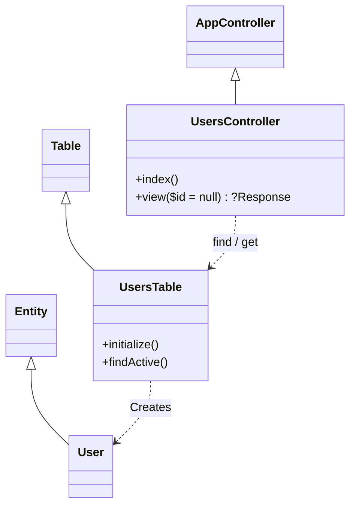
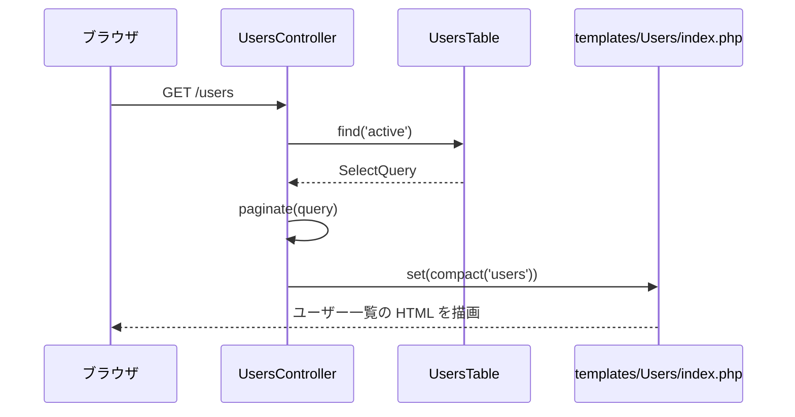
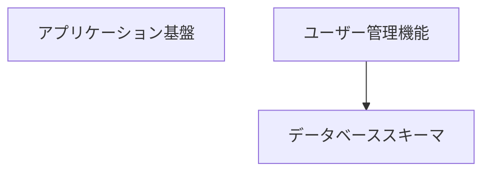

# CodeDoc — ソースコード自動ドキュメント生成システム

Tree-sitter による AST 解析と Vertex AI（Gemini）を組み合わせたパイプラインで、ソースコードから日本語の Wiki ドキュメントを自動生成するシステムです。さらに、Cloud Spanner 上にコードのナレッジグラフを構築することで、自然言語による質問応答や継承関係・呼出しチェーンといった構造的クエリ（graph-RAG）を可能にします。

中核となる実装は **`graph_generator/`** パッケージで、Google Gen AI SDK（`google-genai`）を直接利用する 10 フェーズパイプラインとして提供されます。解析対象は **PHP / CakePHP プロジェクト**に特化しており、tree-sitter による PHP の構造抽出に加えて、CakePHP のビューテンプレート（`.ctp`）の解析と Phinx マイグレーション（`config/Migrations/`）からの DB スキーマ検出に対応しています。さらに、呼出し・継承・インポートの解決には Intelephense（LSP）と CakePHP の文字列規約を用い、確定できた解決結果だけをグラフのエッジにします（誤エッジゼロ方針）。

---

## 目次

- [システム概要](#システム概要)
- [前提条件](#前提条件)
- [セットアップ](#セットアップ)
- [モデルの変更方法](#モデルの変更方法)
- [対応言語と除外ディレクトリ](#対応言語と除外ディレクトリ)
- [実行方法](#実行方法)
- [Intelephense によるセマンティック解決とゼロ誤エッジ保証](#intelephense-によるセマンティック解決とゼロ誤エッジ保証)
- [データベーススキーマ カテゴリ（自動生成）](#データベーススキーマ-カテゴリ自動生成)
- [出力結果の構造](#出力結果の構造)
- [出力例の詳細](#出力例の詳細)
- [webapp をローカルで実行する](#webapp-をローカルで実行する)
- [MCP サーバー](#mcp-サーバー)
- [パイプライン構成](#パイプライン構成)
- [ファイル構成](#ファイル構成)

---

## システム概要

CodeDoc は **10 フェーズ** のパイプラインでソースコードを解析し、以下を自動生成します。

| 生成物 | 内容 |
|-------|------|
| **ファイル要約** | 各ソースファイルの目的・クラス・メソッドの日本語要約 |
| **ディレクトリ要約** | ディレクトリ単位の上位要約（ボトムアップで集約） |
| **モジュール（トピック）ドキュメント** | 機能モジュールごとのドキュメント（Mermaid 図・コンポーネント表付き） |
| **reasoning_index.json** | 要約ツリー＋トピックツリーの構造化データ |
| **index.md** | プロジェクト全体の概要ドキュメント |
| **metadata.json** | 生成メタデータ（タイムスタンプ、モデル、統計） |
| **Spanner ナレッジグラフ** | Files / Classes / Methods / Modules / Directories / DbTables の 6 種類のノードと 11 種類のエッジ + `text-embedding-005` ベクトル |

```
ソースコード
   ↓ (Tree-sitter で AST 解析 → エンティティ抽出)
   ↓ (Gemini で要約・トピック抽出・モジュールドキュメント生成)
   ↓ (Intelephense LSP + CakePHP 規約で呼出し先を完全修飾名に解決)
   ↓ (Spanner にグラフ書込み + Vertex AI text-embedding-005 でベクトル化)
Wiki 用ドキュメント + ナレッジグラフ（graph-RAG クエリの基盤）
```

クエリは `graph_query_agent`（Spanner コードグラフに対する GQL 実行エージェント）が担当し、`mcp_server/` および `webapp/` のチャットから利用できます（詳細は後述の各セクションを参照）。

詳細な 10 フェーズの仕様は **[`graph_generator/manual.md`](graph_generator/manual.md)** を参照してください。

---

## 前提条件

| 項目 | 要件 |
|------|------|
| Python | 3.12 以上（リポジトリ自身は `uv` で 3.14 を使用していますが、3.12+ で動作します） |
| Google Cloud | プロジェクトが作成済みであること |
| Vertex AI API | `aiplatform.googleapis.com` を有効化済みであること |
| gcloud CLI | インストール・認証済みであること |
| Cloud Spanner | ナレッジグラフ（graph-RAG クエリ）用に Enterprise 階層のインスタンスが必要 |
| Intelephense（推奨） | `npm i -g intelephense` — Phase 1.6 の LSP 解決に使用。未導入でも動作しますが、解決は CakePHP 規約＋パーサーのみになります |

### Google Cloud の準備

```bash
# gcloud CLI のインストール（未インストールの場合）
# https://cloud.google.com/sdk/docs/install

# ログイン
gcloud auth login
gcloud auth application-default login

# プロジェクト設定
gcloud config set project YOUR_PROJECT_ID

# Vertex AI API の有効化
gcloud services enable aiplatform.googleapis.com
```

---

## セットアップ

### 1. リポジトリのクローンと依存関係のインストール

```bash
git clone <repository-url>
cd codedoc

# 仮想環境の作成（推奨）
python -m venv .venv
source .venv/bin/activate    # macOS/Linux
# .venv\Scripts\activate     # Windows

# 依存関係のインストール（フルパイプライン用）
pip install -r requirements.txt
```

`requirements.txt` には Google Gen AI SDK（`google-genai`）、Cloud Spanner クライアント、tree-sitter 本体と PHP 文法パッケージ（`tree-sitter-php`）、その他必要なライブラリがピン留めされた状態で含まれています。インストール内容の詳細は同ファイルを参照してください。

### 2. 環境変数の設定

設定はプロジェクトルートの `.env` ファイルから読み込まれます。テンプレートとして `.env.example` が用意されているのでコピーして編集してください。

```bash
cp .env.example .env
```

`.env` の主要なキー（基本は `.env.example` がテンプレート。LSP / vendor 関連のキーは任意で、未設定なら既定値が使われます）:

```bash
# --- Required: Google Cloud ---
GOOGLE_CLOUD_PROJECT=your-project-id
GOOGLE_GENAI_USE_VERTEXAI=true

# --- Gemini ---
GEMINI_MODEL=gemini-3.5-flash
GEMINI_CONCURRENCY=100

# --- Spanner Graph ---
SPANNER_INSTANCE=codedoc-instance
SPANNER_DATABASE=codedoc-db
# GRAPH_NAME=code_graph_a

# --- Output ---
OUTPUT_DIR=output_docs_pipeline
EMBED_CONCURRENCY=20

# --- LSP 解決（Phase 1.6）/ vendor 取込み（任意） ---
INTELEPHENSE_PATH=intelephense       # intelephense バイナリのパス
LSP_INDEX_TIMEOUT=300                # ワークスペースインデックスの待機秒数
LSP_REQUEST_TIMEOUT=15               # LSP リクエスト 1 件のタイムアウト秒数
POSSIBLY_CALLS_MAX_CANDIDATES=5      # PossiblyCalls エッジの候補ファンアウト上限
# INCLUDE_VENDOR=true                # 空（未設定）なら解析時に対話プロンプト

# GCE 上の SSL mTLS 問題を回避する場合のみ有効化
GCE_METADATA_MTLS_MODE=none
```

対話的に `.env` を生成したい場合は以下のコマンドが利用できます。

```bash
python -m graph_generator init
```

> **注意**: `GOOGLE_CLOUD_PROJECT` は実際の Google Cloud プロジェクト ID に置き換えてください。Vertex AI を経由するため `GOOGLE_GENAI_USE_VERTEXAI=true` は必須です。

---

## モデルの変更方法

使用する Gemini モデルは環境変数で制御します。

### ドキュメント生成パイプライン

`graph_generator/config.py` は `GEMINI_MODEL` 環境変数を読み込みます（デフォルト: `gemini-3.5-flash`）。

```bash
# .env で変更
GEMINI_MODEL=gemini-3.5-flash
```

```python
# graph_generator/config.py（参考）
MODEL = _env("GEMINI_MODEL", "gemini-3.5-flash")
```

### クエリエージェント

`graph_query_agent/agent.py` のモジュール定数で設定されます。

```python
MODEL = "gemini-3.5-flash"  # ← ここを変更
```

### 利用可能なモデル

| モデル | 特徴 | 推奨用途 |
|--------|------|----------|
| `gemini-3-pro-preview` | 高品質な推論・生成 | 重要プロジェクトのドキュメント生成 |
| `gemini-3.5-flash` | 高速・低コスト・バランス型 | ドキュメント生成（デフォルト）／クエリ応答 |
| `gemini-2.5-pro-preview-06-05` | 安定版 | 品質重視の場合 |
| `gemini-2.5-flash-preview-05-20` | 安定版・高速 | コスト重視の場合 |

> **ヒント**: 並行数（`GEMINI_CONCURRENCY`、デフォルト 100）が大きいほどスループットは上がりますが、Vertex AI のクォータに注意してください。レート制限が頻発する場合は `10`〜`30` 程度まで下げます。

---

## 対応言語と除外ディレクトリ

### 対応するソースファイル拡張子（2 種類）

以下の拡張子を持つファイルが自動的にスキャン・解析されます。

| カテゴリ | 拡張子 |
|---------|--------|
| **PHP** | `.php` |
| **CakePHP ビューテンプレート** | `.ctp`（CakePHP 3 以前のテンプレート） |

スキャンされたファイルはすべて Phase 1.5 で tree-sitter（`tree-sitter-php`）による構造抽出の対象になります。抽出されるのは、クラス／インターフェイス／トレイト／enum（ケース含む）、メソッド（可視性・`static`・`abstract`・`final` の修飾子、パラメータ、戻り値型付き）、クラスプロパティ、継承関係（`extends`／`implements`／トレイト `use`）、`use` インポートと `require`/`include`、名前空間です。トップレベル関数は `(global)` 擬似クラスに集約され、メソッド呼び出しエッジは `foo()`・`$obj->foo()`・`$obj?->foo()`・`Foo::bar()` の各形式から収集されます。HTML が混在する PHP も扱えるフル文法（`language_php()`）を使用しているため、CakePHP テンプレートもそのまま解析できます。

### 自動除外されるディレクトリ

以下のディレクトリはスキャン対象から自動的に除外されます（先頭が `.` で始まるディレクトリも自動的にスキップされます）。

```
.git, .svn, .hg, node_modules, __pycache__,
.idea, .vscode, build, dist, bin,
venv, .venv, vendor, tmp, logs, webroot
```

> **CakePHP プロジェクトの場合**: Composer の `vendor`、CakePHP の `tmp`・`logs`・`webroot`・`bin` が自動除外されるため、依存パッケージ・一時ファイル・静的アセット・`cake` コンソールはスキャンされません。一方 `config/Migrations` は除外されずスキャン対象となり、後述の [データベーススキーマ カテゴリ](#データベーススキーマ-カテゴリ自動生成) の検出に利用されます。なお `vendor` に限り、[vendor ディレクトリの取り扱い](#vendor-ディレクトリの取り扱い) のとおり明示的にグラフへ取り込むこともできます。

### カスタマイズ

対応拡張子や除外ディレクトリを変更したい場合は、**`graph_generator/config.py`** の `SOURCE_EXTENSIONS` および `SKIP_DIRS` を編集してください。

```python
# graph_generator/config.py

# PHP only. `.ctp` covers legacy CakePHP (≤3) view templates — plain PHP syntax.
SOURCE_EXTENSIONS = {
    ".php", ".ctp",
}

# `vendor` (Composer), `tmp`/`logs`, and `webroot` (assets + front controller)
# are CakePHP noise; `bin` holds only the `cake` console bootstrap.
# NOTE: `config/Migrations` must stay scannable — DB_SCHEMA_DETECTORS below
# relies on it.
SKIP_DIRS = {
    ".git", ".svn", ".hg", "node_modules", "__pycache__",
    ".idea", ".vscode", "build", "dist",
    "bin", "venv", ".venv",
    "vendor", "tmp", "logs", "webroot",
}
```

---

## 実行方法

CLI は `python -m graph_generator <command>` の形式で起動します。代表的なコマンドは以下のとおりです。

| コマンド | 説明 | 実行フェーズ |
|---------|------|-------------|
| `init` | 対話的に `.env` を生成 | -- |
| `setup spanner` | Spanner インスタンス + データベース + テーブル + プロパティグラフを作成（既存 DB には不足テーブル／カラムだけを冪等に追加） | -- |
| `generate wiki <target_dir>` | **ドキュメントのみ**生成（→ `output_docs_pipeline/`） | Phase 1〜6 |
| `generate graph <target_dir>` | **Spanner グラフのみ**生成（pickle がなければ Phase 1 + 1.5 を自動実行） | Phase 1, 1.5, 1.6, 1.7, 8〜10 |
| `analyze <target_dir>` | **フルパイプライン**（ドキュメント + グラフ + エンベディング） | Phase 1〜10 |
| `upload graph <target_dir>` | グラフを Spanner にアップロード（`generate graph` のエイリアス） | Phase 1, 1.5, 1.6, 1.7, 8〜10 |
| `evaluate` | `test_codes/` フィクスチャに対する抽出＋解決の精度評価（**ローカル実行・GCP 不要**） | Phase 1, 1.5, 1.6, 1.7 |
| `validate` | Spanner グラフの行数カウントと孤立エッジ検出（PossiblyCalls / TableReferences 等を含む）を行い整合性を検証 | -- |

補足:

- `analyze` / `generate wiki` / `generate graph` は `--include-vendor` / `--exclude-vendor` フラグを受け付けます（詳細は [vendor ディレクトリの取り扱い](#vendor-ディレクトリの取り扱い)）。
- 既存データベースへのスキーマ反映だけを行う場合は `python -m graph_generator.setup_spanner_graph --migrate` を使います。`INFORMATION_SCHEMA` との差分から `CREATE TABLE` / `ALTER TABLE ADD COLUMN` のみを発行するためデータは保持され、プロパティグラフは `CREATE OR REPLACE` で更新されます。

### 推奨ワークフロー

```bash
# 1. 設定生成（対話的）
python -m graph_generator init

# 2. Spanner リソースを作成
python -m graph_generator setup spanner

# 3. ドキュメント＋グラフを一気に生成
python -m graph_generator analyze /path/to/your/source

# 4. Spanner グラフの整合性を検証
python -m graph_generator validate
```

### 単独実行のパターン

```bash
# ドキュメントだけ欲しい（グラフ機能は不要）
python -m graph_generator generate wiki /path/to/source

# 既にドキュメントは生成済みで、グラフだけ追加したい
python -m graph_generator generate graph /path/to/source
```

`generate wiki` 完了時にパイプライン状態が `output_docs_pipeline/pipeline_data.pkl` に保存されるため、`generate graph` はそれを読み込んでグラフ生成だけを実行できます。pickle が無い場合は Phase 1（スキャン）と Phase 1.5（tree-sitter）を自動で再実行し、ディスク上に既に存在する要約をロードしてからグラフ生成に進みます。Phase 1.6（LSP 解決）と Phase 1.7（DB スキーマ）はグラフ生成トラックの冒頭で毎回実行されます — Phase 1.6 は `resolutions.json` によりファイル単位（mtime）でレジュームされ、Phase 1.7 はローカルで即座に再構築されます。

### vendor ディレクトリの取り扱い

`vendor/` は既定でスキャン対象外です。グラフに取り込みたい場合は次のいずれかで指定します（優先順: CLI フラグ → `.env` の `INCLUDE_VENDOR` → 対話プロンプト）。

```bash
python -m graph_generator analyze /path/to/source --include-vendor   # 取り込む（プロンプト抑止）
python -m graph_generator analyze /path/to/source --exclude-vendor   # 取り込まない（プロンプト抑止）
```

- フラグも `INCLUDE_VENDOR` も未指定のまま vendor 配下に PHP ファイルが見つかると、解析時に**ファイル数と合計サイズを表示して対話的に確認**します（非対話実行時は除外にフォールバック）。
- 取り込んだ場合、vendor ファイルは `origin='vendor'` のノード／エッジとしてグラフに入りますが、コスト抑制のため **Gemini ドキュメント生成（Phase 2〜6）とエンベディング（Phase 10）の対象からは除外**されます。
- vendor をグラフに取り込まない場合でも Intelephense は vendor をインデックスするため、vendor への呼出しは `external`（確定済み・グラフ外）として集計されます — 名前だけの推測で誤ったエッジになることはありません。

### 精度評価（`evaluate`・GCP 不要）

コミット済みフィクスチャ `test_codes/php_plain`（フレームワークなし）と `test_codes/php_cakephp`（実 CakePHP アプリ）に対して Phase 1 / 1.5 / 1.6 / 1.7 とノード／エッジ導出をローカル実行し、正解データ `ground_truth.json` と突き合わせます。

```bash
python -m graph_generator evaluate                       # 既定は --fixture all
python -m graph_generator evaluate --fixture php_plain   # php_plain | php_cakephp | all
python -m graph_generator evaluate --dump-edges          # 導出エッジ（MethodCalls 等）をレポートに含める
```

レポート項目は **ground-truth 正答率・エンティティカバレッジ・QA 正答率・誤エッジ数** の 4 つ。終了コードは、すべて 85% 以上かつ誤エッジ 0 件で `0`、目標未達で `1`、環境不備（`php_cakephp` の vendor が `composer install` されていない等）で `2` です。

### パイプラインの 10 フェーズ（概要）

| Phase | 名称 | 概要 |
|-------|------|------|
| 1 | File Scanner | 対象ディレクトリを再帰走査しソースファイルを収集 |
| 1.5 | Tree-sitter Entities | AST 解析でクラス／メソッド／インポート等をローカル抽出（API 呼出しゼロ） |
| 1.6 | LSP Resolution | Intelephense（LSP）+ CakePHP 文字列規約で呼出し・継承・インポートを完全修飾名に解決（ローカル、API 呼出しゼロ。グラフ生成トラックの冒頭で実行） |
| 1.7 | DB Schema | Phinx マイグレーションを決定論的に再生して最終 DB スキーマを構築（DB 接続不要。同じくグラフ生成トラックで実行） |
| 2 | File Summaries | Gemini で各ファイルの要約を並行生成 |
| 3 | Dir Summaries | ボトムアップでディレクトリ要約を生成（深さレベル別並行） |
| 4 | Topic Extraction | ファイル要約から機能モジュール（トピック）を識別 |
| 5 | Topic Summaries | 各トピックの包括ドキュメント（Mermaid 図付き）を生成 |
| 6 | Index Assembly | `reasoning_index.json` / `index.md` / `metadata.json` を出力 |
| 7 | （欠番） | 旧 LLM ベースのエンティティ抽出は Phase 1.5 の tree-sitter に置換済み |
| 8 | Write Graph Nodes | Files / Classes / Methods / Modules / Directories / DbTables の 6 種類のノードを Spanner に書込み |
| 9 | Write Graph Edges | Phase 1.6/1.7 の解決結果から導出した 11 種類のエッジ（MethodCalls / PossiblyCalls 等）を並行で書込み |
| 10 | Generate Embeddings | `text-embedding-005` で Files / Classes / Modules のベクトルを生成 |

レジューム（途中中断後の再実行）、リトライ機構、エラーログの仕様などの詳細は **[`graph_generator/manual.md`](graph_generator/manual.md)** を参照してください。

> **処理時間の目安**: 30 ファイル程度のプロジェクトで数分、数千ファイルのリポジトリは並行数とモデル選択次第で十数分〜1 時間程度になります。Phase 1.5（tree-sitter）は API を一切使用しないため、37,000 ファイル規模でも約 40 秒で完了します。

> **テストフィクスチャ**: `test_codes/php_plain` と `test_codes/php_cakephp` は正解データ（`ground_truth.json`）付きの**コミット済み**フィクスチャで、`evaluate` コマンドの評価対象です（`php_cakephp` の `vendor/` 等のみローカルで `composer install` して生成）。本番では自分のプロジェクトディレクトリのパスを `<target_dir>` に指定してください。

---

## Intelephense によるセマンティック解決とゼロ誤エッジ保証

グラフ生成トラックの冒頭（Phase 8 の前）で、**Phase 1.6（LSP Resolution）** がすべての PHP 呼出し・継承・インポートの解決を行います（`graph_generator/resolution.py` / `lsp_client.py` / `php_conventions.py`。ローカル実行・API 呼出しゼロ）。

- **Intelephense（LSP）**: パーサーが捉えた各呼出し位置に `textDocument/definition` を発行し、エイリアス付き `use`・レシーバ型・fluent チェーン・`parent::` などを正確な完全修飾名に解決します。導入は `npm i -g intelephense`（パスは `.env` の `INTELEPHENSE_PATH`）。
- **CakePHP 文字列規約**: `fetchTable('Users')` → `App\Model\Table\UsersTable`、プラグインドット記法 `'Billing.Audit'`、`loadComponent`／`addBehavior`、`Table::__call` によるマジックファインダー、エンティティ仮想フィールドなどを候補化し、**実在するクラス／メンバーに確認できた場合のみ**採用します。
- 各解決レコードは status（`resolved`＝グラフ内の確定ターゲット / `external`＝確定したがグラフ外（vendor 等） / `ambiguous` / `dynamic` / `unresolved`）と由来 `via`（`lsp` / `convention:<ルール名>` / `parser`）を持ち、`resolutions.json` にチェックポイントされます（ファイル単位の mtime でレジューム）。
- Intelephense が見つからない場合は**大きく警告を表示したうえで**規約＋パーサーのみの解決に切り替えます。確認できなかった呼出しは PossiblyCalls に回るだけで、旧来の「単純名一致」による誤ったエッジ生成には決してフォールバックしません。

**ゼロ誤エッジ保証**: `MethodCalls` / `ClassInherits` / `FileImports` / `FileDependsOn` の各エッジは、**`resolved` かつターゲットがグラフ内ノードである解決レコードからのみ**生成され、それぞれ由来を示す `resolution` プロパティを持ちます。`external` なターゲットは件数として集計されるだけでエッジにはなりません。`ambiguous` / `dynamic` / `unresolved` の呼出しは専用エッジ **`PossiblyCalls`**（名前ヒューリスティック／候補のファンアウトを `POSSIBLY_CALLS_MAX_CANDIDATES`＝既定 5 で上限）に分離されます。first-definition-wins の単純名マッチングは廃止されました。

ノード ID は「解析対象ルートからの**相対パス + FQCN**」のハッシュで決まるため、マシン間でポータブルであり、ファイル／名前空間／プロジェクトをまたいだ同名クラス・同名メソッドがひとつのノードに混ざることはありません。

### グラフのノードとエッジ（6 ノード / 11 エッジ）

スキーマの単一の情報源は `graph_generator/setup_spanner_graph.py` のスキーマ定義（`NODE_SPEC` / `EDGE_SPEC`）です。詳細な列定義とマッピングは **[`GRAPH_SCHEMA_GUIDE.md`](GRAPH_SCHEMA_GUIDE.md)** を参照してください。

- **ノード（6 種類）**: `Files` / `Classes` / `Methods` / `Modules` / `Directories` / **`DbTables`（新規）**。主要ノードには `origin`（app｜vendor）、`fqcn`／`fqmn`、`start_line`／`end_line` などの列が追加されています。`DbTables` は columns / indexes / foreign_keys（JSON）、source_file、plugin を保持します。
- **エッジ（11 種類）**: `FileImports`（解決済み `use` から生成されるようになりました）/ `FileDependsOn` / `ClassInherits` / `MethodCalls`（`resolution`・`call_line` 付き）/ **`PossiblyCalls`（新規）** / `FileDefinesClass` / `ClassDefinesMethod` / `FileBelongsToModule` / `DirContainsFile` / **`TableReferences`（新規）**＝外部キーによるテーブル間参照 / **`ClassMapsToTable`（新規）**＝CakePHP の Table クラス → DbTable（`setTable('x')` リテラルなら `via='settable'`、それ以外は Inflector 規約で `via='convention'`）。

**Phase 1.7（DB Schema）** は `config/Migrations/`（プラグイン含む）配下の CakePHP/Phinx マイグレーションを `graph_generator/migration_parser.py` で決定論的に再生し、最終スキーマ（テーブル／カラム／インデックス／外部キー）を構築します（DB 接続不要）。これが `DbTables` ノードと `TableReferences` / `ClassMapsToTable` エッジの供給元です（例: `CreateUsers` マイグレーション → `users` テーブル → `UsersTable` クラス。Gemini による ER 図ドキュメント生成 `phase_schema_docs` とは独立）。

---

## データベーススキーマ カテゴリ（自動生成）

解析対象のコードベースに DB スキーマ／マイグレーションファイルが含まれている場合、通常のトピック（LLM が推論する機能モジュール）に加えて、**`データベーススキーマ`** カテゴリが決定論的に自動追加され、**専用の `schema/` ディレクトリ**に展開されます。

- **`output_docs_pipeline/schema/index.md`** — スキーマ全体の概要、Mermaid `erDiagram` による ER 図、各テーブルへのリンク付きの **テーブル一覧表**。
- **`output_docs_pipeline/schema/<テーブル名>.md`** — テーブルごとに 1 ページ。**カラム**（名前／型／制約／説明の表）、**インデックス**、**外部キー**、**リレーション**を記載。
- **`output_docs_pipeline/topics/データベーススキーマ.md`** — `index.md` のモジュール一覧から辿れる**ポインターページ**。`schema/index.md` と各テーブルページへのリンク集として機能します（旧バージョンの単一 ER ページの代わり）。Spanner グラフ側でも他のトピックと同様に `Modules` ノードとして取り込まれます。

生成は **1 回の構造化 LLM 抽出 → 純粋な Python による決定論的レンダリング** で完結します（Phase 4 と Phase 5 の間で走る `phase_schema_docs` が担当）。Mermaid 構文やテーブル列は LLM 出力ではなく抽出済みデータから組み立てるため、出力が安定し、テーブル数が増えても LLM コストはほぼ一定です。抽出が失敗した場合は Phase 5 の `DB_SCHEMA_PROMPT` 分岐で単一ページのドキュメントを生成するフォールバックがあり、`schema/index.md` が既に存在する場合は再生成をスキップしてレジューム可能です。

現在は **CakePHP (Phinx Migrations)** に対応しています（`config/Migrations/` 配下の `.php` マイグレーションファイルをパスで検出します。通常は `Migrations\AbstractMigration` を継承するクラスです）。他のフレームワーク（Rails、Prisma、Django、Raw SQL DDL など）への対応は `graph_generator/config.py` の `DB_SCHEMA_DETECTORS` に検出器辞書を 1 つ追加するだけで拡張でき、`pipeline.py` の変更は不要です。詳細は **[`graph_generator/manual.md`](graph_generator/manual.md#データベーススキーマ-カテゴリ)** を参照してください。

> **注意**: 検出は Phase 1 でスキャンされたファイルのみが対象です。`.sql` などデフォルトでスキャン対象外の拡張子を使うフレームワークを追加する場合は、同じ `config.py` の `SOURCE_EXTENSIONS` への追加が前提になります。また、このカテゴリと `schema/` ディレクトリは docs パイプライン（Phase 4〜6 + `phase_schema_docs`）で生成されるため、ドキュメント未生成のリポジトリに `generate graph` を直接実行した場合はグラフに現れません。

---

## 出力結果の構造

`generate wiki` または `analyze` を実行すると、`$OUTPUT_DIR`（既定 `output_docs_pipeline/`）以下に次の構造でドキュメントが生成されます。

```
output_docs_pipeline/
├── index.md                              # プロジェクト全体の概要
├── reasoning_index.json                  # 構造化データ（機械可読）
├── metadata.json                         # 生成メタデータ
├── entities.json                         # Phase 1.5 で抽出した tree-sitter エンティティ
├── resolutions.json                      # Phase 1.6 の解決結果チェックポイント（グラフ生成時。mtime レジューム）
├── pipeline_data.pkl                     # フェーズ間でのデータ受け渡し（generate graph がこれを再利用）
├── timing_report.json                    # 各フェーズの実行時間レポート
├── summaries/
│   ├── files/
│   │   ├── src_Controller_UsersController.php.md  # 各ソースファイルの要約
│   │   └── ...
│   └── dirs/
│       ├── src.md                        # 各ディレクトリの要約
│       └── ...
├── topics/
│   ├── topic_tree.json                   # トピック構造定義
│   ├── ユーザー管理機能.md                # モジュール（トピック）ドキュメント
│   ├── アプリケーション基盤.md            # モジュール（トピック）ドキュメント
│   ├── データベーススキーマ.md            # （DB スキーマ検出時）schema/ へのポインターページ
│   └── ...
└── schema/                               # phase_schema_docs で生成（DB スキーマ検出時のみ）
    ├── index.md                          # 概要 + Mermaid erDiagram + テーブル一覧
    ├── users.md                          # テーブルごとに 1 ページ
    └── ...                               #   （カラム / インデックス / 外部キー / リレーション）
```

ファイル名はパス区切りをアンダースコアに変換した形（例: `src/Controller/UsersController.php` → `src_Controller_UsersController.php.md`）になります。

---

## 出力例の詳細

### ファイル要約の例

`output_docs_pipeline/summaries/files/<ファイル名>.md` には、Gemini が生成した数段落の日本語要約が記録されます。

> このファイル `UsersController.php` は、CakePHP アプリケーションのユーザー管理機能を担うコントローラークラス `UsersController` を定義しています。`App\Controller` 名前空間に属し、共通基底クラスである `AppController` を継承して、`index` と `view` の 2 つのアクションを公開しています。
>
> `index` アクションは `UsersTable` の `find('active')` で有効なユーザーの一覧を取得し、`paginate` によるページネーションを適用してビューへ渡します。`view` アクションは URL パラメータ `$id` を受け取り、`$this->Users->get($id)` で単一の `User` エンティティを取得して詳細画面を表示します。

### モジュールドキュメントの例

`output_docs_pipeline/topics/<トピック名>.md` には次のような情報が自動生成されます。

**1. クラス関係図（Mermaid）**



**2. コンポーネント表**

| コンポーネント | 責務 |
|-----------|----------------|
| **UsersController** | `index`（一覧）と `view`（詳細）のアクションを提供する HTTP リクエストの受け口。 |
| **UsersTable** | `users` テーブルへのアクセスと `findActive` カスタムファインダーを提供するテーブルクラス。 |

**3. データフロー図（Mermaid）**



**4. 依存関係（他モジュールへのリンク）**

- **[アプリケーション基盤](アプリケーション基盤.md)**: `UsersController` は共通基底クラス `AppController` を継承しています。
- **[データベーススキーマ](データベーススキーマ.md)**: `users` テーブルの定義は `config/Migrations/` の Phinx マイグレーション（`CreateUsers`）に由来します。

### index.md の例

プロジェクト全体の概要ドキュメントで、高レベルのアーキテクチャ図とモジュールリンクが含まれます。



### metadata.json の例

```json
{
  "generation_info": {
    "timestamp": "2026-04-10T12:00:00.000000",
    "model": "gemini-3.5-flash",
    "generator": "pipeline_v2 (google-genai)",
    "repo_path": "/path/to/source"
  },
  "statistics": {
    "total_files": 200,
    "total_directories": 30,
    "total_topics": 8
  }
}
```

---

## webapp をローカルで実行する

`webapp/` は **FastAPI（バックエンド）+ Vite/React 19（フロントエンド）** で構築されたドキュメントビューア兼チャット UI です。生成済みのドキュメントをブラウザで閲覧でき、`graph_query_agent`（Spanner コードグラフに GQL を実行する構造解析エージェント）を使ったチャット応答機能も組み込まれています。

### ドキュメントの読み込み元

`webapp/main.py` の `DOCS_DIR` は、パイプライン本体（`graph_generator/config.py`）と同じ `OUTPUT_DIR` 環境変数を参照します（既定値も同じく `output_docs_pipeline/`）。webapp は起動時にリポジトリルートの `.env` を読み込むため、`generate wiki` や `analyze` で生成したドキュメントは追加設定なしでそのまま表示されます。

出力先を変更している場合は、パイプライン実行時と webapp 起動時で同じ `OUTPUT_DIR` をリポジトリルートの `.env` に設定し、両者の値を揃えてください。

> **注意**: チャットタブは `graph_query_agent` を直接呼び出すため、Spanner コードグラフ（`codedoc-instance` / `codedoc-db` / `code_graph_a`）が構築済み（`setup spanner` → `analyze` → `upload graph`）である必要があります。

### バックエンド（FastAPI）

```bash
# リポジトリルートから
pip install -r webapp/requirements.txt

# webapp はリポジトリルートの .env に続けて graph_query_agent/.env を自動で
# 読み込みます（dotenv は既存の値を上書きしません）。そのため graph_query_agent/.env に
# Vertex AI 設定が入っていれば、ルート .env が無くても API キー不要（Vertex AI / ADC）で
# 動作します。ルート .env を置いた場合はそちらが優先されます。
#
# 最低限の設定（ルート .env もしくは graph_query_agent/.env のいずれか）:
# GOOGLE_CLOUD_PROJECT=YOUR_PROJECT_ID
# GOOGLE_GENAI_USE_VERTEXAI=true   # ← これが無いと Gemini Developer API 扱いになり API キーを要求される
#
# チャット機能（graph_query_agent）を使うには、Spanner コードグラフが
# 構築済みである必要があります。グラフの接続先は環境変数で指定します
# （既定値は実インスタンスと一致するため通常は設定不要）:
#   - SPANNER_INSTANCE=codedoc-instance
#   - SPANNER_DATABASE=codedoc-db
#   - GRAPH_NAME=code_graph_a

# 開発サーバーを起動
uvicorn webapp.main:app --reload --port 8000
```

これで `http://localhost:8000` で FastAPI サーバーが起動します。

### フロントエンド（Vite 開発サーバー）

開発時はホットリロードが効く Vite 開発サーバーを使うのが便利です。

```bash
cd webapp/frontend
npm install
npm run dev
```

`http://localhost:5173` をブラウザで開きます。Vite の `vite.config.js` で `/api` リクエストは `http://localhost:8000` にプロキシされる設定になっているため、バックエンドを `port 8000` で並行起動しておけばそのまま動作します。

### フロントエンド（本番ビルド・シングルサーバー構成）

本番運用や、フロントエンドとバックエンドを 1 つのポートで配信したい場合はビルド成果物を FastAPI から配信できます。

```bash
cd webapp/frontend
npm run build      # → webapp/frontend/dist/ に成果物が生成される

# あとはバックエンドだけ起動すれば OK
cd ../..
uvicorn webapp.main:app --port 8000
```

`webapp/main.py` の末尾は `frontend/dist/` が存在する場合に限り `/` 配下に静的ファイルをマウントするようになっているので、`http://localhost:8000` をブラウザで開けば SPA がそのまま表示されます。

### 主な API エンドポイント

| メソッド | パス | 概要 |
|---------|------|------|
| `GET` | `/api/docs/index` | `index.md` を Markdown + HTML レンダリング結果として返す |
| `GET` | `/api/docs/tree` | トピック／ファイル要約／ディレクトリ要約の一覧をツリー構造で返す |
| `GET` | `/api/docs/topics` | `topic_tree.json` の中身を返す |
| `GET` | `/api/docs/topics/{topic_name}` | 指定トピックのドキュメントを返す |
| `GET` | `/api/docs/summaries/{files\|dirs}/{name}` | ファイル／ディレクトリ要約を返す |
| `GET` | `/api/docs/metadata` | `metadata.json` を返す |
| `POST` | `/api/chat` | `graph_query_agent` への単発質問（最終応答のみ返却） |
| `POST` | `/api/chat/stream` | `graph_query_agent` への質問（Server-Sent Events で逐次配信） |

---

## MCP サーバー

`mcp_server/` は CodeDoc のクエリエージェントを [Model Context Protocol](https://modelcontextprotocol.io) 経由で外部ホスト（Antigravity CLI、Claude Code、MCP Inspector など）に公開する FastMCP ベースのサーバーです。streamable-http トランスポートで動作し、ローカル起動と Cloud Run へのデプロイの両方をサポートします。

```bash
# ローカル起動 → http://127.0.0.1:8080/mcp
python -m mcp_server
```

`ask_codebase(question, session_id?)` ツールが、本リポジトリの **`graph_query_agent`**（Spanner コードグラフを用いるクエリエージェント。`adk run graph_query_agent` で単体起動するものと同一）を呼び出し、クラス関係・呼び出し階層・継承・影響範囲などの質問に回答します。`session_id` を渡すと同一スレッドで会話を継続できます。詳細は **[`mcp_server/README.md`](mcp_server/README.md)** を参照してください。

---

## パイプライン構成

```mermaid
graph LR
    subgraph Phase1["Phase 1: Scanner"]
        S1[scan_and_build_tree]
    end

    subgraph Phase15["Phase 1.5: Tree-sitter Entities"]
        TS[parse_entities]
    end

    subgraph Phase2["Phase 2: ファイル要約"]
        FS[file_summarizer]
    end

    subgraph Phase3["Phase 3: ディレクトリ要約"]
        DS[dir_summarizer]
    end

    subgraph Phase4["Phase 4: トピック抽出"]
        TE[topic_extractor]
    end

    subgraph Phase5["Phase 5: トピック要約"]
        TW[topic_writer]
    end

    subgraph Phase6["Phase 6: インデックス組立"]
        IW[index_writer]
    end

    subgraph Phase16["Phase 1.6: LSP 解決"]
        RS[run_resolution]
    end

    subgraph Phase17["Phase 1.7: DB スキーマ"]
        MS[build_schema]
    end

    subgraph Phase8["Phase 8: グラフノード"]
        GN[write_nodes]
    end

    subgraph Phase9["Phase 9: グラフエッジ"]
        GE[write_edges]
    end

    subgraph Phase10["Phase 10: エンベディング"]
        EM[generate_embeddings]
    end

    Phase1 --> Phase15 --> Phase2 --> Phase3 --> Phase4 --> Phase5 --> Phase6 --> Phase16 --> Phase17 --> Phase8 --> Phase9 --> Phase10
```



各フェーズの詳細仕様、レジューム機構、エラーハンドリング、リトライ戦略、パフォーマンス特性については以下を参照してください。

- **[`graph_generator/manual.md`](graph_generator/manual.md)** — 10 フェーズの詳細マニュアル
- **[`ARCHITECTURE.md`](ARCHITECTURE.md)** — パイプラインの全体アーキテクチャ

---

## ファイル構成

```
codedoc/
├── .env                          # Google Cloud 認証・モデル・Spanner 設定
├── .env.example                  # .env のテンプレート
├── requirements.txt              # Python 依存パッケージ（フルピン留め）
├── graph_generator/              # 中核のパイプライン実装（10 フェーズ）
│   ├── __main__.py               # CLI エントリーポイント
│   ├── pipeline.py               # 10 フェーズパイプライン本体
│   ├── treesitter_parser.py      # tree-sitter による PHP の AST エンティティ抽出（.ctp 含む）
│   ├── resolution.py             # Phase 1.6: Intelephense + CakePHP 規約による意味解決
│   ├── lsp_client.py             # Intelephense（LSP）クライアント
│   ├── php_conventions.py        # CakePHP 文字列規約 → FQCN 候補（純関数）
│   ├── migration_parser.py       # Phase 1.7: Phinx マイグレーション再生 → DB スキーマ
│   ├── evaluate.py               # evaluate コマンド本体（test_codes/ フィクスチャ評価）
│   ├── config.py                 # 設定（環境変数 + デフォルト）
│   ├── prompts.py                # Gemini 用プロンプト群
│   ├── setup_spanner_graph.py    # Spanner インスタンス + DB + テーブル + グラフを作成（--migrate 対応）
│   └── manual.md                 # 詳細マニュアル（日本語）
├── graph_query_agent/            # Spanner コードグラフに GQL を実行するクエリエージェント（graph-RAG）
│   └── agent.py
├── mcp_server/                   # MCP プロトコル経由で graph_query_agent を公開
│   ├── README.md
│   ├── server.py
│   └── deploy.sh                 # Cloud Run デプロイ
├── webapp/                       # FastAPI + Vite/React 19 のビューア兼チャット UI
│   ├── main.py                   # FastAPI 本体（DOCS_DIR は OUTPUT_DIR、既定 output_docs_pipeline/）
│   ├── requirements.txt
│   └── frontend/                 # React フロントエンド
│       ├── package.json
│       └── vite.config.js
├── test_codes/                   # コミット済み評価フィクスチャ（php_plain / php_cakephp + ground_truth.json）
└── output_docs_pipeline/         # 生成ドキュメントのデフォルト出力先
```

---

## ライセンス

（プロジェクトのライセンスをここに記載してください）
