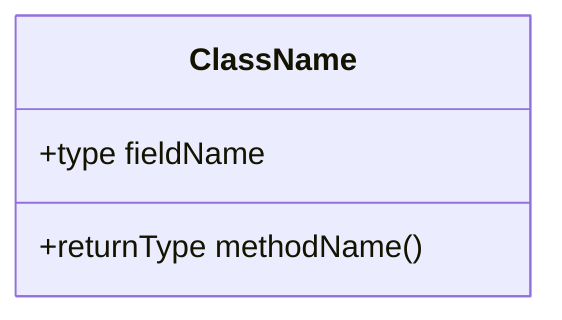
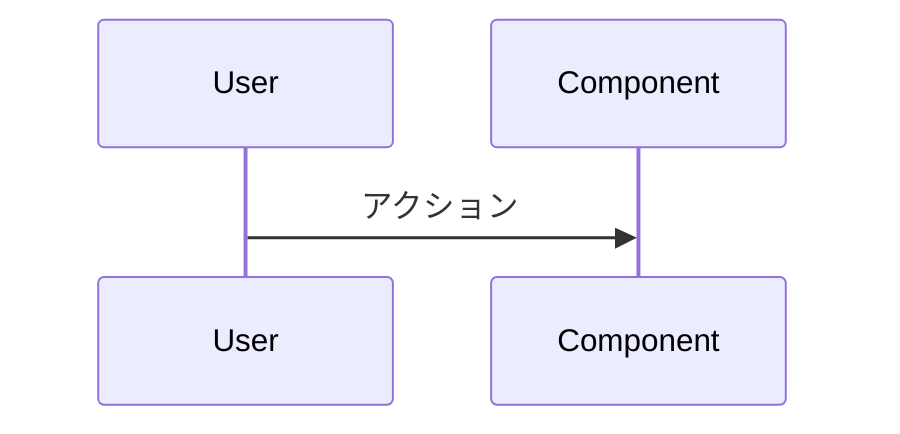

# graph_generator パイプライン マニュアル

## 目次

1. [概要](#概要)
2. [CLI コマンド](#cli-コマンド)
3. [パイプラインフェーズ](#パイプラインフェーズ)
4. [データベーススキーマ カテゴリ](#データベーススキーマ-カテゴリ)
5. [レジューム機能](#レジューム機能)
6. [設定](#設定)
7. [使い方](#使い方)
8. [クエリエージェント](#クエリエージェント)
9. [出力構成](#出力構成)
10. [レート制限とエラーハンドリング](#レート制限とエラーハンドリング)
11. [進捗表示](#進捗表示)
12. [リトライ機構](#リトライ機構)
13. [エラーログ](#エラーログ)
14. [ヘルパー関数](#ヘルパー関数)
15. [パフォーマンスノート](#パフォーマンスノート)

---

## 概要

`graph_generator` は、PHP（CakePHP 対応）のソースコードリポジトリを自動的にスキャンし、tree-sitter でエンティティを高速抽出し、Gemini（Google Gen AI SDK 経由の Vertex AI）を使用してドキュメントを生成し、Cloud Spanner 上にナレッジグラフを構築し、Vertex AI のテキストエンベディングを生成する **10 フェーズ** のパイプラインです。出力は日本語で生成されます。

パイプラインは3つの実行モードに分割されています:

- **`run_docs_pipeline()`** -- ドキュメント生成のみ（Phase 1-6）
- **`run_graph_pipeline()`** -- グラフ生成のみ（Phase 8-10）
- **`run_pipeline()`** -- フルパイプライン（Phase 1-10）

`__main__.py` の CLI コマンドでこれらのモードを選択的に実行できます（[CLI コマンド](#cli-コマンド)を参照）。ドキュメント生成とグラフ生成を別々に実行する場合、`PipelineData` は pickle ファイル（`pipeline_data.pkl`）として保存・復元されます。

### パイプラインが行うこと

1. **ソースコードスキャン** -- 対象ディレクトリを再帰的にスキャンし、サポートされる拡張子（`.php` / `.ctp` の2種類）のソースファイルを収集
2. **Tree-sitter エンティティ抽出** -- tree-sitter AST 解析で PHP のクラス/インタフェース/トレイト/enum/メソッド/プロパティ/継承/trait use/名前空間/use インポートをローカル抽出（API 呼出しゼロ）
3. **ファイル要約生成** -- Gemini API を使用してファイル単位の要約を並行生成（要約のみ、エンティティは Phase 1.5 で抽出済み）
4. **ディレクトリ要約生成** -- ボトムアップで子要約を統合したディレクトリ要約を深さレベル別に並行生成
5. **トピック抽出** -- ファイル要約から機能モジュール（トピック）を自動識別
6. **トピックドキュメント生成** -- 各トピックの包括的ドキュメントを Mermaid 図付きで生成
7. **インデックス生成** -- 構造化インデックス、目次、メタデータを出力
8. **ナレッジグラフノード構築** -- Cloud Spanner にノードを書き込み（リトライ付きバッチ挿入）
9. **ナレッジグラフエッジ構築** -- Cloud Spanner にエッジを並行書込み（ThreadPoolExecutor 7 並行）
10. **エンベディング生成** -- `text-embedding-005` モデルでノードのベクトル表現を並行生成

### 10フェーズ パイプラインアーキテクチャ

```
ソースコード
    |
    v
[Phase 1]    Scanner              -- ファイル収集・ツリー構築・チェックポイント読込
    |
    v
[Phase 1.5]  Tree-sitter Entities -- AST解析でエンティティ抽出（PHP対応・API呼出しゼロ）
    |                                ── run_docs_pipeline() ──
    v
[Phase 2]    File Summaries       -- Gemini 並行呼出し・要約のみ・ディスク即時保存
    |
    v
[Phase 3]    Dir Summaries        -- ボトムアップ深さレベル別並行処理・子要約統合・ディスク保存
    |
    v
[Phase 4]    Topic Extraction     -- トップレベルディレクトリ別ファンアウト・TOPIC_MERGE_PROMPT で統合
    |
    v
[Phase 5]    Topic Summaries      -- トピック毎の包括的ドキュメント生成（basename_to_path 辞書で高速ルックアップ）
    |
    v
[Phase 6]    Index Assembly       -- reasoning_index.json / index.md / metadata.json 出力
    |                                ── run_graph_pipeline() ──
    v
[Phase 8]    Write Graph Nodes    -- Files/Classes/Methods/Modules/Directories を Spanner に書込み（リトライ付き）
    |
    v
[Phase 9]    Write Graph Edges    -- 7種類のエッジを ThreadPoolExecutor で 7 並行書込み
    |
    v
[Phase 10]   Generate Embeddings  -- text-embedding-005 で Files/Classes/Modules のベクトルを並行生成
```

**注意:** Phase 番号は Phase 7 を欠番としています（旧 Phase 7 の LLM ベースエンティティ抽出は Phase 1.5 の tree-sitter に置き換え済み）。コード内のフェーズ番号（phase8, phase9, phase10）は Spanner グラフの操作に対応しています。

### 技術スタック

| コンポーネント | 技術 |
|---|---|
| LLM | Google Gemini（Vertex AI 経由） |
| SDK | `google-genai`（Google Gen AI SDK） |
| AST 解析 | `tree-sitter`（PHP: `tree-sitter-php`、`.php` / `.ctp` 対応） |
| 非同期処理 | Python `asyncio` + `Semaphore` |
| グラフDB | Cloud Spanner（GQL対応） |
| エンベディング | Vertex AI `text-embedding-005` |
| エージェント | Google ADK（Agent Development Kit） |

### データモデル

パイプライン全体のデータは `PipelineData` データクラスで管理されます。

```python
@dataclass
class PipelineData:
    target_dir: str              # スキャン対象ディレクトリ（絶対パス）

    # Phase 1
    file_list: list[str]         # ソースファイルパス一覧
    dir_tree: dict[str, Any]     # ディレクトリツリー（files + subdirs）
    dir_queue: list[str]         # ボトムアップ順のディレクトリキュー

    # Phase 2
    file_summaries: dict[str, str]    # ファイルパス → 日本語要約

    # Phase 3
    dir_summaries: dict[str, str]     # ディレクトリパス → 統合要約

    # Phase 4
    topics: list[dict]                # トピック一覧（JSON構造）

    # Phase 5
    topic_summaries: dict[str, str]   # トピック名 → 包括的ドキュメント

    # Phase 1.5
    extracted_entities: dict[str, Any] # ファイルパス → エンティティJSON（tree-sitter で抽出）

    # Phase 8-10（グラフIDマップ）
    file_id_map: dict[str, str]       # ファイルパス → Spanner ID
    class_id_map: dict[str, str]      # "ファイル|クラス名" → Spanner ID
    method_id_map: dict[str, str]     # "ファイル|クラス|メソッド" → Spanner ID
    module_id_map: dict[str, str]     # トピック名 → Spanner ID
    dir_id_map: dict[str, str]        # ディレクトリパス → Spanner ID

    # タイミング
    timings: dict[str, float]         # フェーズ名 → 実行秒数
```

全フェーズが同一インスタンスを直接変更（in-place mutation）します。

---

## CLI コマンド

`__main__.py` は `argparse` ベースの CLI を提供し、パイプラインの各段階を個別にまたは組み合わせて実行できます。

### コマンド一覧

| コマンド | 説明 | 実行フェーズ |
|---------|------|------------|
| `init` | 対話的に `.env` 設定ファイルを生成 | -- |
| `setup spanner` | Spanner インスタンス + データベース + 13テーブル + プロパティグラフを作成 | -- |
| `analyze <dir>` | フルパイプライン（ドキュメント生成 + グラフ構築） | Phase 1-6, 8-10 |
| `generate wiki <dir>` | ドキュメント生成のみ | Phase 1-6 |
| `generate graph <dir>` | Spanner グラフ生成のみ（単独実行可能） | Phase 1, 1b, 8-10 |
| `upload graph <dir>` | グラフデータを Spanner にアップロード（`generate graph` と同等） | Phase 8-10 |
| `validate` | Spanner グラフデータの整合性を検証 | -- |

### 推奨ワークフロー

```
init → setup spanner → analyze (or generate wiki + generate graph) → validate
```

1. `init` で `.env` を生成
2. `setup spanner` で Spanner のリソースを作成
3. `analyze` でフルパイプライン実行（または `generate wiki` + `generate graph` を個別に実行）
4. `validate` で Spanner グラフの整合性を検証

### 使用例

```bash
# 対話的に .env を生成
python -m graph_generator init

# クラウドリソースのセットアップ
python -m graph_generator setup spanner
python -m graph_generator setup spanner --region us-central1

# フルパイプライン（ドキュメント + グラフ）
python -m graph_generator analyze /path/to/source

# ドキュメントだけ生成（グラフはまだ不要な場合）
python -m graph_generator generate wiki /path/to/source

# グラフだけ生成（単独実行可能 — 保存データがなければ Phase 1 + 1b を自動実行）
python -m graph_generator generate graph /path/to/source

# 生成済みグラフを Spanner にアップロード（generate graph と同等）
python -m graph_generator upload graph /path/to/source

# Spanner グラフの整合性検証（行数カウント + 孤立エッジ検出）
python -m graph_generator validate
```

### パイプラインデータの永続化（pickle）

`generate wiki` コマンドはパイプライン完了後に `PipelineData` を `output_docs_pipeline/pipeline_data.pkl` として pickle 保存します。`generate graph` コマンドは保存済みの `PipelineData` がある場合はそれを読み込みます。保存データがない場合は、Phase 1（スキャン）と Phase 1b（tree-sitter エンティティ抽出）を自動的に実行し、ディスク上の既存サマリーを読み込んでからグラフ生成を行います。

```
パターン1: generate wiki の後に実行
  generate wiki → Phase 1-6 実行 → pipeline_data.pkl に保存
                                          ↓
  generate graph → pipeline_data.pkl を読込み → Phase 8-10 実行

パターン2: 単独実行（保存データなし）
  generate graph → Phase 1（スキャン）+ Phase 1b（tree-sitter）を自動実行
                 → ディスク上の既存サマリーを読込み → Phase 8-10 実行
```

### validate コマンドの出力

`validate` コマンドは Spanner グラフの整合性を検証します。

```
======================================================================
  GRAPH VALIDATION
======================================================================
  Files                          1,234
  Classes                        5,678
  Methods                       12,345
  Modules                            8
  Directories                       30
  FileDependsOn                  2,345
  ClassInherits                    567
  ...

  Orphan checks:
  FileDependsOn → Files              OK
  ClassInherits → Classes            OK
======================================================================
```

検証内容:
- 全 12 テーブル（5 ノードテーブル + 7 エッジテーブル）の行数カウント
- 孤立エッジの検出（エッジが参照するノードが存在するかチェック）

---

## パイプラインフェーズ

### Phase 1: Scanner（ファイルスキャン）

**関数:** `phase1_scan(data: PipelineData)`
**実行方式:** 同期（LLM呼び出しなし）

対象ディレクトリを `os.walk` で再帰的に走査し、ソースファイルを収集します。

**処理内容:**

1. `data.target_dir` を絶対パスに変換
2. `config.SKIP_DIRS` に含まれるディレクトリと `.` で始まるディレクトリをスキップ
3. `config.SOURCE_EXTENSIONS` に一致する拡張子のファイルを収集
4. ディレクトリツリー（`dir_tree`）を構築 -- 各ディレクトリの子ファイル（`files`）とサブディレクトリ（`subdirs`）を記録
5. ボトムアップ順のディレクトリキュー（`dir_queue`）を生成（葉ディレクトリが先、ルートが最後）
6. **`_load_checkpoint()` を呼び出して、前回の実行結果を復元**

**dir_tree の構造:**

```python
{
    "/path/to/root": {
        "files": [],
        "subdirs": ["/path/to/root/config", "/path/to/root/src"]
    },
    "/path/to/root/src": {
        "files": ["/path/to/root/src/Application.php"],
        "subdirs": ["/path/to/root/src/Controller"]
    },
    "/path/to/root/src/Controller": {
        "files": ["/path/to/root/src/Controller/UsersController.php"],
        "subdirs": []
    }
}
```

**スキップされるディレクトリ:**

```python
SKIP_DIRS = {
    ".git", ".svn", ".hg", "node_modules", "__pycache__",
    ".idea", ".vscode", "build", "dist",
    "bin", "venv", ".venv",
    "vendor", "tmp", "logs", "webroot",
}
```

Composer の `vendor`、CakePHP の `tmp`／`logs`／`webroot`（アセット + フロントコントローラ）／`bin`（`cake` コンソールのみ）は自動的に除外されます。`config/Migrations` はスキャン対象のまま維持されます（[データベーススキーマ カテゴリ](#データベーススキーマ-カテゴリ)の検出が依存するため）。

**対応する拡張子（2種類）:**

```python
SOURCE_EXTENSIONS = {
    ".php", ".ctp",
}
```

`.ctp` は CakePHP 3 以前のビューテンプレート拡張子です（中身は素の PHP + HTML）。

---

### Phase 1.5: Tree-sitter Entity Extraction（エンティティ抽出）

**関数:** `parse_entities(file_path: str, source_code: str) -> dict`
**ファイル:** `treesitter_parser.py`
**実行方式:** 同期（LLM 呼出しなし、API 呼出しゼロ）

Phase 1（スキャン）と Phase 2（要約）の間に実行される新フェーズです。tree-sitter の AST（抽象構文木）解析を使用して、ソースファイルからコードエンティティをローカルで高速抽出します。LLM API を一切使用しないため、レート制限の影響を受けず、37,000 ファイルを約 40 秒で処理できます。

**対応言語と tree-sitter パーサー:**

| 言語 | パーサーパッケージ | 対応拡張子 |
|------|------------------|-----------|
| PHP | `tree-sitter-php` | `.php`, `.ctp` |

`.ctp` は CakePHP 3 以前のビューテンプレート拡張子です。パーサーは `language_php()`（HTML 混在に対応するフル文法）を使用するため、HTML と PHP が交互に現れる CakePHP のビューテンプレートもそのまま解析できます（PHP 単体文法の `language_php_only()` は使用しません）。

**抽出されるエンティティ:**

- **クラス/型** -- クラス名、種別（class/interface/trait/enum）、修飾子、基底クラス、実装インターフェース
- **メソッド** -- メソッド名、修飾子（visibility・static・abstract・final）、戻り値型、パラメータ、呼出し先（`calls`）
- **プロパティ** -- クラスプロパティ（型・修飾子付きのメンバーとして記録）、enum ケース
- **インポート** -- use 文 + require/include
- **名前空間** -- namespace 宣言
- **継承関係** -- extends / implements / trait use（mixin）の関係

**処理フロー:**

```
1. data.file_list の各ファイルについて:
   → 拡張子から対応する tree-sitter パーサーを選択
   → パーサーが存在する場合: ソースコードを AST に変換 → エンティティを抽出
   → パーサーが存在しない場合: グレースフルにスキップ（空の結果を返す）
   → 結果を data.extracted_entities に格納
2. 処理完了後、_save_entities() でチェックポイント保存
```

**出力 JSON 形式:**

Phase 1.5 で抽出されるエンティティは、以前の Phase 7（LLM ベース）と同じ JSON 形式を出力します:

```json
{
  "file_path": "src/Controller/UsersController.php",
  "namespace": "App\\Controller",
  "classes": [
    {
      "name": "UsersController",
      "kind": "class",
      "modifiers": "",
      "base_classes": ["AppController"],
      "interfaces": [],
      "methods": [
        {
          "name": "index",
          "modifiers": "public",
          "return_type": "",
          "parameters": "",
          "calls": ["paginate", "find", "set", "compact"]
        },
        {
          "name": "view",
          "modifiers": "public",
          "return_type": "?Response",
          "parameters": "$id = null",
          "calls": ["get", "set", "compact", "render"]
        }
      ]
    }
  ],
  "imports": ["App\\Model\\Table\\UsersTable", "Cake\\Http\\Response"]
}
```

**PHP の抽出機能:**

| 言語 | クラス/型 | メソッド | インポート | 名前空間 | メソッド呼出し |
|------|----------|---------|-----------|---------|-------------|
| PHP | class/interface/trait/enum（enum ケースは `case` 修飾子付きメンバーとして記録）+ 継承(extends→base_classes) / 実装(implements→interfaces) / trait use（mixin として interfaces に記録）+ (global) 疑似クラス（トップレベル関数） | メソッド（visibility・static・abstract・final・readonly 修飾子 + パラメータ + 戻り値型）/ クラスプロパティ（ゼロパラメータのメンバーとして畳込み） | use（グループ形式 `use Foo\{Bar, Baz};` は生の宣言のまま保持）/ require / include（リテラルパスのみ） | namespace（ブレース形式 `namespace Foo { ... }` 対応） | 呼出し抽出（`foo()`, `$obj->foo()`, `$obj?->foo()`, `Foo::bar()`） |

**PHP 固有の制限（既知）:**

- 動的呼出し（`$this->$method()` や `$fn()` のような可変関数・可変メソッド呼出し）は callee 名を持たないため抽出されません。
- 修飾名（`App\Model\Table\UsersTable` など）は最右セグメント（`UsersTable`）に縮約して記録されます（Phase 9 の継承・呼出しエッジ解決が単純名マッチのため）。
- プロパティのデフォルト値内の呼出しは抽出されません（`calls` は空）。
- 変数を含む `require`/`include`（`require $path;` 等）はリテラル文字列を持たないため記録されません。

**tree-sitter-php が利用できない場合のフォールバック:**

スキャン対象の拡張子は `.php` / `.ctp` のみのため、他言語のファイルはそもそも Phase 1 で収集されません。`tree-sitter-php` パッケージが未インストールの場合やパースに失敗した場合、`parse_entities()` は `None` を返します。この場合 Phase 8-10 のグラフ構築時にクラス/メソッドノードやエッジが生成されませんが、ファイル要約やトピックドキュメントは通常通り生成されます。

**構造ベースチャンキング（`chunk_by_structure`）:**

`treesitter_parser.py` は `chunk_by_structure()` 関数も提供しており、Phase 2 で大きなファイルを要約する際に、クラス/メソッド/フィールドの構造的境界でチャンク分割します。これにより、文字ベースの分割よりも意味のある単位でチャンクが生成されます。構造分割できない場合（`tree-sitter-php` 不在・パース失敗等）は `None` を返し、呼出し元は `_chunk_content()` による文字ベースの分割にフォールバックします。

**パフォーマンス比較:**

| 方式 | 37,000 ファイルの処理時間 | API コスト |
|------|------------------------|-----------|
| LLM ベース（旧 Phase 7） | 数時間 | Gemini API トークン消費 |
| tree-sitter（Phase 1.5） | 約 40 秒 | ゼロ |

---

### Phase 2: File Summaries（ファイル要約生成）

**関数:** `phase2_file_summaries(data: PipelineData, client: genai.Client)`
**実行方式:** 非同期並行（`asyncio.gather` + `Semaphore`）
**同時実行数:** `config.GEMINI_CONCURRENCY`（デフォルト: 100）
**プロンプト:** `FILE_SUMMARY_PROMPT`

各ソースファイルを読み込み、Gemini API で要約（2-4段落）のみを並行生成します。エンティティ抽出は Phase 1.5 で tree-sitter により完了しているため、このフェーズでは要約生成のみを行います。これにより、プロンプトが短縮され、LLM の応答速度が向上し、トークン消費とレート制限の影響が軽減されます。

**処理フロー:**

```
1. チェックポイントで既に要約済みのファイルを特定
2. 未処理ファイルのみを対象に BATCH_SIZE（500）ずつ asyncio.gather() で並行処理
3. 各ファイル:
   → _read_source_file() で読込み（最大10,000行、超過分は切詰め）
   → FILE_SUMMARY_PROMPT にフォーマット（要約のみ）
   → _generate() で Gemini 非同期呼出し（Semaphore で同時実行数制限）
   → 結果を data.file_summaries に格納
   → エラー発生時は _log_error() でエラーログに記録、failed_files に追加
4. プログレスバーで経過時間付きの進捗を表示
5. 各バッチ完了後、チェックポイント保存
6. 失敗ファイルを最大3ラウンドまでリトライ（エスカレーティングクールダウン: 30s, 90s, 180s）
7. 完了後、残存失敗がある場合は error_log.txt を参照するよう案内
```

**プロンプトが要求する内容（FILE_SUMMARY_PROMPT）:**

- ファイルの目的と役割
- 主要なクラスとその責務
- 重要なメソッド/関数とその動作
- 依存関係（インポート）と他ファイルとの関連
- 使用されているデザインパターン

**大きなファイルのチャンク化（map-reduce）:**

ファイルが Gemini の入力制限を超える場合（400 INVALID_ARGUMENT エラー）、自動的に map-reduce 方式にフォールバックします。

```
1. 全文を単一呼出しで要約（通常パス）
   ↓ 400 INVALID_ARGUMENT エラー
2. chunk_by_structure() で tree-sitter 構造分割を試行
   → 構造分割できない場合: _chunk_content() で文字ベース分割にフォールバック
3. 各チャンクを FILE_CHUNK_SUMMARY_PROMPT で要約
   ↓ チャンクが依然として大きすぎる場合
4. chunk_by_structure() でサブチャンクに再分割
   → 分割できない場合: _chunk_content() でフォールバック
5. 全チャンク要約を FILE_MERGE_SUMMARY_PROMPT で統合
```

**注意:** 以前のバージョンでは Phase 2 で要約とエンティティ抽出を同時に行っていましたが、エンティティ抽出は Phase 1.5（tree-sitter）に移行されたため、Phase 2 は要約生成のみに簡略化されました。これにより、プロンプトが短くなり、LLM の応答が高速化し、トークン消費が減少しています。

**保存形式:**
ファイルパスの相対パスのセパレータをアンダースコアに変換した `.md` ファイル。

```
例: src/Controller/UsersController.php → src_Controller_UsersController.php.md
保存先: output_docs_pipeline/summaries/files/src_Controller_UsersController.php.md
```

**レジューム時の動作:**
既に `data.file_summaries` にエントリがあるファイルは `pending` リストから除外され、処理をスキップします。全ファイルが処理済みの場合、フェーズ全体がスキップされます。

```
[Phase 2] All 200 files already summarized (resumed), skipping
```

---

### Phase 3: Dir Summaries（ディレクトリ要約生成）

**関数:** `phase3_dir_summaries(data: PipelineData, client: genai.Client)`
**実行方式:** 非同期 **深さレベル別並行**（ボトムアップ順）
**同時実行数:** `config.GEMINI_CONCURRENCY`
**プロンプト:** `DIR_SUMMARY_PROMPT`

ボトムアップ順（葉ディレクトリから）で、ディレクトリの要約を深さレベル別に並行生成します。

**処理フロー:**

```
Step 1: 深さレベルの構築
  dir_queue の各ディレクトリを深さ（target_dir からの相対パスの os.sep 数）でグルーピング
  深い順（ボトムアップ）にソートしてリスト化

Step 2: レベル別並行処理
  各深さレベルごとに:
    → 同じ深さのディレクトリを asyncio.gather() で並行処理
    → 子ファイルの要約を data.file_summaries から収集（各先頭 1,500 文字に切詰め）
    → 子ディレクトリの要約を data.dir_summaries から収集（各先頭 1,500 文字に切詰め）
    → 子ファイルも子ディレクトリも要約がない場合、そのディレクトリはスキップ
    → DIR_SUMMARY_PROMPT で Gemini 呼出し → data.dir_summaries に格納
    → 各ディレクトリの要約を即座にディスクに保存
    → エラー発生時は _log_error() でエラーログに記録、failed_dirs に追加
  
Step 3: リトライ
  失敗ディレクトリを最大 3 ラウンドまでリトライ（エスカレーティングクールダウン: 30s, 90s, 180s）
```

**深さレベル別並行処理の設計:**
同じ深さのディレクトリは互いに親子関係がないため、安全に並行処理できます。ボトムアップの順序は深さレベル間で保証されるため、子ディレクトリの要約は必ず親ディレクトリの処理前に完了しています。これにより、以前の完全逐次処理と比較して大幅に高速化されています。

**ディレクトリ要約切詰めの増加:**
子ファイル/子ディレクトリの要約の切詰め上限が 500 文字から **1,500 文字** に増加されました。`_truncate()` ヘルパーが使用され、切詰め時には `...[TRUNCATED]` マーカーが付加されます。

**プロンプトが要求する内容:**

- このディレクトリ/モジュールの全体的な目的
- 内部のファイルがどのように連携しているか
- 主要なコンポーネントとその相互作用
- このレベルで見られるパターンやアーキテクチャ上の判断

---

### Phase 4: Topic Extraction（トピック抽出）

**関数:** `phase4_topics(data: PipelineData, client: genai.Client)`
**実行方式:** 非同期並行（ファンアウト + マージ）
**プロンプト:** `TOPIC_EXTRACTION_PROMPT`

ファイル要約からコードベースの機能モジュール（トピック）を自動識別します。

**処理フロー:**

```
Step 1: ファンアウト
  ルートディレクトリのトップレベルサブディレクトリを取得
  各トップレベルディレクトリごとに:
    → サブツリー内のファイル要約を再帰的に収集（各先頭300文字）
    → テキストが200,000文字を超える場合は切詰め
    → TOPIC_EXTRACTION_PROMPT で Gemini 並行呼出し
    → JSONレスポンスをパース → チャンクトピックリスト

Step 2: マージ
  全チャンクの結果をフラット化:
    ├── 15件以下: 名前ベースの重複排除のみ
    └── 16件以上: TOPIC_MERGE_PROMPT で Gemini に統合プロンプトを送信し、3-15個のグローバルトピックに統合
                  統合失敗時は重複排除した最初の15件を使用

Step 3: 即時保存
  トピック一覧を topics/topic_tree.json に即座に保存（レジューム対応）
```

**トピックの JSON 構造:**

```json
[
  {
    "name": "ユーザー管理機能",
    "linked_files": ["User.php", "UsersController.php"],
    "subtopics": [
      {
        "name": "ユーザーデータモデル",
        "linked_files": ["User.php"]
      }
    ]
  }
]
```

**分類方針:** 機能・特徴別に分類（アーキテクチャ層別ではない）

- 良い例: 「テストフレームワークコア」「アサーション機能」「テストランナー」
- 悪い例: 「サービス層」「データアクセス層」

**サブディレクトリがない場合:**
ルート直下にファイルしかない場合、ルートを単一チャンクとして処理します。

**レジューム時の動作:**
`data.topics` が既に存在する場合、フェーズ全体がスキップされます。

**決定論的な「データベーススキーマ」カテゴリの注入:**
`run_docs_pipeline()` は Phase 4 完了直後に `_ensure_schema_topic(data)` を呼び出し、コードベースに DB スキーマ／マイグレーションファイルが存在する場合のみ `データベーススキーマ` トピック（`kind: "db_schema"`）を `data.topics` に追記します。冪等で、`topic_tree.json` から復元済みの場合は何もしません。続けて `phase_schema_docs(data, client)` が同じ検出結果を入力に、構造化抽出（1 回の LLM 呼出し）と決定論的レンダリングで専用の `schema/` ディレクトリ（`index.md` + 各テーブル 1 ページ）を生成し、`データベーススキーマ` トピックの要約には `schema/` への **ポインターページ** を設定します。これにより Phase 5 はこのトピックの再生成をスキップします。詳細と拡張方法は [データベーススキーマ カテゴリ](#データベーススキーマ-カテゴリ) を参照してください。

---

### Phase 5: Topic Summaries（トピック要約生成）

**関数:** `phase5_topic_summaries(data: PipelineData, client: genai.Client)`
**実行方式:** 非同期並行（`asyncio.gather` + `Semaphore`）
**プロンプト:** `TOPIC_SUMMARY_PROMPT`

各トピックについて、包括的なマークダウンドキュメントを並行生成します。

**処理フロー:**

```
Step 0: ファイルルックアップ辞書の構築
  data.file_list から basename_to_path 辞書を構築（O(n) → O(1) ルックアップ）
  以前は各トピックで O(n*m) のファイル検索を行っていたボトルネックを修正

各トピックについて（並行）:
  1. トピックの linked_files と subtopics の linked_files を統合
  2. ファイル名から basename_to_path 辞書でフルパスを O(1) で解決
  3. ソースコードを読込み（各ファイル先頭15,000文字）
  4. ファイル要約を収集（各先頭500文字、_truncate() で切詰め）
  5. プロンプト選択: `topic.get("kind") == "db_schema"` の場合は `DB_SCHEMA_PROMPT`（ER図＋テーブル定義テンプレート。**通常は `phase_schema_docs` が先に要約を埋めるため `pending` から外れて呼ばれません**。Phase 4 直後の構造化抽出が失敗した場合のフォールバック経路として使われます）、それ以外は通常の `TOPIC_SUMMARY_PROMPT`（classDiagram/sequenceDiagram テンプレート）で Gemini 呼出し
  6. Markdown ドキュメントを data.topic_summaries に格納、即座にディスクに保存
     エラー発生時は _log_error() でエラーログに記録、failed_topics に追加
  7. プログレスバーで経過時間付きの進捗を表示
  8. 失敗トピックを最大3ラウンドまでリトライ（エスカレーティングクールダウン: 30s, 90s, 180s）
```

**生成されるドキュメントの構成:**

```markdown
# モジュール名

## はじめに
このモジュールの役割とアプリケーション内での位置づけ。

## アーキテクチャと設計
使用されているアーキテクチャパターンを説明。

### コンポーネント関係図


### モジュールコンポーネント
| コンポーネント | 責務 |
|-----------|----------------|
| **ClassName** | 何をするか |

## データフロー


## 主要コンポーネント
各重要クラスについて説明。

## 依存関係
他モジュールへの依存。
```

**レジューム時の動作:**
既に `data.topic_summaries` にエントリがあるトピックは `pending` リストから除外されます。

---

### Phase 6: Index Assembly（インデックス生成）

**関数:** `phase6_index(data: PipelineData)`
**実行方式:** 同期（LLM呼び出しなし）

全フェーズの結果を集約し、インデックスファイルとメタデータを出力します。

**出力ファイル:**

| ファイル | 内容 |
|---|---|
| `reasoning_index.json` | サマリーツリー + トピックツリーの構造化インデックス |
| `index.md` | 人間向けエントリーポイント（目次、モジュール一覧、コンポーネント表） |
| `metadata.json` | 生成メタデータ（タイムスタンプ、モデル、統計） |
| `topics/topic_tree.json` | トピック一覧の JSON |
| `topics/<topic_name>.md` | 各トピックのマークダウンドキュメント |
| `summaries/files/*.md` | ファイル要約（再保存） |
| `summaries/dirs/*.md` | ディレクトリ要約（再保存） |

**reasoning_index.json の構造:**

```json
{
  "summary_tree": {
    "path": "cakephp-app",
    "type": "directory",
    "name": "cakephp-app",
    "summary": "...(先頭500文字)",
    "children": [
      {
        "path": "src/Controller/UsersController.php",
        "type": "file",
        "name": "UsersController.php",
        "summary": "...(先頭500文字)"
      },
      {
        "path": "src/Model",
        "type": "directory",
        "name": "Model",
        "summary": "...",
        "children": [...]
      }
    ]
  },
  "topic_tree": [
    {
      "name": "ユーザー管理機能",
      "summary": "...(先頭500文字)",
      "linked_files": ["User.php", "UsersController.php"],
      "subtopics": [...]
    }
  ]
}
```

**index.md の構成:**

- リポジトリ名をタイトルとしたドキュメント
- モジュールドキュメントへのリンク一覧（各トピックの最初の1行付き）
- コンポーネント一覧表（最大200ファイル、超過分は省略表示）

**metadata.json の構造:**

```json
{
  "generation_info": {
    "timestamp": "2026-04-10T12:00:00.000000",
    "model": "gemini-3.5-flash",
    "generator": "pipeline_v2 (google-genai)",
    "repo_path": "/path/to/source"
  },
  "statistics": {
    "total_files": 200,
    "total_directories": 30,
    "total_topics": 8
  }
}
```

---

### Phase 8: Write Graph Nodes（グラフノード書込み）

**関数:** `phase8_write_nodes(data: PipelineData)`
**実行方式:** 同期
**リトライ:** `_batch_insert()` で Spanner トランジェントエラーに対して指数バックオフリトライ（最大 5 回）

抽出したデータを Cloud Spanner のナレッジグラフにノードとして書き込みます。

**書き込まれるノードの種類:**

| テーブル | カラム | ソース |
|---------|--------|--------|
| **Files** | `file_id`, `file_name`, `extension`, `directory`, `summary` | `data.file_summaries` |
| **Classes** | `class_id`, `name`, `file_id`, `kind`, `modifiers`, `summary` | `data.extracted_entities` の `classes` |
| **Methods** | `method_id`, `name`, `class_id`, `file_id`, `signature`, `modifiers`, `return_type`, `summary` | `classes` 内の `methods` |
| **Modules** | `module_id`, `name`, `summary` | `data.topics` + `data.topic_summaries` |
| **Directories** | `dir_id`, `name`, `summary` | `data.dir_summaries` |

**ID 生成:**
各ノードの ID は `_make_id()` 関数で決定論的に生成されます。

```python
def _make_id(*parts: str) -> str:
    raw = "|".join(parts)
    h = hashlib.sha256(raw.encode()).hexdigest()[:16]
    return f"{config.ID_PREFIX}_{h}"
```

- プレフィックス（デフォルト `a`）と SHA-256 ハッシュの先頭16文字を組み合わせ
- 同じ入力に対して常に同じ ID が生成される（決定論的）
- 再実行時に `insert_or_update` で既存ノードは上書き
- ID形式例: `a_3f7b9c2e1d4a8f06`

**summary の切詰め:** 各ノードの summary は最大 4,000 文字に切り詰められます。

**バッチ処理:** `config.SPANNER_BATCH_SIZE`（5,000行）ごとにバッチ挿入されます。`_batch_insert()` は Spanner のトランジェントエラー（`Aborted`, `ServiceUnavailable`, `DeadlineExceeded`）に対して指数バックオフリトライを行います（最大 5 回、`2^attempt + random(0,1)` 秒待機）。

---

### Phase 9: Write Graph Edges（グラフエッジ書込み）

**関数:** `phase9_write_edges(data: PipelineData)`
**実行方式:** **並行**（`ThreadPoolExecutor` で 7 エッジタイプを同時書込み）

ノード間の関係を表す **7 種類** のエッジを Cloud Spanner に書き込みます。

**エッジの種類:**

| エッジテーブル | カラム | 方向 | 説明 |
|--------------|--------|------|------|
| **FileDependsOn** | `edge_id`, `source_file`, `target_file` | File -> File | ファイル間の依存関係 |
| **ClassInherits** | `edge_id`, `child_class`, `parent_class`, `kind` | Class -> Class | クラスの継承・インターフェース実装 |
| **MethodCalls** | `edge_id`, `caller_method`, `callee_method`, `callee_name` | Method -> Method | メソッド間の呼び出し関係 |
| **FileDefinesClass** | `edge_id`, `file_id`, `class_id` | File -> Class | ファイルがクラスを定義 |
| **ClassDefinesMethod** | `edge_id`, `class_id`, `method_id` | Class -> Method | クラスがメソッドを定義 |
| **FileBelongsToModule** | `edge_id`, `file_id`, `module_id` | File -> Module | ファイルのモジュール所属 |
| **DirContainsFile** | `edge_id`, `dir_id`, `file_id` | Directory -> File | ディレクトリによるファイル包含 |

**FileDependsOn の導出ロジック（2段階）:**

```
段階1: import文ベースの依存
  各ファイルの imports からベースネーム（最後のセグメント）を抽出
  → 同名のソースファイルがあればエッジを作成
  → ベースネームが複数ファイルに衝突する場合はスキップ（誤依存防止）

段階2: 同一名前空間内の暗黙的依存
  同じ namespace に属するファイル間で:
  → 一方のファイルが他方で定義されたクラス名を参照
  → base_classes、interfaces、method.calls の "Obj.Method" パターンから抽出
  → 参照があればエッジを作成
```

**ClassInherits の kind:** すべて `"extends"` として記録されます（base_classes と interfaces の両方）。

**MethodCalls の導出:** `calls` リストの各エントリについて、`"Obj.Method"` パターンの場合は最後のセグメント（メソッド名部分）で名前解決を試みます。

**重複エッジの防止:** `FileDependsOn` では `seen_deps` セットで `(source_id, target_id)` の重複を防止しています。

**並行書込み:**

全 7 種類のエッジを `ThreadPoolExecutor(max_workers=7)` で並行に Spanner へ書き込みます。各エッジタイプは独立したテーブルに書き込むため、並行処理が安全です。

```python
edge_writes = [
    ("FileDependsOn", [...], dep_rows),
    ("ClassInherits", [...], inherit_rows),
    ("MethodCalls", [...], call_rows),
    ("FileDefinesClass", [...], fdc_rows),
    ("ClassDefinesMethod", [...], cdm_rows),
    ("FileBelongsToModule", [...], fbm_rows),
    ("DirContainsFile", [...], dcf_rows),
]

with ThreadPoolExecutor(max_workers=7) as pool:
    list(pool.map(_write_edge, edge_writes))
```

---

### Phase 10: Generate Embeddings（エンベディング生成）

**関数:** `phase10_generate_embeddings(data: PipelineData)`
**実行方式:** **並行**（`ThreadPoolExecutor` + `EMBED_CONCURRENCY` 同時バッチ）
**モデル:** `text-embedding-005`（Vertex AI）

ノードのテキスト情報をベクトル表現に変換し、Spanner の `embedding` カラムに格納します。

**エンベディング対象:**

| ノード種別 | 入力テキスト | 最大文字数 |
|-----------|-------------|-----------|
| **Files** | ファイル要約 | 2,000文字 |
| **Classes** | `"{クラス名} ({kind}): methods={メソッド一覧}. {ファイル要約}"` | 2,000文字 |
| **Modules** | トピック要約 | 2,000文字 |

**注意:** Methods と Directories にはエンベディングは生成されません。

**並行バッチ処理:** `_embed_and_write()` ヘルパーが各ノード種別（Files, Classes, Modules）のエンベディングを並行生成します。

- `config.EMBED_BATCH_SIZE`（20件）ずつバッチに分割
- `config.EMBED_CONCURRENCY`（デフォルト: 20）の `ThreadPoolExecutor` で並行処理
- 各バッチ（`_do_batch()`）は Vertex AI のエンベディング API を呼び出し、結果を Spanner の `embedding` カラムに `update` で書き込み
- `_do_batch()` は `(count, failed_ids)` タプルを返し、失敗した ID をトラッキング
- レート制限エラー（429/Resource exhausted）に対して指数バックオフリトライ（最大 5 回、`2^attempt * 2 + random(0,1)` 秒待機）
- 全バッチ完了後、失敗した ID は `error_log.txt` に記録

以前は Module エンベディングを順次ループで処理していましたが、現在は `_embed_and_write()` による並行処理に統一されています。

---

## データベーススキーマ カテゴリ

通常のトピックは LLM が要約から推論する非決定論的なものですが、**`データベーススキーマ`** カテゴリだけは「DB スキーマ／マイグレーションファイルが存在するか」というシグナルから決定論的に検出され、**専用の `schema/` ディレクトリ**（概要 + ER 図 + 各テーブル 1 ページ）に展開されます。

### 何が起きるか

スキーマファイルが見つかった場合のみ:

- **トピック追加**: `data.topics` に `{"name": "データベーススキーマ", "kind": "db_schema", "linked_files": [...]}` が `_ensure_schema_topic()` によって追加されます（Phase 4 完了直後）。
- **専用 `schema/` ディレクトリの生成**: 直後に `phase_schema_docs(data, client)` が走り、以下を生成します:
  - `output_docs_pipeline/schema/index.md` — スキーマ全体の概要、**Mermaid `erDiagram` による ER 図**、各テーブルへのリンクを含む **テーブル一覧表**（テーブル | 説明）。
  - `output_docs_pipeline/schema/<テーブル名>.md` — テーブルごとに 1 ページ。**カラム** (名前／型／制約／説明の表)、**インデックス**、**外部キー**、**リレーション**、および `index.md` への戻りリンクで構成されます。
- **トピックページはポインター化**: `output_docs_pipeline/topics/データベーススキーマ.md` は、`_render_schema_topic_pointer()` により **`schema/index.md` と各テーブルページへのリンク集** に置き換わります（旧バージョンのような単一の ER ページではありません）。`phase_schema_docs` がこのポインター文字列を `data.topic_summaries` に書き込むため、Phase 5 は当該トピックを `pending` から除外してスキップし、Phase 6 のインデックス組立がそのままポインターページを書き出します。
- **`index.md` のモジュール一覧に掲載**: 他のトピックと同様、Phase 6 のインデックス組立で「モジュールドキュメント」セクションに `データベーススキーマ` がリンクとして並び（リンク先はポインターページ、そこから `schema/` 配下に辿れます）。
- **Spanner グラフのモジュールノード**: 他のトピックと同じく `Modules` テーブルに 1 行追加され、`FileBelongsToModule` でスキーマファイルと結ばれます。

### 処理フロー

```
Phase 4 (Topic Extraction)
    ↓
_ensure_schema_topic(data)
    ↓  検出器が一致 → "データベーススキーマ" トピックを追記（kind: "db_schema"）
    ↓
phase_schema_docs(data, client)     ← Phase 4 と Phase 5 の間で実行
    ↓  1) _detect_db_schema_files() で同じ検出ロジックを再走
    ↓  2) スキーマファイル本文を結合（各先頭 20,000 文字、合計 200,000 文字まで）
    ↓  3) DB_SCHEMA_EXTRACT_PROMPT で 1 回だけ LLM を呼び、構造化 JSON を抽出
    ↓     （overview / tables[columns,indexes,foreign_keys] / relationships）
    ↓  4) _coerce_schema() で形を整え、_render_schema_index() / _render_schema_table() で
    ↓     **決定論的にレンダリング**（Mermaid 構文・テーブル列は Python 側で組み立て、LLM 任せにしない）
    ↓  5) data.topic_summaries["データベーススキーマ"] にポインターを書き込む
    ↓
Phase 5 (Topic Summaries) ← トピック要約が埋まっているため "db_schema" トピックはスキップ
    ↓
Phase 6 (Index Assembly) ← ポインターを topics/データベーススキーマ.md に書き出す
```

抽出 → レンダリングは **LLM 呼出し 1 回 + 純粋な Python レンダリング** で完結します。Mermaid 構文やテーブル列は LLM 出力ではなく構造化データから組み立てるため、出力の安定性が高く、テーブル数が増えても LLM コストはほぼ一定です。

### フォールバックとレジューム

- **フォールバック**: 構造化抽出（JSON パース／テーブル空のケースを含む）で失敗すると、`phase_schema_docs` は静かに戻ります。その結果 `data.topic_summaries` にエントリが入らないため、続く Phase 5 が `kind == "db_schema"` のトピックを通常の `pending` として拾い、Phase 5 の **`DB_SCHEMA_PROMPT`** 分岐（ER 図 + テーブル定義表を 1 ファイルで描く旧来のテンプレート）で `topics/データベーススキーマ.md` を生成します。`schema/` ディレクトリは作られません。
- **レジューム**: `schema/index.md` が既に存在し空でない場合、`phase_schema_docs` は LLM 抽出をスキップし、`schema/` ディレクトリの中身（`*.md` のファイル名）からポインターページのテーブル一覧を再構築します。

### 検出のしくみ

検出は `config.DB_SCHEMA_DETECTORS`（辞書のリスト）で駆動され、Phase 1 でスキャン済みのファイルだけを対象に走査します。各検出器ごとに、以下のいずれかにマッチすれば「スキーマファイル」と判定されます。

| キー | 役割 |
|------|------|
| `file_names` | ベースネーム完全一致（例: `{"structure.sql", "schema.sql"}`） |
| `dir_tokens` | パスに含まれる部分文字列（例: `{"/config/Migrations/"}`） |
| `content_patterns` | （任意）ファイル冒頭 4,000 文字に含まれる部分文字列。ファイル I/O が発生するため使うときは `dir_tokens` と組み合わせて対象を絞ること |

呼び出しは `_detect_db_schema_files()` → `_ensure_schema_topic()` の順で、`run_docs_pipeline()` の Phase 4 直後（Phase 5 開始前）に行われます。`_ensure_schema_topic()` は冪等で、`topic_tree.json` からの復元などで既に `kind=="db_schema"` のトピックがある場合は何もしません。

**重要な制約**: 検出対象になるのは **Phase 1 でスキャンされたファイルのみ** です。Phase 1 のスキャンは `config.SOURCE_EXTENSIONS` に含まれる拡張子だけを拾うため、対応していない拡張子のファイルはそもそも検出器に渡りません。

### 現在対応しているフレームワーク

| フレームワーク | 検出方法 | 必要な拡張子 |
|---|---|---|
| CakePHP (Phinx Migrations) | パスに `/config/Migrations/` を含むファイル（`config/Migrations/*.php`） | `.php`（デフォルトで対応済み） |

CakePHP／Phinx のマイグレーション（`Migrations\AbstractMigration` を継承するクラス）は素の `.php` ファイルなので、追加設定なしで Phase 1 のスキャン対象になります。`SKIP_DIRS` は `config/Migrations` をスキャン対象のまま残しています（この検出器が依存するため）。

### 別フレームワークを追加する（拡張ガイド）

サポート追加は **完全に加算的（additive）** で、`graph_generator/config.py` の `DB_SCHEMA_DETECTORS` に辞書を 1 つ足すだけです。`pipeline.py` には手を入れる必要はありません。例えば以下のような検出器を追加できます。

**Laravel:**

```python
{
    "framework": "Laravel",
    "dir_tokens": {"/database/migrations/"},
}
```

**Doctrine Migrations:**

```python
{
    "framework": "Doctrine Migrations",
    "dir_tokens": {"/migrations/"},
    "content_patterns": {"AbstractMigration"},
}
```

Doctrine のマイグレーションは `.php` ファイルなのでスキャン対象には入っていますが、`/migrations/` という単純なディレクトリ名はプロジェクトによっては他用途と衝突しやすいため、`content_patterns` で `AbstractMigration` を含む実際のマイグレーションファイルだけに絞っています。

**Raw SQL DDL:**

```python
{
    "framework": "SQL DDL",
    "file_names": {"structure.sql", "schema.sql"},
    "content_patterns": {"CREATE TABLE"},
}
```

**注意**: SQL DDL を有効化する場合は、先に `config.SOURCE_EXTENSIONS` に `".sql"` を **必ず追加** してください。Phase 1 でスキャンされない拡張子は検出器に到達せず、`structure.sql` を置いていても無視されます。

```python
SOURCE_EXTENSIONS = {
    ".php", ".ctp",
    ".sql",   # ← 追加
}
```

### 制限事項

- **`generate graph` 単独実行ではカテゴリは合成されません**。`データベーススキーマ` カテゴリと `schema/` ディレクトリは docs パイプライン（Phase 4〜6 + `phase_schema_docs`）の中で生成されるため、まだドキュメントを生成していないリポジトリに対していきなり `generate graph` を実行しても、Spanner グラフにこのカテゴリのモジュールノードは現れません。`generate wiki`（または `analyze`）を一度実行してドキュメントを生成すれば、その後の `generate graph` で `Modules` ノードとして取り込まれます。
- **Spanner にはテーブル／カラムノードは作りません**。グラフに乗るのは引き続き 1 つの `Modules` ノード（`データベーススキーマ`）と `FileBelongsToModule` エッジのみで、`Tables`／`Columns` といった独立したノード種別はありません。ER 図とテーブル定義は **Markdown ドキュメント (`schema/` ディレクトリ)** として提供されます。

---

## レジューム機能

### 概要

パイプラインは中断・再実行に対応しています。各フェーズが完了するたびに結果がディスクに保存され、再実行時に Phase 1 で自動的に復元されます。

### チェックポイントの読み込み (`_load_checkpoint`)

Phase 1 のスキャン完了後に `_load_checkpoint(data)` が呼び出され、以下の既存出力を `PipelineData` に復元します。

```
_load_checkpoint(data) の読込対象:
                                                            保存先ファイル
  1. ファイル要約     → data.file_summaries      ← output_docs_pipeline/summaries/files/*.md
  2. ディレクトリ要約 → data.dir_summaries        ← output_docs_pipeline/summaries/dirs/*.md
  3. トピック一覧     → data.topics               ← output_docs_pipeline/topics/topic_tree.json
  4. トピック要約     → data.topic_summaries      ← output_docs_pipeline/topics/<name>.md
  5. 抽出エンティティ → data.extracted_entities   ← output_docs_pipeline/entities.json
```

**ファイル要約の復元ロジック:**

```python
# 現在のスキャン結果から期待されるファイル名を計算
for fp in data.file_list:
    doc_name = os.path.relpath(fp, abs_path).replace(os.sep, "_") + ".md"
    # → "src_Controller_UsersController.php.md"

# ディスク上にそのファイルがあれば読込み
if fn in expected_map:
    data.file_summaries[fp] = ファイル内容
```

**トピック要約の復元ロジック:**

```python
# トピック名からファイル名を計算
safe_name = tname.lower().replace(" ", "_")
safe_name = "".join(c for c in safe_name if c.isalnum() or c == "_")
# → "ユーザー管理機能" → "ユーザー管理機能" （英数字と_以外は除去）
```

### 各フェーズの保存タイミングとレジューム動作

| フェーズ | 保存タイミング | 保存先 | レジューム時の動作 |
|---------|-------------|--------|------------------|
| Phase 1.5 | フェーズ完了後 | `entities.json` | 抽出済みファイルを `pending` から除外、未処理のみ抽出 |
| Phase 2 | フェーズ完了後 | `summaries/files/*.md` | 要約済みファイルを `pending` から除外、未処理のみ生成 |
| Phase 3 | フェーズ完了後 | `summaries/dirs/*.md` | 要約済みディレクトリをスキップ、ループ内で `continue` |
| Phase 4 | Phase 6 で保存 | `topics/topic_tree.json` | `data.topics` が空でなければフェーズ全体をスキップ |
| Phase 5 | Phase 6 で保存 | `topics/<name>.md` | 要約済みトピックを `pending` から除外 |
| Phase 6 | フェーズ実行時 | 全出力ファイル | （常に実行。再保存） |
| Phase 8-10 | -- | Spanner | （レジューム非対応。`insert_or_update` で冪等性を確保） |

### レジュームの使い方

パイプラインを途中で中断した場合、**同じコマンドを再実行するだけ**で自動的にレジュームされます。

```bash
# 初回実行（途中で中断、例: Ctrl+C）
python -m graph_generator analyze /path/to/source

# 再実行（自動レジューム）
python -m graph_generator analyze /path/to/source
```

レジューム時のログ出力例:

```
[Resume] Loaded checkpoint: 150 file summaries, 20 dir summaries, 8 topics, 8 topic summaries, 120 entities
[Phase 1.5] Extracting entities via tree-sitter: 80/200 files (skipping 120 resumed)
[Phase 2] Summarizing 50/200 files (skipping 150 resumed), concurrency=10
[Phase 3] Resuming: 20/30 dirs already done
[Phase 4] 8 topics already extracted (resumed), skipping
[Phase 5] All 8 topic summaries already written (resumed), skipping
```

### 部分的な失敗時の動作

- **個別ファイルのエラー:** 同一実行内で最大3ラウンドのリトライが実行される（各ラウンド前に30秒クールダウン）。リトライでも失敗したファイルは空文字列として結果に含まれるが、ディスクには保存されない。そのため次回実行時にも再試行される。全エラーは `error_log.txt` に記録される
- **フェーズ中断:** 完了済みの作業はディスクに保存済みのため失われない。未完了の項目のみ再実行される
- **Phase 8-10 の中断:** Spanner への書込みは `insert_or_update` を使用しているため、再実行時に既存データは上書きされる（冪等）。`_batch_insert()` は Spanner トランジェントエラーに対して自動リトライを行う

---

## 設定

### config.py の全変数

| 変数名 | デフォルト値 | 環境変数 | 説明 |
|--------|------------|---------|------|
| `GCP_PROJECT` | `""` | `GOOGLE_CLOUD_PROJECT` | Google Cloud プロジェクトID |
| `GCP_REGION` | `"global"` | `GOOGLE_CLOUD_LOCATION` | Vertex AI リージョン |
| `MODEL` | `"gemini-3.5-flash"` | `GEMINI_MODEL` | 使用する Gemini モデル |
| `GEMINI_CONCURRENCY` | `100` | `GEMINI_CONCURRENCY` | Gemini API の最大同時呼出し数 |
| `EMBED_CONCURRENCY` | `20` | `EMBED_CONCURRENCY` | エンベディング生成の最大同時バッチ数 |
| `SPANNER_INSTANCE` | `"codedoc-instance"` | `SPANNER_INSTANCE` | Spanner インスタンス名 |
| `SPANNER_DATABASE` | `"codedoc-db"` | `SPANNER_DATABASE` | Spanner データベース名 |
| `GRAPH_NAME` | `"code_graph_a"` | `GRAPH_NAME` | Spanner Graph 名 |
| `ID_PREFIX` | `"a"` | `ID_PREFIX` | グラフノードIDのプレフィックス |
| `SPANNER_BATCH_SIZE` | `5000` | -- | Spanner バッチ挿入サイズ（変更不可） |
| `EMBED_BATCH_SIZE` | `20` | -- | エンベディング生成のバッチサイズ（変更不可） |
| `EMBED_MODEL` | `"text-embedding-005"` | -- | エンベディングモデル名（変更不可） |
| `OUTPUT_DIR` | `"output_docs_pipeline"` | `OUTPUT_DIR` | 出力ディレクトリ名 |
| `SOURCE_EXTENSIONS` | `{".php", ".ctp"}` | -- | スキャン対象の拡張子（変更不可） |
| `SKIP_DIRS` | 16種類のセット | -- | スキップするディレクトリ名（変更不可） |

### 環境変数による設定変更例

```bash
# Gemini モデルを変更
export GEMINI_MODEL="gemini-2.0-flash"

# 並行数を増やす（APIクォータに注意）
export GEMINI_CONCURRENCY=200

# 並行数を下げる（レート制限回避）
export GEMINI_CONCURRENCY=10

# エンベディング並行数を変更
export EMBED_CONCURRENCY=10

# Spanner 接続先を変更
export SPANNER_INSTANCE="my-instance"
export SPANNER_DATABASE="my-database"

# グラフ名を変更
export GRAPH_NAME="code_graph_b"

# グラフノードIDのプレフィックスを変更（複数プロジェクトを同一DBに格納する場合）
export ID_PREFIX="proj_b"
```

### Gemini 生成設定

パイプライン内部で使用される生成設定（`pipeline.py` 内で定義、変更不可）:

```python
_GEN_CONFIG = types.GenerateContentConfig(
    temperature=0.2,           # 低めの温度で安定した出力
    max_output_tokens=4096,    # 十分な長さのドキュメント生成
)
```

---

## 使い方

### 前提条件

- Python 3.10 以上
- Google Cloud 認証が設定済み
- `.env.example` がテンプレートとして提供されています。`init` コマンドで対話的に `.env` を生成するか、`.env.example` をコピーして手動で値を設定してください
- 必要な Python パッケージ:

| パッケージ | 用途 |
|-----------|------|
| `google-genai` | Gemini API 呼出し（Phase 2-5） |
| `google-cloud-spanner` | Spanner グラフ操作（Phase 8-10） |
| `vertexai` | エンベディング生成（Phase 10） |
| `tree-sitter` | AST 解析エンジン（Phase 1.5） |
| `tree-sitter-php` | PHP パーサー（Phase 1.5、`.php` / `.ctp`） |

**tree-sitter パッケージのインストール:**

```bash
uv pip install tree-sitter tree-sitter-php
```

### 認証設定

```bash
gcloud auth application-default login
gcloud config set project your-gcp-project-id
```

### 初期セットアップ

```bash
# 1. 対話的に .env を生成（GCPプロジェクト、Spanner設定、GCSバケット等を入力）
python -m graph_generator init

# 既存の .env を上書きする場合
python -m graph_generator init --force
```

`init` コマンドは以下の項目を対話的にプロンプトします:

| 項目 | 環境変数 | デフォルト値 |
|------|---------|------------|
| GCP プロジェクトID | `GOOGLE_CLOUD_PROJECT` | `your-project-id` |
| Spanner インスタンス | `SPANNER_INSTANCE` | `codedoc-instance` |
| Spanner データベース | `SPANNER_DATABASE` | `codedoc-db` |

### setup コマンド

クラウドリソースを作成するコマンドです。

```bash
# Spanner のセットアップ（インスタンス + データベース + 13テーブル + プロパティグラフ）
python -m graph_generator setup spanner
```

**setup spanner のオプション:**

| オプション | デフォルト | 説明 |
|-----------|----------|------|
| `--instance` | config.SPANNER_INSTANCE | Spanner インスタンスID |
| `--database` | config.SPANNER_DATABASE | Spanner データベースID |
| `--region` | `asia-northeast1` | Spanner リージョン |
| `--skip-instance` | -- | インスタンス作成をスキップ（既存インスタンスを使用） |

### 基本的な実行

```bash
# フルパイプライン（推奨）
python -m graph_generator analyze <対象ディレクトリ>

# ドキュメントのみ
python -m graph_generator generate wiki <対象ディレクトリ>
```

起動時に以下の情報が表示されます:

```
======================================================================
  CodeDoc — Full Pipeline (Phases 1-10)
======================================================================
  Target:      /absolute/path/to/source/code
  Model:       gemini-3.5-flash
  Concurrency: 100
  Output:      output_docs_pipeline
======================================================================
```

### 実行例

```bash
# フルパイプライン（ドキュメント + グラフ + エンベディング）
python -m graph_generator analyze /path/to/source/code

# ドキュメントのみ生成
python -m graph_generator generate wiki test_repos/cakephp-app

# グラフのみ生成（単独実行可能 — 保存データがなければ Phase 1 + 1b を自動実行）
python -m graph_generator generate graph test_repos/cakephp-app

# 生成済みグラフを Spanner にアップロード（generate graph と同等）
python -m graph_generator upload graph test_repos/cakephp-app

# グラフデータの整合性検証
python -m graph_generator validate
```

### レジューム（中断後の再実行）

途中で中断した場合、同じコマンドを再実行するだけです:

```bash
# そのまま同じコマンドを再実行
python -m graph_generator analyze /path/to/source/code
```

### 完了後の出力

実行完了時にタイミングレポートと統計情報が表示されます:

```
======================================================================
  TIMING REPORT
======================================================================
  Phase 1:   File Scanning               0.15s
  Phase 1.5: Tree-sitter Entities        0.40s
  Phase 2:   File Summaries              2m 30.50s
  Phase 3:   Dir Summaries               45.20s
  Phase 4:   Topic Extraction            8.30s
  Phase 5:   Topic Summaries             1m 12.00s
  Phase 6:   Index Assembly              0.50s
  Phase 8:   Write Graph Nodes           3.20s
  Phase 9:   Write Graph Edges           2.10s
  Phase 10:  Generate Embeddings         15.60s
  ---------------------------------------------
  TOTAL                                  4m 55.55s
======================================================================

  Files summarized:    200
  Dirs summarized:     30
  Topics extracted:    8
  Entities extracted:  195 (tree-sitter)
  Graph nodes:         files=200, classes=150, methods=800
  Graph modules:       8, dirs=30

  Timing report saved: output_docs_pipeline/timing_report.json
```

---

## クエリエージェント

### graph_query_agent の概要

`graph_query_agent` は、パイプラインで構築された Spanner 上のナレッジグラフに対して GQL クエリを発行し、コードに関する質問に回答するエージェントです。検索バックエンドはグラフのみで、ドキュメントテキストへのフリーテキスト検索層は持ちません（必要なテキスト要約は `Files` / `Classes` / `Modules` ノードの `summary` カラムから取得します）。

Google ADK（Agent Development Kit）の `Agent` を使用し、**ルートエージェントが直接 GQL ツール `run_gql_query` を保持** します。エージェントは `mcp_server/`（MCP プロトコル経由でホスト IDE/エージェントに公開）および `webapp/`（チャット UI）から呼び出されます。

```
ユーザーの質問
    |
    v
[Root Agent] graph_query_agent
    ツール: run_gql_query
    |
    ├── 構造的な質問（メソッド一覧、依存関係、継承階層、循環依存、影響範囲...）
    │   → 適切な GQL クエリを組み立てて run_gql_query を呼出し
    │
    └── 意味的な質問（設計意図、モジュール概要...）
        → Files/Classes/Modules ノードの summary を GQL で取得して文脈を構成
    |
    v
最終回答（日本語）
```

### run_gql_query ツール

ルートエージェントが直接保持する GQL クエリツール。Spanner Graph に対して読取り専用クエリを実行します。

- **関数:** `run_gql_query(gql_query: str, tool_context: ToolContext) -> dict`
- **役割:** 依存関係、継承関係、メソッド呼出し関係などの構造的な分析、および `summary` カラムを介した要約取得

**グラフのノードラベルとカラム:**

| ノード | カラム |
|--------|--------|
| Files | `file_id`, `file_name`, `extension`, `directory`, `summary` |
| Classes | `class_id`, `name`, `file_id`, `kind`, `modifiers`, `summary` |
| Methods | `method_id`, `name`, `class_id`, `file_id`, `signature`, `modifiers`, `return_type` |
| Modules | `module_id`, `name`, `summary` |
| Directories | `dir_id`, `name`, `summary` |

**グラフのエッジラベル:**

| エッジ | 方向 | 説明 |
|--------|------|------|
| FileDependsOn | (source_file) -> (target_file) | ファイル間の依存 |
| ClassInherits | (child_class) -> (parent_class) | クラス継承 |
| MethodCalls | (caller_method) -> (callee_method) | メソッド呼出し |
| FileDefinesClass | (file_id) -> (class_id) | ファイルがクラスを定義 |
| ClassDefinesMethod | (class_id) -> (method_id) | クラスがメソッドを定義 |
| FileBelongsToModule | (file_id) -> (module_id) | モジュール所属 |
| DirContainsFile | (dir_id) -> (file_id) | ディレクトリ包含 |

### GQL クエリ例

```sql
-- 依存ファイルの検索
GRAPH code_graph_a
MATCH (dep:Files)-[e:FileDependsOn]->(f:Files)
WHERE f.file_name = 'User.php'
RETURN dep.file_name

-- クラス継承（直接+間接、最大5階層）
GRAPH code_graph_a
MATCH (child:Classes)-[i:ClassInherits]->{1,5}(ancestor:Classes)
WHERE ancestor.name = 'AppController'
RETURN child.name

-- メソッド一覧
GRAPH code_graph_a
MATCH (c:Classes)-[d:ClassDefinesMethod]->(m:Methods)
WHERE c.name = 'UsersController'
RETURN m.name, m.signature

-- 変更影響分析（最大3ホップ）
GRAPH code_graph_a
MATCH (affected:Files)-[e:FileDependsOn]->{1,3}(f:Files)
WHERE f.file_name = 'User.php'
RETURN DISTINCT affected.file_name

-- 循環依存の検出
GRAPH code_graph_a
MATCH (a:Files)-[e:FileDependsOn]->{2,10}(a)
RETURN DISTINCT a.file_name
```

### エージェントの実行

```bash
# 1. 環境変数の設定（.env ファイルまたはエクスポート）
export SPANNER_INSTANCE="codedoc-instance"
export SPANNER_DATABASE="codedoc-db"
export GRAPH_NAME="code_graph_a"
export GOOGLE_CLOUD_PROJECT="your-project-id"

# 2. ADK で実行
adk run graph_query_agent

# あるいは MCP サーバー / webapp 経由でホストする
python -m mcp_server
python -m webapp
```

### run_gql_query ツールの動作

```python
def run_gql_query(gql_query: str, tool_context: ToolContext) -> dict:
    # Spanner snapshot で読取り専用クエリを実行
    # 結果: 最大50行、各値は最大500文字に切詰め
    return {
        "status": "success",          # or "error"
        "query": gql_query,           # 実行されたクエリ
        "row_count": len(results),    # 結果行数
        "results": results[:50]       # 結果（最大50行）
    }
```

---

## 出力構成

パイプライン実行後、以下のディレクトリ構造が生成されます。

```
output_docs_pipeline/
├── index.md                    # メインインデックス（目次、モジュール一覧、コンポーネント表）
├── metadata.json               # 生成メタデータ（タイムスタンプ、モデル、統計）
├── reasoning_index.json        # 構造化インデックス（サマリーツリー + トピックツリー）
├── timing_report.json          # 実行時間レポート（各フェーズの所要時間、統計）
├── entities.json               # 全ファイルの抽出エンティティ（チェックポイント用）
├── pipeline_data.pkl           # PipelineData の pickle（docs/graph 分離実行用）
├── error_log.txt               # エラーログ（タイムスタンプ付き、全フェーズのエラーを記録）
├── summaries/
│   ├── files/                  # Phase 2 で生成
│   │   ├── src_Controller_UsersController.php.md
│   │   ├── src_Model_Table_UsersTable.php.md
│   │   ├── src_Model_Entity_User.php.md
│   │   └── ...
│   └── dirs/                   # Phase 3 で生成
│       ├── project_src_Controller.md
│       ├── project_src_Model.md
│       └── ...
├── topics/                     # Phase 4-6 で生成
│   ├── topic_tree.json         # トピック一覧（JSON）
│   ├── データアクセス管理.md    # トピック別ドキュメント（Mermaid図含む）
│   ├── ビジネスロジック.md
│   ├── ユーザーインターフェース.md
│   ├── データベーススキーマ.md  # （DB スキーマ検出時）schema/ へのポインターページ
│   └── ...
└── schema/                     # phase_schema_docs で生成（DB スキーマ検出時のみ）
    ├── index.md                # 概要 + Mermaid erDiagram + テーブル一覧
    ├── users.md                # テーブルごとに 1 ページ
    ├── posts.md                #   （カラム / インデックス / 外部キー / リレーション）
    └── ...
```

### 各ファイルの内容

| ファイル | 形式 | 内容 | 生成フェーズ |
|---------|------|------|------------|
| `index.md` | Markdown | リポジトリ全体の目次。モジュールへのリンクとコンポーネント一覧表（最大200件） | Phase 6 |
| `metadata.json` | JSON | 生成情報（タイムスタンプ、モデル名 `"pipeline_v2 (google-genai)"`）と統計情報 | Phase 6 |
| `reasoning_index.json` | JSON | `summary_tree`（ディレクトリ階層+要約500文字）と `topic_tree`（トピック+要約+関連ファイル） | Phase 6 |
| `timing_report.json` | JSON | 対象ディレクトリ、モデル、同時実行数、各フェーズの実行秒数、全体統計 | `__main__.py` |
| `entities.json` | JSON | ファイルパスをキーとした抽出エンティティ（クラス、メソッド、インポート）-- tree-sitter で抽出 | Phase 1.5 |
| `pipeline_data.pkl` | pickle | `PipelineData` の完全なシリアライズ。`generate wiki` → `generate graph` の分離実行に使用 | `__main__.py` |
| `error_log.txt` | テキスト | 全フェーズのエラーをタイムスタンプ付きで記録（`_log_error()` で追記） | Phase 2, 3, 4, 5, 8, 10 |
| `summaries/files/*.md` | Markdown | 各ソースファイルの日本語要約（2-4段落） | Phase 2 |
| `summaries/dirs/*.md` | Markdown | 各ディレクトリの統合要約（2-3段落） | Phase 3 |
| `topics/topic_tree.json` | JSON | トピック名、関連ファイル、サブトピックの一覧 | Phase 6 |
| `topics/*.md` | Markdown | トピック別の包括的ドキュメント（Mermaid classDiagram/sequenceDiagram含む）。`データベーススキーマ.md` だけは `schema/` へのポインターページ | Phase 6 |
| `schema/index.md` | Markdown | DB スキーマの概要 + Mermaid `erDiagram` + テーブル一覧。DB スキーマ検出時のみ生成 | `phase_schema_docs`（Phase 4 と Phase 5 の間） |
| `schema/<テーブル名>.md` | Markdown | 各テーブルの定義（カラム／インデックス／外部キー／リレーション）。DB スキーマ検出時のみ生成 | `phase_schema_docs` |

### ファイル命名規則

**ファイル要約:**

```
元のパス: /project/src/Controller/UsersController.php
相対パス: src/Controller/UsersController.php
ファイル名: src_Controller_UsersController.php.md  （セパレータを _ に変換）
```

**ディレクトリ要約:**

```
元のパス: /project/src/Controller
相対パス: project/src/Controller  （target_dir の親からの相対パス）
ファイル名: project_src_Controller.md
```

**トピックドキュメント:**

```
トピック名: "ユーザー管理機能"
ファイル名: ユーザー管理機能.md  （小文字化、スペースを _ に、英数字と _ 以外を除去）
```

---

## レート制限とエラーハンドリング

### キャップ付き指数バックオフ

Gemini API 呼出し時のレート制限（429エラー）に対して、キャップ付きバックオフを実装しています。

```python
async def _generate(client, prompt, max_retries=5):
    for attempt in range(max_retries):
        try:
            response = await client.aio.models.generate_content(
                model=config.MODEL,
                contents=prompt,
                config=_GEN_CONFIG,
            )
            return response.text or ""
        except Exception as e:
            err_str = str(e).lower()
            if attempt < max_retries - 1 and (
                "429" in str(e) or
                "rate" in err_str or
                "quota" in err_str or
                "resource" in err_str
            ):
                wait_time = min(1.0 + attempt * 0.5, 3.0) + random.uniform(0, 0.5)
                await asyncio.sleep(wait_time)
                continue
            raise
```

**バックオフのパラメータ:**

| パラメータ | 値 |
|-----------|-----|
| 最大リトライ回数 | 5回 |
| 初期待機時間 | 1.0秒 |
| 増分 | 0.5秒/回 |
| 最大待機時間（キャップ） | 3.0秒 |
| ジッター | 0.0 - 0.5秒のランダム値 |
| 対象エラーキーワード | `429`, `rate`, `quota`, `resource` |

**待機時間の推移（ジッター除く）:**

```
attempt 0: 1.0s
attempt 1: 1.5s
attempt 2: 2.0s
attempt 3: 2.5s
attempt 4: 3.0s（キャップ）
```

**対象外のエラー:** 上記キーワードを含まないエラー（認証エラー、モデル不存在など）は即座に例外を送出します。

### アダプティブスロットル（`_AdaptiveThrottle`）

TCP 輻輳制御に着想を得たアダプティブスロットル機構を実装しています。全ての同時ワーカーがグローバルに共有する単一のスロットルインスタンスを使用し、Gemini API のレート制限に動的に適応します。

**動作原理:**

| イベント | 遅延の変化 | 説明 |
|---------|-----------|------|
| 429 レート制限エラー | +0.5秒（高速ランプアップ） | レート制限に達したら即座に減速 |
| 成功レスポンス | -0.1秒（低速ランプダウン） | 安定時はゆっくりと加速 |

**パラメータ:**

| パラメータ | 値 |
|-----------|-----|
| 初期遅延 | 0.0秒 |
| 最小遅延 | 0.0秒 |
| 最大遅延 | 5.0秒 |
| レート制限時の増分 | +0.5秒 |
| 成功時の減分 | -0.1秒 |

**フェーズ間のリセット:**

各フェーズ（Phase 2, 3, 4, 5）の開始時に `_throttle.reset()` が呼び出され、遅延とサーキットブレーカーの状態がクリアされます。これにより、前のフェーズで蓄積されたスロットル遅延が次のフェーズに持ち越されるのを防ぎます。

**サーキットブレーカー:**

スロットルにはサーキットブレーカーが組み込まれており、直近のリクエストの失敗率が閾値を超えた場合にパイプラインを一時停止します。

| パラメータ | 値 |
|-----------|-----|
| ウィンドウサイズ | 直近 50 リクエスト |
| 開放閾値 | 80% 失敗率 |
| 開放時の一時停止 | 60 秒 |

**サーキットブレーカーの状態遷移:**

```
CLOSED（正常）
  ├── 成功/失敗を記録（ローリングウィンドウ 50 件）
  ├── 失敗率 < 80% → CLOSED のまま
  └── 失敗率 >= 80% → OPEN（60秒の一時停止）

OPEN（停止中）
  ├── 新しいリクエストは 60 秒待機
  └── 待機完了 → プローブ送信
       ├── プローブ成功 → CLOSED に遷移
       └── プローブ失敗 → 再度 OPEN
```

**ログ出力:**

```
[Throttle] Circuit breaker OPEN — 85% failure rate, pausing 60s
[Throttle] Circuit open — waiting 45s before probe
[Throttle] Circuit breaker probing...
[Throttle] Circuit breaker CLOSED — probe succeeded
```

**スロットル遅延の推移例:**

```
成功 → 0.0s
成功 → 0.0s  （最小値でクランプ）
429  → 0.5s  （+0.5s）
429  → 1.0s  （+0.5s）
成功 → 0.9s  （-0.1s）
成功 → 0.8s  （-0.1s）
429  → 1.3s  （+0.5s）
成功 → 1.2s  （-0.1s）
...
（50件中40件以上失敗）→ サーキットブレーカー OPEN → 60秒待機 → プローブ
```

**プログレスバーでの表示:**

現在のスロットル遅延がプログレスバーに `t=X.Xs` として表示されます:

```
  █████████░░░░░░░░░░░░░░░░░░░░░  25.0% (9401/37604) 15m32s t=1.2s | filename.php
```

**非対称な増減の理由:**

- 増分（+0.5s）が減分（-0.1s）よりも大きいのは、レート制限の超過を素早く検出して減速し、安定した状態にゆっくり戻すためです
- これにより、レート制限のバースト的な発生を防ぎ、安定したスループットを維持します

---

### ファイル単位のエラー分離

各ファイルの処理はそれぞれ独立しており、1つのファイルでエラーが発生しても他のファイルの処理には影響しません。

```
Phase 2: ファイルA → 成功
Phase 2: ファイルB → エラー → _log_error() で error_log.txt に記録 → failed_files に追加
Phase 2: ファイルC → 成功  ← ファイルBのエラーに影響されない
```

エラーが発生したファイルはプログレスバーにはエラーを表示せず、代わりに `output_docs_pipeline/error_log.txt` にタイムスタンプ付きで記録されます。失敗したファイルは同一実行内で最大3ラウンドまでリトライされます（[リトライ機構](#リトライ機構)を参照）。リトライでも失敗したファイルは空文字列（Phase 2/3/5）として記録され、ディスクには保存されないため **次回実行時にも再試行** されます。

### JSON パースの3段階フォールバック

Phase 4（トピック抽出）では、LLM のレスポンスから JSON を抽出する3段階のフォールバックを実装しています。

```
段階1: マークダウンフェンス除去 → json.loads()
         ↓ 失敗
段階2: テキスト内のJSON配列/オブジェクトをブラケットマッチングで抽出
       （文字列リテラル内のブラケットを正しくスキップ）
         ↓ 失敗
段階3: LLM修復プロンプトで修正した上で再パース
       （client が渡された場合のみ。先頭50,000文字を送信）
         ↓ 失敗
JSONDecodeError を送出 → 呼出し元で空辞書として処理
```

**ブラケットマッチング（段階2）の特徴:**

```python
# 文字列リテラル内のブラケットをスキップ
# エスケープ文字 (\) を正しく処理
# ネストされた構造に対応
# [ ] と { } の両方に対応
```

### グレースフルデグラデーション

| フェーズ | 失敗時の動作 |
|---------|------------|
| Phase 2 | ファイル要約が失敗 → `_log_error()` で記録 → 最大3ラウンドのリトライ → それでも失敗なら空文字列。後続フェーズで「要約なし」として扱われる |
| Phase 3 | ディレクトリ要約が失敗 → `_log_error()` で記録 → 最大3ラウンドのリトライ → それでも失敗ならスキップ。親ディレクトリは残りの子要約で生成 |
| Phase 4 | チャンクのトピック抽出が失敗 → `_log_error()` で記録 → 空リスト。他チャンクの結果で続行 |
| Phase 4 | トピック統合が失敗 → `_log_error()` で記録 → 生のチャンク結果から重複排除して最大15個を使用 |
| Phase 1.5 | tree-sitter-php が利用できない／パースに失敗 → `None` を返す。Phase 8-9 でそのファイルのクラス/メソッドノード・エッジはスキップ |
| Phase 5 | トピック要約が失敗 → `_log_error()` で記録 → 最大3ラウンドのリトライ → それでも失敗なら空文字列。Phase 6 でそのトピックのMDファイルは生成されない |
| Phase 8 | Spanner バッチ挿入が失敗 → 指数バックオフリトライ（最大 5 回）→ 全試行失敗なら `_log_error()` で記録して例外送出 |
| Phase 9 | エッジ書込みが失敗 → 個別エッジタイプの失敗は他のエッジタイプに影響しない（並行書込み） |
| Phase 10 | エンベディングバッチが失敗 → エラーログ出力に失敗 ID リスト記録、次のバッチへ進む |

---

## 進捗表示

### 概要

Phase 2, 3, 5 のプログレスバーは **経過時間（elapsed time）** と **アダプティブスロットル遅延** を表示します。以前は ETA（推定残り時間）を表示していましたが、ETA は不安定で信頼性が低かったため削除されました。

### プログレスバーの形式

**Phase 2（ファイル要約）:**

```
  █████████░░░░░░░░░░░░░░░░░░░░░  25.0% (9401/37604) 15m32s t=1.2s | filename.php
```

- `█░` -- 30文字幅のバー。完了率に応じて塗りつぶし
- `25.0%` -- パーセンテージ（小数点1桁）
- `(9401/37604)` -- 完了数/全体数
- `15m32s` -- フェーズ開始からの経過時間（`_fmt_elapsed()` で整形）
- `t=1.2s` -- 現在のアダプティブスロットル遅延（0.0s〜5.0s）
- `filename.php` -- 現在処理中のファイル名（55文字を超える場合は末尾52文字+`...` に切詰め）

**Phase 3（ディレクトリ要約）:**

```
  [Phase 3] 45.0% (27/60) 3m15s | dirname
```

**Phase 5（トピック要約）:**

```
  [Phase 5] 3/8 2m45s | トピック名
```

### エラーの非表示

エラーはプログレスバーにインラインで表示されません。代わりに `_log_error()` を通じて `error_log.txt` に記録されます（[エラーログ](#エラーログ)を参照）。これによりプログレスバーの表示が乱れることなく、エラーの詳細は後から確認できます。

---

## リトライ機構

### 概要

Phase 2, 3, 5, 7 では、初回処理で失敗したファイル/ディレクトリ/トピックを **最大3ラウンド** までリトライします。これは後続フェーズが前のフェーズの完全なデータを必要とするため、完全性を確保するための仕組みです。

### 動作フロー

```
初回処理:
  全対象を処理 → 失敗した項目を failed リストに収集

リトライラウンド 1（failed リストが空でなければ）:
  → 30秒間のクールダウン待機
  → プログレスバーをリセット
  → failed リストの全項目を再処理
  → 成功した項目は結果に格納
  → 再度失敗した項目は新しい failed リストに追加

リトライラウンド 2（同上）:
  → 90秒間のクールダウン待機（エスカレーション）
  → ...

リトライラウンド 3（同上）:
  → 180秒間のクールダウン待機（エスカレーション）
  → ...

全ラウンド終了後:
  まだ失敗項目が残っている場合、完了メッセージに
  「(N failed — see error_log.txt)」を表示
```

**エスカレーティングリトライクールダウン [30, 90, 180] 秒:**

各リトライラウンドの前にクールダウン期間を設けており、ラウンドが進むごとにクールダウン時間が増加します。以前は全ラウンド一律 30 秒でしたが、エスカレーティング方式に変更されました。

| ラウンド | クールダウン |
|---------|------------|
| 1 | 30 秒 |
| 2 | 90 秒 |
| 3 | 180 秒 |

これにより:

- リトライストームの防止: 大量の失敗ファイルを即座にリトライすると、再びレート制限をトリガーする問題を回避
- API クォータの回復: 後のラウンドほど長い待機時間で、Gemini API のレート制限ウィンドウが確実にリセットされるまでの時間を確保
- プログレスバーのリセット: 各リトライラウンドでプログレスバーが 0% からリスタートし、100% を超えるバグを修正

### リトライのログ出力例

```
  [Phase 2] Waiting 30s for rate limit recovery...
  [Phase 2] Retry round 1: 5 files
  [Phase 2] Waiting 90s for rate limit recovery...
  [Phase 2] Retry round 2: 2 files
[Phase 2] Completed: 198 summaries in 15m32s (2 failed — see error_log.txt)
```

### 各フェーズのリトライ対象

| フェーズ | リトライ対象 | 最大ラウンド | 定数名 |
|---------|------------|------------|--------|
| Phase 2 | 要約生成に失敗したファイル | 3 | `MAX_PHASE_RETRIES` |
| Phase 3 | 要約生成に失敗したディレクトリ | 3 | `MAX_PHASE_RETRIES` |
| Phase 5 | 要約生成に失敗したトピック | 3 | `MAX_PHASE_RETRIES` |

### リトライと API レベルのリトライの違い

| レベル | 対象 | 最大回数 | トリガー |
|-------|------|---------|---------|
| **API リトライ**（`_generate()`） | 個別の Gemini API 呼出し | 5回 | 429/rate/quota/resource エラー |
| **フェーズリトライ**（`MAX_PHASE_RETRIES`） | フェーズ全体の失敗ファイル | 3ラウンド | API リトライでも回復しなかったエラー全般 |

API リトライはレート制限の一時的なエラーに対応し、フェーズリトライはそれ以外のエラー（ネットワーク障害、タイムアウト等）やAPI リトライを使い切った場合に対応します。

---

## エラーログ

### 概要

パイプライン実行中のエラーは `output_docs_pipeline/error_log.txt` にタイムスタンプ付きで記録されます。プログレスバーにはエラーを表示せず、このファイルに集約することで、実行後にエラーの全容を確認できます。

### ファイルパス

```
output_docs_pipeline/error_log.txt
```

### ログ形式

各行は以下の形式で記録されます:

```
[YYYY-MM-DD HH:MM:SS] [Phase N] エラー種別: ファイルパス: エラーメッセージ
```

**具体例:**

```
[2026-04-10 12:34:56] [Phase 2] summary failed: src/Controller/UsersController.php: 429 Resource has been exhausted
[2026-04-10 12:35:10] [Phase 2] summary failed: src/Model/Table/UsersTable.php: Connection timeout
[2026-04-10 12:40:22] [Phase 3] dir summary failed: src_Controller: 429 Rate limit exceeded
[2026-04-10 12:45:00] [Phase 4] topic extraction failed: src: JSONDecodeError
[2026-04-10 12:50:15] [Phase 5] topic summary failed: データアクセス管理: Connection reset
```

### エラー種別の一覧

| フェーズ | エラー種別 | 説明 |
|---------|----------|------|
| Phase 2 | `summary failed` | ファイル要約の生成が失敗 |
| Phase 3 | `dir summary failed` | ディレクトリ要約の生成が失敗 |
| Phase 4 | `topic extraction failed` | チャンクのトピック抽出が失敗 |
| Phase 4 | `topic merge failed` | トピック統合が失敗 |
| Phase 5 | `topic summary failed` | トピックの包括的ドキュメント生成が失敗 |

### 追記モード

`_log_error()` はファイルを追記モード（`"a"`）で開くため、複数回の実行のログが蓄積されます。新しい実行を開始する前にファイルを削除またはローテーションすることを推奨します。

**注意:** Phase 1.5（tree-sitter エンティティ抽出）は LLM を使用しないため、エラーログにエントリを追加しません。解析できないファイル（tree-sitter-php 不在・パース失敗）はエラーではなく、グレースフルにスキップされます。

---

## ヘルパー関数

### `_truncate(text: str, limit: int, marker: str = " ...[TRUNCATED]") -> str`

テキストを指定された文字数に切り詰めます。切り詰めが発生した場合、末尾にマーカーが付加されます。Phase 3（ディレクトリ要約入力）、Phase 5（ファイル要約入力）、Phase 10（エンベディング入力）など、テキスト長の制限が必要な箇所で広く使用されます。

**実装:**

```python
def _truncate(text: str, limit: int, marker: str = " ...[TRUNCATED]") -> str:
    if len(text) <= limit:
        return text
    return text[: limit - len(marker)] + marker
```

**入出力例:**

| 入力 | limit | 出力 |
|------|-------|------|
| `"Hello"` (5文字) | 10 | `"Hello"` |
| `"Hello World..."` (200文字) | 100 | `"Hello Wor... ...[TRUNCATED]"` |

---

### `_fmt_elapsed(seconds: float) -> str`

経過時間を人間が読みやすい形式にフォーマットします。プログレスバーやフェーズ完了メッセージで使用されます。

**入出力例:**

| 入力（秒） | 出力 |
|-----------|------|
| `45` | `"0m45s"` |
| `125` | `"2m05s"` |
| `932` | `"15m32s"` |
| `3661` | `"1h01m01s"` |
| `7325` | `"2h02m05s"` |

**実装:**

```python
def _fmt_elapsed(seconds: float) -> str:
    h = int(seconds // 3600)
    m = int((seconds % 3600) // 60)
    s = int(seconds % 60)
    if h > 0:
        return f"{h}h{m:02d}m{s:02d}s"
    return f"{m}m{s:02d}s"
```

- 1時間未満の場合: `Xm XXs` 形式（例: `15m32s`）
- 1時間以上の場合: `Xh XXm XXs` 形式（例: `1h01m01s`）

### `_log_error(msg: str)`

タイムスタンプ付きのエラーメッセージを `error_log.txt` に追記します。

**実装:**

```python
def _log_error(msg: str):
    out_root = os.path.join(os.getcwd(), config.OUTPUT_DIR)
    os.makedirs(out_root, exist_ok=True)
    log_path = os.path.join(out_root, "error_log.txt")
    ts = datetime.now().strftime("%Y-%m-%d %H:%M:%S")
    with open(log_path, "a", encoding="utf-8") as f:
        f.write(f"[{ts}] {msg}\n")
```

- 出力ディレクトリが存在しない場合は自動作成
- UTF-8 エンコーディングで書込み（日本語パスやメッセージに対応）
- 呼出し元でフェーズ名とエラー内容を含むメッセージを構築して渡す

---

## パフォーマンスノート

### 並行処理モデル

パイプラインは `asyncio` ベースの非同期処理を使用し、`asyncio.Semaphore` で同時実行数を制御しています。

```python
sem = asyncio.Semaphore(config.GEMINI_CONCURRENCY)  # デフォルト: 10

async def process_one(item):
    async with sem:
        result = await _generate(client, prompt)
        return result

# 全タスクを並行実行（Semaphore で同時実行数を制限）
results = await asyncio.gather(*[process_one(item) for item in items])
```

`__main__.py` から `asyncio.run(run_pipeline(...))` で呼び出され、全体で単一のイベントループが使用されます。ネストされた `asyncio.run()` はありません。

**各フェーズの処理方式:**

| フェーズ | 処理方式 | 理由 |
|---------|---------|------|
| Phase 1: Scanner | 同期 | LLM呼出しなし、ファイルシステム操作のみ |
| Phase 1.5: Tree-sitter Entities | 同期 | LLM呼出しなし、ローカルAST解析のみ |
| Phase 2: File Summaries | **非同期並行** | 各ファイルが独立 |
| Phase 3: Dir Summaries | **非同期深さレベル別並行** | 同じ深さのディレクトリは並行可能、ボトムアップ順はレベル間で保証 |
| Phase 4: Topic Extraction | **非同期並行** | 各チャンクが独立 |
| Phase 5: Topic Summaries | **非同期並行** | 各トピックが独立 |
| Phase 6: Index Assembly | 同期 | LLM呼出しなし、ファイル書込みのみ |
| Phase 8: Write Graph Nodes | 同期 | Spanner バッチ書込み（リトライ付き） |
| Phase 9: Write Graph Edges | **並行**（ThreadPoolExecutor 7ワーカー） | 7 エッジタイプを同時書込み |
| Phase 10: Generate Embeddings | **並行**（ThreadPoolExecutor EMBED_CONCURRENCY） | 複数バッチを同時にエンベディング生成 |

### Spanner バッチサイズ

ノードとエッジの書込みは `config.SPANNER_BATCH_SIZE = 5000` 行ずつバッチ処理されます。

```python
def _batch_insert(db, table, columns, rows, max_retries=5):
    from google.api_core.exceptions import Aborted, ServiceUnavailable, DeadlineExceeded

    for i in range(0, len(rows), config.SPANNER_BATCH_SIZE):
        batch = rows[i : i + config.SPANNER_BATCH_SIZE]
        for attempt in range(max_retries):
            try:
                with db.batch() as txn:
                    txn.insert_or_update(table=table, columns=columns, values=batch)
                break
            except (Aborted, ServiceUnavailable, DeadlineExceeded) as e:
                if attempt == max_retries - 1:
                    _log_error(f"[Spanner] {table} batch {i} failed after {max_retries} attempts: {e}")
                    raise
                time.sleep(2 ** attempt + random.uniform(0, 1))
```

- `insert_or_update` を使用しているため、再実行時に既存のノードは上書きされます（冪等性）
- Spanner のトランジェントエラー（`Aborted`, `ServiceUnavailable`, `DeadlineExceeded`）に対して指数バックオフリトライを行います
- リトライ待機時間: `2^attempt + random(0,1)` 秒（最大 16 秒 + ジッター）
- 全リトライ失敗時は `error_log.txt` に記録して例外を送出

### エンベディングバッチサイズと並行処理

エンベディング生成は `config.EMBED_BATCH_SIZE = 20` 件ずつバッチに分割され、`config.EMBED_CONCURRENCY = 20` の `ThreadPoolExecutor` で並行処理されます。

```
_embed_and_write(items, table, id_col, label)
  ├── items を EMBED_BATCH_SIZE (20) ずつバッチに分割
  ├── ThreadPoolExecutor(max_workers=EMBED_CONCURRENCY) で並行実行
  ├── 各 _do_batch():
  │   ├── model.get_embeddings(texts) で Vertex AI API 呼出し
  │   ├── 結果を Spanner の embedding カラムに update
  │   ├── 成功: (count, []) を返す
  │   └── 失敗: (0, failed_ids) を返す
  └── 全バッチ完了後、失敗 ID をログに記録
```

各バッチの結果は即座に Spanner の `embedding` カラムに `update` で書き込まれます。レート制限エラーに対しては各バッチ内で最大 5 回のリトライが行われます。

### ベースネーム衝突の処理

Phase 9（FileDependsOn エッジの導出）で、同じベースネーム（拡張子なしのファイル名）を持つファイルが複数ある場合、そのベースネームによる依存解決はスキップされます。

```python
# 衝突カウント
_bn_counts: dict[str, int] = {}
for fp in data.file_list:
    bn = os.path.splitext(os.path.basename(fp))[0]
    _bn_counts[bn] = _bn_counts.get(bn, 0) + 1
    basename_to_fp[bn] = fp

# 衝突するベースネームを除外
for bn, cnt in _bn_counts.items():
    if cnt > 1:
        del basename_to_fp[bn]  # 曖昧 — スキップ
```

これにより、例えば `src/Model/Entity/User.php` と `plugins/Admin/src/Model/Entity/User.php` の両方がある場合に、`User` への依存が誤ったファイルに解決されるのを防ぎます。代わりに、同一名前空間内の暗黙的依存（段階2）でより正確な依存関係を導出します。

### テキスト長の制限

| 項目 | 最大長 |
|------|-------|
| ソースファイル読込み | 10,000行 |
| ファイル要約（Phase 3 入力） | 1,500文字 |
| ディレクトリ要約（Phase 3 入力） | 1,500文字 |
| ファイル要約（Phase 4 入力） | 300文字 |
| チャンクサマリーテキスト（Phase 4） | 200,000文字 |
| ソースコード（Phase 5 入力） | 15,000文字 |
| トピック統合プロンプト入力 | 100,000文字 |
| Spanner ノードの summary | 4,000文字 |
| エンベディング入力テキスト | 2,000文字 |
| reasoning_index の要約 | 500文字 |
| JSON修復プロンプト入力 | 50,000文字 |

### ID の一意性

ノード ID は SHA-256 ハッシュの先頭 16 文字（64ビット相当）を使用しています。プレフィックスと組み合わせることで、異なるプロジェクトのデータを同一データベースに格納できます。

```
ID形式: {ID_PREFIX}_{sha256_hex[:16]}
例:     a_3f7b9c2e1d4a8f06
```

各ノード種別の ID 生成入力:

| ノード種別 | `_make_id()` の引数 |
|-----------|-------------------|
| File | `"file"`, ファイルパス |
| Class | `"class"`, ファイルパス, クラス名 |
| Method | `"method"`, ファイルパス, クラス名, メソッド名 |
| Module | `"module"`, トピック名 |
| Directory | `"dir"`, ディレクトリパス |

### 同時実行数の調整ガイド

```bash
# デフォルト（高クォータプロジェクト向け）
export GEMINI_CONCURRENCY=100

# 低クォータプロジェクト: レート制限回避
export GEMINI_CONCURRENCY=10

# エンベディング並行数の調整
export EMBED_CONCURRENCY=20  # デフォルト
export EMBED_CONCURRENCY=5   # 低クォータプロジェクト
```

**注意:** `GEMINI_CONCURRENCY` のデフォルトは 100 に増加されています。アダプティブスロットルとサーキットブレーカーがレート制限を自動的に処理するため、高い初期並行数で開始しても安全です。

### ボトルネック

1. **Phase 2（ファイル要約）**: ファイル数に比例するが、並行処理とアダプティブスロットル（サーキットブレーカー付き）により比較的安定。要約のみ（エンティティ抽出なし）になったことで以前より高速。
2. **Phase 3（ディレクトリ要約）**: 深さレベル別の並行処理により以前の完全逐次処理から大幅に改善。ただし、ボトムアップの依存関係があるためレベル間は逐次処理。要約入力の切詰め上限が 1,500 文字に増加し、より良い要約品質を実現。
3. **Phase 1.5（tree-sitter エンティティ抽出）**: 37,000 ファイルで約 40 秒と非常に高速。PHP（`.php` / `.ctp`）専用の解析に特化しています。ボトルネックにはなりません。
4. **Phase 5（トピック要約）**: `basename_to_path` 辞書により O(n*m) のファイルルックアップが O(1) に改善。以前はファイル数とトピック数の積に比例する処理時間がかかっていた。
5. **Phase 9（エッジ書込み）**: 7 種類のエッジを `ThreadPoolExecutor(max_workers=7)` で並行書込みすることで、以前の逐次書込みから大幅に高速化。
6. **Phase 10（エンベディング生成）**: `_embed_and_write()` による並行バッチ処理（`EMBED_CONCURRENCY=20`）で Module エンベディングも含めて高速化。
